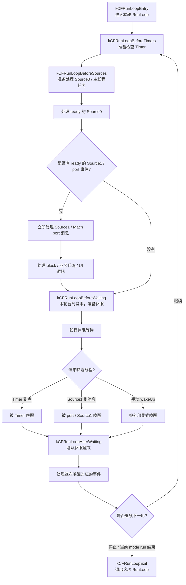
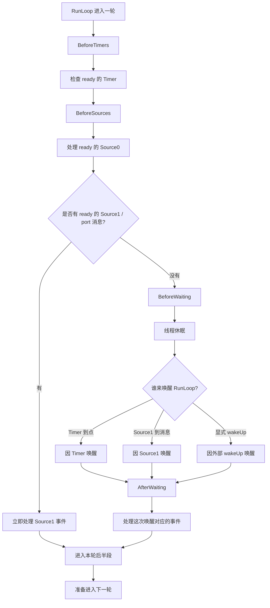
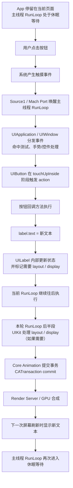
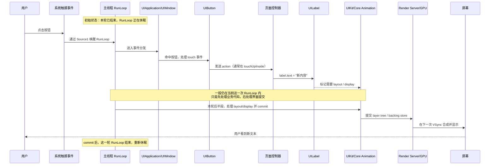

# RunLoop 面试文档

## 1. 重新画一遍 `runloop.png`，并对照 `test-runloop-monitor`

配合 [runloop.png](/Users/huchu/Desktop/test-swift-program/runloop.png) 和 [RunLoopStallMonitor.swift](/Users/huchu/Desktop/test-swift-program/test-runloop-monitor/RunLoopStallMonitor.swift:1) 一起看，主线程或子线程上的一轮 RunLoop，更准确地可以画成下面这样：



这张图里有 2 个非常关键的点：

1. `BeforeTimers / BeforeSources / BeforeWaiting / AfterWaiting` 是 **RunLoop Observer 能观察到的状态点**
2. `处理 Timer / Source0 / Source1 / block` 是 **真实发生的工作阶段**，但它们本身不是 `CFRunLoopActivity` 枚举值

### 1.1 `test-runloop-monitor` 里所有状态，对应到图上分别是什么

`test-runloop-monitor` 用的是：

```swift
CFRunLoopActivity.allActivities.rawValue
```

也就是把所有可观察状态一次性都监听上。这里要注意：

- `allActivities` 是 **监听掩码**
- 它不是 RunLoop 真实运行时会回调出来的某一个具体阶段

对应关系可以直接记成这张表：

| `CFRunLoopActivity` | 在图里的位置 | 含义 |
| --- | --- | --- |
| `entry` | `kCFRunLoopEntry` | 进入本轮 RunLoop |
| `beforeTimers` | `kCFRunLoopBeforeTimers` | 即将检查 Timer |
| `beforeSources` | `kCFRunLoopBeforeSources` | 即将处理 Source0 / 主线程任务 |
| `beforeWaiting` | `kCFRunLoopBeforeWaiting` | 本轮处理完暂时没事，准备休眠 |
| `afterWaiting` | `kCFRunLoopAfterWaiting` | 刚从休眠中被唤醒 |
| `exit` | `kCFRunLoopExit` | 退出这次 RunLoop / 当前 mode run |
| `allActivities` | 不对应图里的单独节点 | 只是“把上面所有状态都监听起来”的组合掩码 |

### 1.2 为什么 `test-runloop-monitor` 重点盯的是 `AfterWaiting / BeforeSources / BeforeWaiting`

结合 [RunLoopStallMonitor.swift](/Users/huchu/Desktop/test-swift-program/test-runloop-monitor/RunLoopStallMonitor.swift:117)：

- `afterWaiting`
  - 表示线程刚醒
  - 如果长时间停在这里，常见含义是：刚醒来就被主线程任务、锁等待、事件处理堵住了
- `beforeSources`
  - 表示马上要处理 Source0、主线程 block、业务代码
  - 如果长时间停在这里，通常说明：业务逻辑、主队列任务、事件处理执行太久
- `beforeWaiting`
  - 表示这轮事情基本做完了，准备休眠
  - 如果超时还停在这里，很多时候其实是“主线程空闲”，不是卡死

所以卡顿监控不是平均对待所有状态，而是：

- 重点怀疑 `AfterWaiting`
- 重点怀疑 `BeforeSources`
- 把 `BeforeWaiting` 更多当成“健康收尾点”

## 2. 先看 `runloop.png` 应该怎么理解

配合 [runloop.png](/Users/huchu/Desktop/test-swift-program/runloop.png) 看，主线程 RunLoop 可以先粗略理解成：

1. 进入一轮 RunLoop
2. 检查并处理 Timer
3. 检查并处理非端口输入源，也就是 Source0
4. 如果有端口消息等 Source1 事件，直接处理
5. 如果暂时没有更多事，就准备休眠
6. 休眠期间等待 Timer、Source1 或外部唤醒
7. 被唤醒后处理这次唤醒对应的事件
8. 开始下一轮

要注意：

- 这张图是**简化图**
- 真实顺序比图上更细，不要把它理解成逐行源码

Apple Run Loops 文档给出的顺序更接近下面这样：

1. `kCFRunLoopEntry`
2. `kCFRunLoopBeforeTimers`
3. `kCFRunLoopBeforeSources`
4. 处理 ready 的 **Source0**
5. 如果有 ready 的 **Source1 / port-based source**，立刻处理
6. `kCFRunLoopBeforeWaiting`
7. 线程休眠
8. 因 Timer / Source1 / wakeup 被唤醒
9. `kCFRunLoopAfterWaiting`
10. 处理这次唤醒带来的事件

参考：

- [CFRunLoop.h](/Applications/Xcode.app/Contents/Developer/Platforms/iPhoneSimulator.platform/Developer/SDKs/iPhoneSimulator.sdk/System/Library/Frameworks/CoreFoundation.framework/Headers/CFRunLoop.h:43)
- [Apple Run Loops 文档](https://developer.apple.com/library/archive/documentation/Cocoa/Conceptual/Multithreading/RunLoopManagement/RunLoopManagement.html)

## 3. Timer 是在 Source0 后还是 Source1 后处理

这个问题最容易被图带偏。

**不能简单说“Timer 在 Source0 后”或者“Timer 在 Source1 后”。**

更准确的理解是：

- Timer 有自己独立的检查阶段，对应 `BeforeTimers`
- Source0 有自己独立的检查阶段，对应 `BeforeSources`
- Source1 经常扮演“唤醒 RunLoop 的外部事件”
- RunLoop 醒来后，再去处理这次唤醒对应的事件

所以它们不是简单的一个固定串行队列：

- Source0 不是永远先于所有 Timer
- Timer 也不是永远排在 Source1 之后

更合适的说法是：

**Timer、Source0、Source1 都是 RunLoop 要处理的不同来源，RunLoop 按自己的阶段顺序和唤醒条件去处理它们。**

## 4. Source0、Source1、Timer 的区别

### 4.1 Source0

Source0 是：

- 非 port-based input source
- 不依赖内核端口消息直接投递
- 需要手动标记为 ready

它的特点是：

- **自己不能主动唤醒正在休眠的 RunLoop**
- 但可以在 RunLoop 醒着时被处理
- 也可以配合 `CFRunLoopWakeUp` 让 RunLoop 尽快回来处理它

### 4.2 Source1

Source1 是：

- port-based input source
- 往往依赖 mach port / socket / 内核消息

它的特点是：

- 可以作为外部事件直接把 RunLoop 唤醒
- 被唤醒后，RunLoop 就会处理它对应的事件

### 4.3 Timer

Timer 是：

- 时间驱动的事件源
- 不是输入源，但也是 RunLoop 的重要事件来源

它的特点是：

- 到点时可以唤醒 RunLoop
- 如果当前 RunLoop 正在执行别的 handler，timer 回调可能延后到下一轮

## 5. Source0 不能主动唤醒线程，那它是怎么添加和执行的

这个问题非常关键。

### 5.1 Source0 怎么添加

常见方式有：

- 自定义 `CFRunLoopSourceRef`（version 0）
- Cocoa 的 perform selector source
- 框架内部封装的一些主线程任务分发源

Apple 文档里明确提到：

- `performSelector:onThread:...`
- `performSelectorOnMainThread:...`
- `performSelector:withObject:afterDelay:...`

这类 perform selector source 会在目标线程的下一个 RunLoop 周期里执行。

### 5.2 Source0 既然不能主动唤醒，那怎么保证它能执行

答案是：

**Source0 自己不能把线程叫醒，但它可以先被 signal，然后借助一次唤醒机会被处理。**

典型过程是：

1. 把 Source0 加到某个 RunLoop mode
2. 某个线程或某段代码把它标记为 ready
3. 如果 RunLoop 本来就醒着，那它会在后续这轮/下一轮处理 Source0 阶段执行
4. 如果 RunLoop 已经睡着了，通常要额外调用 `CFRunLoopWakeUp(runLoop)`
5. RunLoop 醒来后，在处理 Source0 的阶段执行它

也就是说：

- Source0 **不能自己唤醒**
- 但 Source0 **可以被别人 signal + wakeup**

一句话总结：

**Source0 负责“我有活了”，真正把线程叫醒通常靠 `CFRunLoopWakeUp` 或别的外部唤醒事件。**

## 6. 常见的 Source0 场景

面试里可以举这些例子：

- `performSelector:onMainThread:` 这类投递到主线程下一个 RunLoop 的任务
- 某些自定义线程通信方案里的 `CFRunLoopSourceRef`
- 框架内部把“待执行任务”包装成 RunLoop source 的场景

注意：

很多业务代码里你看见的“主线程回调”，不一定都要强行归类成 Source0 或 Source1。

比如：

- 触摸事件到达主线程，底层更接近 Source1 / port 唤醒
- 但唤醒之后某段业务回调是不是 Source0，要看它是怎么被投递到 RunLoop 的

## 7. 一张图把 Timer / Source0 / Source1 / WakeUp 串起来



这张图最关键的 3 句话：

- Source0 更像“本轮处理的非端口输入源”
- Source1 和 Timer 更常扮演“唤醒 RunLoop 的原因”
- Source0 自己不能叫醒线程，但可以在 RunLoop 醒来后被处理，必要时配合 `CFRunLoopWakeUp`

## 8. 面试时最稳的回答

你可以直接这么说：

> RunLoop 里 Timer、Source0、Source1 不是简单的先后串行关系。Timer 有自己的 `BeforeTimers` 阶段，Source0 对应 `BeforeSources` 后处理的非端口输入源，而 Source1 往往是 port-based source，经常作为外部事件直接唤醒 RunLoop。Source0 自己不能主动唤醒线程，所以如果它在 RunLoop 休眠时才被标记 ready，通常还需要配合 `CFRunLoopWakeUp` 或等待别的唤醒事件，等 RunLoop 醒来后再进入 Source0 的处理阶段。`

## 9. 按钮点击修改 UILabel 文本时，RunLoop 是怎么跑的

这是面试里非常典型的 UI 场景：

- App 停留在某个页面
- 页面上有一个按钮和一个 `UILabel`
- 用户点击按钮
- 按钮 action 方法里修改 `label.text`

### 9.1 先说结论

这个场景要分成两层理解：

1. 从**一次完整点击**看，通常可能不止一次 RunLoop  
   因为手指按下、移动、抬起本身就是系统触摸事件，常常会分布在不同的事件分发过程中。

2. 从**按钮 action 开始，到 `label.text` 改动被提交去显示**看，通常是在**同一次 RunLoop**里完成的  
   也就是：
   - 事件分发
   - `UIButton` 触发 action
   - `label.text = ...`
   - 标记需要 layout / display
   - 本轮 RunLoop 后半段 `CATransaction commit`
   - Render Server / GPU 合成
   - 下一次屏幕刷新显示新文本

### 9.2 流程图



### 9.3 时序图



### 9.4 这里到底是几次 RunLoop

这个问题最容易混淆，所以单独说清楚。

- 从“用户一次完整点击”看，可能跨越不止一次 RunLoop  
  例如按下和抬起本身就可能是不同触摸事件。

- 从“按钮 action 执行”到“`UILabel` 文本变化被提交”看，通常是在同一次 RunLoop  
  因为 `label.text = ...` 之后并不是立刻上屏，而是先修改状态，等本轮 RunLoop 后半段统一提交。

所以更准确的说法是：

**用户交互可能跨多次 RunLoop，但 action 里这次 UI 修改的提交通常发生在当前这一次 RunLoop 的后半段。**

### 9.5 和 `setNeedsDisplay` 的关系

你之前看到的“`UIView` 在 `setNeedsDisplay` 后，不是立刻画，而是在 RunLoop 即将休眠前处理 backing store / 提交”这个理解，放到这里也是成立的。

只是要注意：

- `label.text = ...` 不一定等价于你手写 `drawRect:`
- 但它的**显示提交时机**仍然是类似的
- 也就是先事件处理，再到本轮后半段由 UIKit / Core Animation 统一提交

一句话概括：

**按钮点击改 `UILabel` 文本，不是改完立刻上屏，而是当前事件处理结束后，在本轮 RunLoop 后半段统一提交，再交给 Render Server / GPU 在下一次屏幕刷新时显示。**

### 9.6 提交到 GPU 后还和 RunLoop 有关系吗

可以这样理解：

- **App 主线程 RunLoop 负责的是 CPU 侧这部分**
  - 事件处理
  - 业务代码执行
  - layout / display
  - `CATransaction commit`

- **提交到 Render Server / GPU 之后**
  - 当前这次界面更新的后续显示就不再由主线程 RunLoop 直接负责
  - 后面主要是系统渲染管线和屏幕刷新节奏

所以你可以记成一句话：

**RunLoop 管的是“这一帧怎么准备并提交出去”，提交之后怎么合成到屏幕，主要就不是 RunLoop 在直接管了。**

## 10. 结合 `test_runloop` demo 来记忆

代码和说明在这里：

- [main.swift](/Users/huchu/Desktop/test-swift-program/test_runloop/Sources/main.swift)
- [README.md](/Users/huchu/Desktop/test-swift-program/test_runloop/README.md)

这套 demo 最适合拿来回答 3 类面试题：

1. 子线程为什么“活着”但 `performSelector(onThread:)` 还是不执行
2. Source0 为什么 `signal` 之后还经常要 `CFRunLoopWakeUp`
3. `Port` 是不是让 RunLoop 常驻的唯一方式

### 10.1 `performSelector(onThread:)` demo 结论

`selector` 这组实验现在有 4 个 case：

| Case | 做了什么 | 结果 |
| --- | --- | --- |
| 1 | 子线程完全不碰 RunLoop | selector 不执行 |
| 2 | 子线程只取 `RunLoop.current`，但不 `run()` | selector 仍然不执行 |
| 3 | 子线程 `runLoop + Port + run()` | selector 执行 |
| 4 | 子线程 `runLoop + Timer + run()` | selector 也执行 |

这组实验最关键的结论不是“必须加 Port”，而是：

**目标线程的 RunLoop 必须真的跑起来，并且当前 mode 里要有可等待、可保活的 source / timer。**

也就是说：

- 只有 `RunLoop.current` 不够
- 只有线程活着也不够
- `Port` 只是最常见的保活手段之一
- `Timer` 也可以让这个 mode 保持可运行

### 10.2 Source0 demo 结论

`source0` 这组实验现在有 3 个 case：

| Case | 做了什么 | 结果 |
| --- | --- | --- |
| 1 | `signal` Source0，但不 `wakeUp` | 一段时间内不会执行，直到手动 `CFRunLoopWakeUp` |
| 2 | `signal + wakeUp`，用 `Port` 保活 | 很快进入 `perform callback` |
| 3 | `signal + wakeUp`，用 `Timer` 保活 | 同样很快进入 `perform callback` |

这组实验对应的面试结论是：

**Source0 可以被 signal，但它自己不会像 Source1 那样把睡着的 RunLoop 弄醒。**

所以如果目标线程已经休眠了，通常要配合：

1. `CFRunLoopSourceSignal(source)`
2. `CFRunLoopWakeUp(runLoop)`

线程醒来后，RunLoop 才会在后续的 Source0 处理阶段执行 `perform callback`。

### 10.3 `run(mode:before:)` 在 demo 里说明了什么

`test_runloop` 里多处都用了：

```swift
runLoop.run(mode: .default, before: .distantFuture)
```

这个方法不是“跑一小轮就返回”，而是：

- 让当前线程在指定 mode 下进入真正的 RunLoop 工作流程
- 里面可以连续处理很多次事件、很多次休眠/唤醒
- 直到超时、被 `CFRunLoopStop(...)` 停掉，或者当前 mode run 结束时才返回

所以外层常常还会再套一层 `while`，把它当成常驻线程的消息循环外壳。

## 11. 高频面试问答整理

### 11.1 `RunLoop.run(mode:before:)` 什么时候返回，是不是跑一轮就返回

不是。

更准确地说：

- 一次 `run(mode:before:)` 调用里，可能包含很多次状态流转
- 不只是过一遍 `BeforeTimers -> BeforeSources -> BeforeWaiting -> AfterWaiting`
- 它通常会一直运行到：
  - 到了 `before` 指定时间
  - 被 `CFRunLoopStop(...)` 停掉
  - 当前 mode 没有可继续支撑它运行的 source / timer
  - 当前这次 mode run 结束

一句话记忆：

**`run(mode:before:)` 是“让当前线程在某个 mode 下持续跑一段 RunLoop”，不是“只跑一圈就返回”。**

### 11.2 `performSelector:onThread:` 和 `performSelector:withObject:afterDelay:` 分别更像什么

这两个不要混在一起。

- `performSelector:onThread:` / `performSelectorOnMainThread:`
  - 更接近 **perform selector source**
  - 可以近似理解成 **Source0 风格**
  - 目标线程必须有正在运行的 RunLoop，selector 才会被处理

- `performSelector:withObject:afterDelay:`
  - 更接近 **RunLoop timer**
  - 本质上是把一次 selector 调用包装成一个延时任务
  - delay 到点后，由 timer 机制推进 RunLoop，再执行对应 selector

所以：

- 前者更偏“把一件事投递给某条线程的 RunLoop”
- 后者更偏“在当前线程 RunLoop 上注册一个延时触发的任务”

### 11.2.1 `performSelector(onThread:)` 和 `CFRunLoopPerformBlock` 底层逻辑一样吗

**不一样，但目标很像。**

相同点是：

- 都不是立刻执行
- 都依赖目标线程的 RunLoop 真正在跑
- 都可以把工作安排到目标线程后续执行

不同点在“投递模型”：

- `performSelector(onThread:)`
  - 是 `NSObject` / Foundation 这一层的 API
  - 你投递的是 **selector + object**
  - 更像一个 **perform selector source**
  - 你指定的是 **thread**
  - 所以它更偏“把一个方法调用扔给某条线程”

- `CFRunLoopPerformBlock`
  - 是 Core Foundation 这一层的 API
  - 你投递的是 **block**
  - 你指定的是 **runLoop + mode**
  - 它不是 `Source0`、不是 `Source1`、也不是 `Timer`
  - 它是 **RunLoop 自己维护的一类待执行 block 机制**
  - 所以它更偏“把一段代码挂到某个 RunLoop 的某个 mode 上”

还可以再记一个关键差别：

- `performSelector(onThread:)` 通常由系统内部帮你处理“投递到目标线程”这层细节
- `CFRunLoopPerformBlock` 经常需要你自己再配合 `CFRunLoopWakeUp(runLoop)`，保证目标 RunLoop 如果正在休眠，也能尽快起来执行这个 block

一句话记忆：

**`performSelector(onThread:)` 更偏“线程投递模型”，`CFRunLoopPerformBlock` 更偏“RunLoop/mode 投递模型”；它们目的相似，但不是同一套底层机制。**

### 11.3 `dispatch_async(dispatch_get_main_queue(), block)` 到底是什么时机执行

它不是 `Timer`，也不要简单等同成普通 `Source0`。

更准确地说：

- 它是 **GCD 主队列任务**
- 主队列和主线程 RunLoop 做了专门集成
- 底层常见表现是主线程 RunLoop 在某个主队列处理点去 drain main queue

几个结论可以直接记：

- 它不会打断当前调用栈
- 它不会因为你调用了它，就切换成新的 RunLoop mode
- 从调用栈角度看，它一定是“稍后执行”
- 从 RunLoop 轮次看，可能是当前这轮后半段执行，也可能是下一轮执行

### 11.4 `CFRunLoopPerformBlock` 属于 Source0、Source1 还是 Timer

它**不属于 `Source0`、`Source1`、`Timer` 里的任何一种**。

更准确地说：

- `Source0`
  - 是 non-port-based input source
  - 需要 `signal`，必要时还要 `wakeUp`
- `Source1`
  - 是 port-based input source
  - 常见形式是 `Port / Mach port`
- `Timer`
  - 是到点触发的 RunLoop 定时任务
- `CFRunLoopPerformBlock`
  - 是 **RunLoop 自己提供的一种 block 投递机制**
  - 用来把一段代码挂到“指定 RunLoop + 指定 mode”上，等这个 RunLoop 后续轮到合适阶段时执行

在 [test-runloop-demo/RunLoopThreadLab.swift](/Users/huchu/Desktop/test-swift-program/test-runloop-demo/RunLoopThreadLab.swift:76) 里有一段很典型：

```swift
CFRunLoopPerformBlock(runLoop, CFRunLoopMode.defaultMode.rawValue) { [weak self] in
    guard let self else { return }
    self.emitLog("worker 线程收到 stop 请求，准备调用 CFRunLoopStop")
    CFRunLoopStop(CFRunLoopGetCurrent())
}
CFRunLoopWakeUp(runLoop)
```

这里的作用不是“立刻 stop”，而是：

1. 主线程先把“停止 worker RunLoop”这件事投递到 **worker 自己的 RunLoop**
2. 如果 worker 此时正在休眠，再用 `CFRunLoopWakeUp` 把它叫醒
3. worker RunLoop 后续运行到合适阶段时，执行这个 block
4. block 内部在 **worker 线程**里调用 `CFRunLoopStop(CFRunLoopGetCurrent())`

所以一句话记忆：

**`CFRunLoopPerformBlock` 里的 block 是独立于 `Source0 / Source1 / Timer` 的另一类 RunLoop 任务机制。**

### 11.5 `Timer` 和 `DispatchSourceTimer` 的区别

- `Timer / NSTimer`
  - 是 **RunLoop-based**
  - 依赖 RunLoop mode
  - 只加在 `NSDefaultRunLoopMode` 的话，滚动 `UIScrollView` 时可能暂停

- `DispatchSourceTimer`
  - 是 **GCD-based**
  - 依赖 dispatch queue，不依赖 RunLoop mode
  - 如果 target queue 是 `.main`，回调仍然会在主线程执行

最关键的判断标准不是“谁更高级”，而是：

**卡不卡，主要取决于回调跑在哪个线程、做了多少事，不是取决于它叫 `Timer` 还是 `DispatchSourceTimer`。**

### 11.6 为什么 `UIScrollView` 拖拽时跑在 `UITrackingRunLoopMode`

因为滚动是一个强实时交互，系统需要优先保证：

- 触摸事件处理
- `contentOffset` 更新
- cell 复用
- 布局和显示提交
- 尽量赶上当前帧

如果这时候 `NSDefaultRunLoopMode` 下一堆无关任务也一起跑，比如：

- banner 自动轮播
- 秒杀倒计时
- 活动角标闪烁
- 页面上每秒刷新的文案

那它们就会和滚动链路抢主线程时间。

所以切到 `UITrackingRunLoopMode` 的目的不是“不更新 UI”，恰恰相反，是：

**让和当前交互最相关的 UI 更新优先跑，减少 default mode 下无关任务干扰。**

要记住：

- UI 更新可以发生在 `NSDefaultRunLoopMode`
- UI 更新也可以发生在 `UITrackingRunLoopMode`
- 取决于当前这轮 RunLoop 正在哪个 mode 下运行

### 11.7 屏幕 60Hz / 120Hz 刷新，是 RunLoop 在驱动吗

不是。

更准确地说：

- RunLoop 负责的是 **App 进程 CPU 侧**：
  - 事件处理
  - 业务代码
  - 布局
  - 绘制触发
  - `CATransaction commit`

- 真正按 60Hz / 120Hz 节奏刷新的，是：
  - 显示硬件
  - VSync
  - 系统显示管线
  - Render Server / GPU

所以一句话记忆：

**RunLoop 不是屏幕刷新的时钟源；RunLoop 的任务是尽量在下一次 VSync deadline 之前把这一帧准备好并提交出去。**

### 11.8 `port` 和 `Source1` 是不是同一个东西

不是同一个层级的概念，但它们强相关。

- `port`
  - 更底层
  - 是消息端点 / 通信端口

- `Source1`
  - 是 RunLoop 里的 **port-based input source**
  - 可以理解成“基于 port 构建出来的输入源”

所以不是：

- `port == Source1`

而是：

- **Source1 依赖 port**
- **RunLoop 监听 port，上面有消息时处理 Source1**

### 11.9 `mach port` 和 Linux `epoll` 是不是一回事

不是。

如果只是从“有事件就把线程唤醒”这个角度看，它们有一点相似；但从抽象层级上说：

- `mach port`
  - 更像消息端点 / IPC 通道
- `epoll`
  - 更像 I/O 多路复用监听器

如果要在 Apple 平台上找和 `epoll` 更接近的概念，通常更像：

- `kqueue / kevent`

### 11.10 什么情况下适合用 Source0

最典型的是：

**你有一个常驻线程，线程里跑着 RunLoop，外部线程希望把“自定义任务”投递给它执行。**

也就是这种模型：

1. 任务本身不是 socket / mach port / timer
2. 你想让任务和某条线程的 RunLoop 绑定
3. 你希望自己控制 `signal + wakeUp + perform`

这时 `Source0` 很合适。

不太适合用 Source0 的情况是：

- 只是想简单异步执行一段代码  
  这时通常 `dispatch_async` 就够了
- 任务本身就是 I/O / port / socket 事件  
  这时更接近 Source1 或系统现成事件源

## 12. 一组适合直接背的面试答案

### 12.1 子线程里 `performSelector(onThread:)` 为什么不执行

> `performSelector:onThread:` 依赖目标线程的 RunLoop。子线程如果只是活着，但没有真正把 RunLoop 跑起来，那么这个 selector source 不会被处理。仅仅访问 `RunLoop.current` 也不够，关键是目标线程的 RunLoop 要真正 run 起来，并且当前 mode 里要有 source/timer 让它保持可运行。

### 12.2 Source0 为什么还要 `CFRunLoopWakeUp`

> Source0 是 non-port-based input source，可以被 signal，但不会像 Source1 那样靠端口消息主动把睡着的 RunLoop 唤醒。所以如果目标 RunLoop 已经休眠了，通常还需要配合 `CFRunLoopWakeUp`，RunLoop 醒来后才会进入后续的 Source0 处理阶段。

### 12.3 为什么滚动时很多 Timer 停了，但 tableView 还能继续更新

> 因为拖拽 `UIScrollView` 时，主线程 RunLoop 通常运行在 `UITrackingRunLoopMode`。只加在 `NSDefaultRunLoopMode` 的 Timer 会暂停，但滚动相关的核心链路，包括触摸处理、`contentOffset` 更新、cell 复用、布局和 Core Animation 提交，都会继续在 tracking mode 下运行。系统这样设计是为了优先保证交互流畅度。

### 12.4 `CFRunLoopPerformBlock` 到底属于哪一类

> `CFRunLoopPerformBlock` 不属于 `Source0`、`Source1` 或 `Timer`，它是 RunLoop 提供的一种独立 block 投递机制。你可以把一段代码挂到指定 RunLoop 和指定 mode 上，等这个 RunLoop 后续轮到合适阶段时执行。实际工程里常见用法，是把某个操作投递回目标线程自己的 RunLoop 上执行，再配合 `CFRunLoopWakeUp` 保证如果线程正在休眠也能及时处理。

### 12.5 `DispatchSourceTimer` 会不会天然比 `Timer` 更流畅

> 不会。`DispatchSourceTimer` 不依赖 RunLoop mode，但卡不卡主要取决于回调跑在哪个线程、做了多少工作。如果 `DispatchSourceTimer` 的回调也放在主线程里做重活，一样会卡。它的优势更多在于可以方便地绑定后台 queue，而不是“天然更快”。
