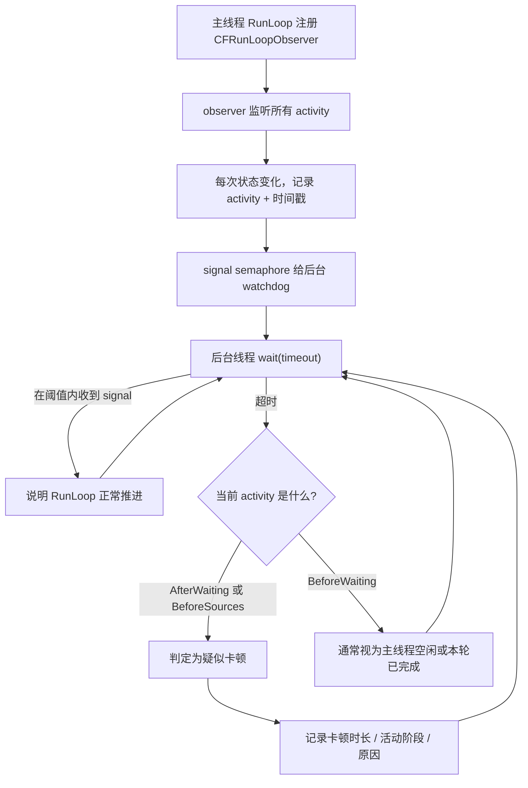
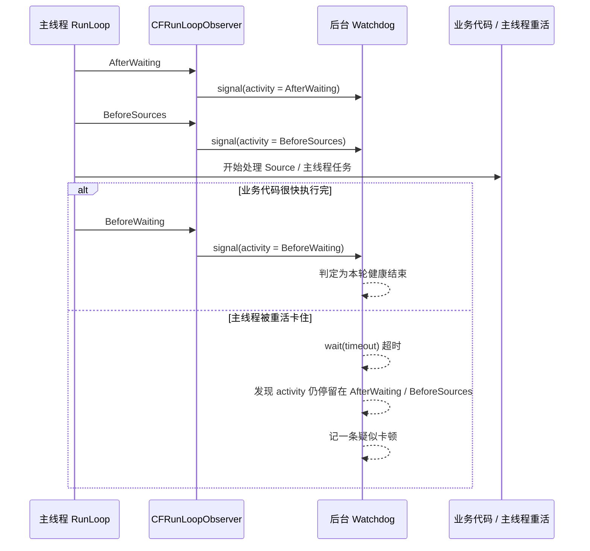

# RunLoop 卡顿监控流程文档

## 1. 为什么很多 RunLoop 卡顿监控盯的是 `AfterWaiting`、`BeforeSources`、`BeforeWaiting`

主流基于 RunLoop 的卡顿监控，本质上监控的是：

**主线程 RunLoop 有没有长时间停留在某个关键阶段而迟迟不能继续推进。**

最常盯的 3 个阶段是：

### 1.1 `kCFRunLoopAfterWaiting`

含义：

- 主线程 RunLoop 刚从休眠中被唤醒
- 这说明系统已经准备好让主线程开始处理这一轮事件

为什么重要：

- 很多卡顿就发生在“刚被唤醒之后”
- 比如触摸事件、主队列 block、锁等待、主线程大计算
- 如果在 `AfterWaiting` 后长时间没有继续推进，通常说明主线程刚醒来就被某段重活卡住了

### 1.2 `kCFRunLoopBeforeSources`

含义：

- RunLoop 马上要去处理 `Source0` / 主线程任务 / 一部分业务代码

为什么重要：

- 用户代码最容易在这附近把主线程拖慢
- 比如按钮 action、`dispatch_async(main)` 里的 block、大量布局、同步 I/O、JSON 解析
- 如果主线程长期停留在这里，说明业务执行或 source 处理太重

### 1.3 `kCFRunLoopBeforeWaiting`

含义：

- 这一轮大部分工作做完了
- RunLoop 准备休眠

为什么也常被看：

- 它通常是一个“健康收尾点”
- 如果 RunLoop 能稳定走到 `BeforeWaiting`，说明这一轮没有卡死在中间
- 很多监控把它当作“本轮已经顺利完成”的边界
- 如果超时时主状态是 `BeforeWaiting`，往往更可能是主线程空闲，而不是卡顿

---

## 2. 主流监控实现思路

1. 在主线程 RunLoop 上注册 `CFRunLoopObserver`
2. observer 监听 `allActivities`
3. 每次状态切换时，记录：
   - 当前 activity
   - 时间戳
4. 后台 watchdog 线程/队列周期性等待信号
5. 如果超过阈值还没等到新的 activity：
   - 若当前 activity 是 `AfterWaiting` / `BeforeSources`
     - 认为主线程疑似卡顿
   - 若当前 activity 是 `BeforeWaiting`
     - 通常认为主线程更可能是空闲

---

## 3. 流程图

---

## 4. 时序图

---

## 5. 这个 demo 做了什么

`test-runloop-monitor` target 里：

- 用 `CFRunLoopObserver` 监听主线程 `allActivities`
- 页面上实时展示当前 activity
- 后台 watchdog 用 80ms 阈值检测主线程是否长时间不推进
- 提供几个按钮触发主线程重活：
  - 阻塞主线程 120ms
  - 阻塞主线程 600ms
  - 主线程布局压力
  - 主队列 burst

你运行后会发现：

- 轻度阻塞时，日志里最常出现的疑似卡顿阶段是 `AfterWaiting` 或 `BeforeSources`
- `BeforeWaiting` 更多像“本轮顺利走完了”的边界

---

## 6. 一句最适合面试背的总结

> 基于 RunLoop 的卡顿监控，核心不是监控某个具体 source，而是通过 `CFRunLoopObserver` 观察主线程 RunLoop 的推进节奏。之所以重点关注 `AfterWaiting` 和 `BeforeSources`，是因为主线程刚被唤醒、以及即将处理 source/主线程任务时，最容易被业务重活卡住；而 `BeforeWaiting` 通常被当作本轮顺利完成的边界，用来辅助排除“主线程只是空闲”这种情况。
