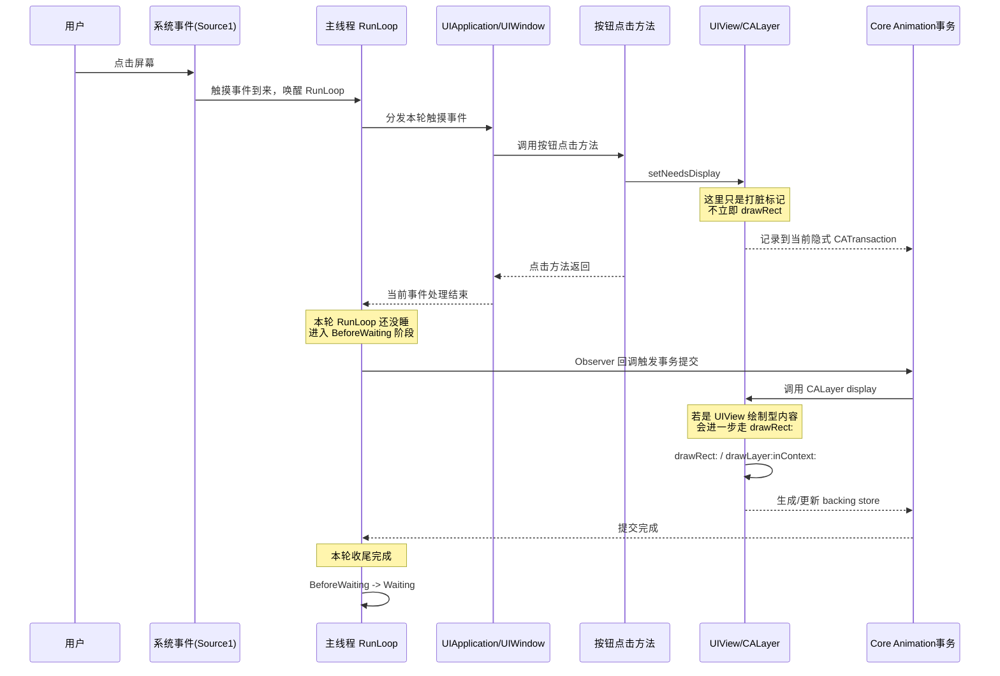
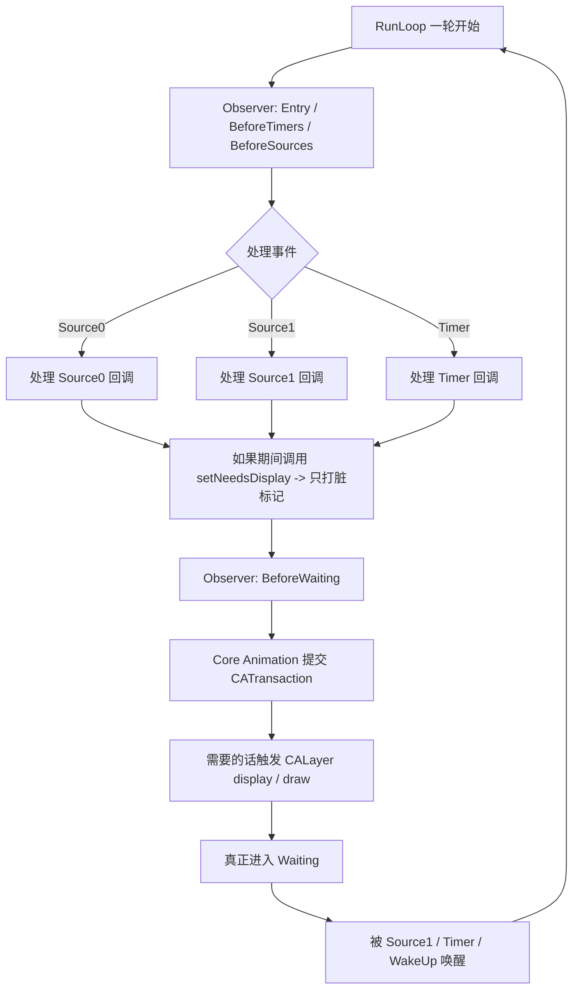
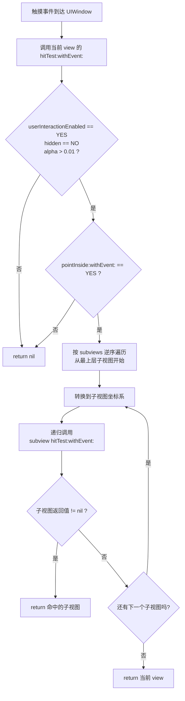
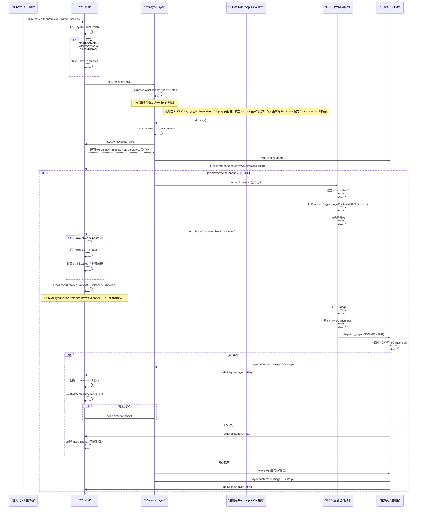
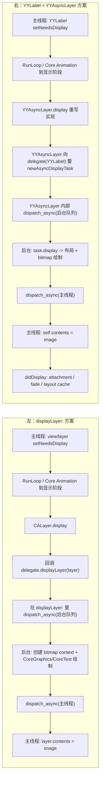

你可以把它记成一句话：

`setNeedsDisplay` 发生在“当前点击事件这一轮”里，真正的 `display/drawRect` 通常发生在这轮快结束、进入 `BeforeWaiting` 时，由 RunLoop 的 `Observer` 触发 Core Animation 提交事务，然后主线程才真正休眠。

再补一个很容易混的点：
- `setNeedsDisplay` 不是唤醒源
- 唤醒这轮 RunLoop 的，是最开始那次点击事件，也就是 `Source1`
- `drawRect` 不是“下一次新事件到来后才画”，而是常常就在**当前这一轮收尾时**画掉

如果你想，我可以继续补一张“`setNeedsLayout` 和 `setNeedsDisplay` 在 RunLoop 末尾分别怎么处理”的对照图。


这里最关键的点，是你那张图里**少了一类对象：`Observer`**。

RunLoop 监控的不只有：
- `Source`
- `Timer`

还有：
- `Observer`

Apple 官方对 `CFRunLoop` 的概述就写了，RunLoop 监控三类对象：`sources`、`timers`、`observers`。  
参考：[CFRunLoop](https://developer.apple.com/documentation/corefoundation/cfrunloop)

所以你问“为什么 RunLoop 将要结束的时候还能做事情”，答案是：

**因为它还没真正睡下去。**  
在“准备休眠”之前，RunLoop 会先回调一批 `Observer`。系统框架就可以把“收尾工作”挂在这里做。

更准确地说，不是“整个 RunLoop 要结束了”，而是：

**当前这一轮 run loop iteration 快结束了，准备 `BeforeWaiting` 或 `Exit` 了。**

---

**`setNeedsDisplay` 放回这条链里怎么理解**

`[view setNeedsDisplay]` / `[view.layer setNeedsDisplay]` 做的事不是立刻绘制，而是：

- 把 view/layer 标成 dirty
- 放进当前线程的隐式 `CATransaction`
- 等到本轮 RunLoop 末尾统一提交

Apple 官方文档里有两条很关键：

- `UIView setNeedsDisplay`：只是记下请求，真正重绘发生在 **next drawing cycle**  
  参考：[UIView setNeedsDisplay](https://developer.apple.com/documentation/uikit/uiview/setneedsdisplay%28%29?language=objc)
- `CATransaction`：隐式事务会在 **thread’s runloop next iterates** 时自动提交  
  参考：[CATransaction](https://developer.apple.com/documentation/quartzcore/catransaction)
- `CATransaction.flush()`：通常会在 **current runloop 的末尾自动执行**  
  参考：[CATransaction.flush()](https://developer.apple.com/documentation/quartzcore/catransaction/flush%28%29?language=objc)

所以公开文档 + 系统行为合起来，最实用的理解就是：

**本轮事件处理过程中你调用 `setNeedsDisplay`，等这轮 RunLoop 快要休眠时，Core Animation 借助 RunLoop Observer 统一提交事务，然后触发 `display/draw`。**

---

**它在你这张图里属于哪一环**

严格说，**它不属于 `Source0 / Source1 / Timer` 任何一个。**

它属于你图里没画出来的这条线：

- `Observer`
- 常见理解位置：`kCFRunLoopBeforeWaiting`
- 以及为了兜底，也常会在 `kCFRunLoopExit` 阶段处理

Apple 官方有这些阶段常量：
- `beforeTimers`
- `beforeSources`
- `beforeWaiting`
- `afterWaiting`
- `exit`

参考：[CFRunLoopActivity.beforeWaiting / exit](https://developer.apple.com/documentation/corefoundation/cfrunloopactivity/kcfrunloopbeforewaiting)

所以如果把图补完整，更像这样：



---

**那它是谁唤醒的？**

分两种情况看。

1. **最常见情况：它根本不是“被唤醒后才做”的**
- 比如你点按钮
- 主线程已经因为触摸事件 `Source1` 醒着了
- 你在按钮点击回调里调用 `setNeedsDisplay`
- 当前事件处理完，本轮 RunLoop 还没睡
- 到 `BeforeWaiting` 时，Observer 提交事务并绘制

这时：
- 唤醒 RunLoop 的原因是：**触摸事件 `Source1`**
- `setNeedsDisplay` 不是唤醒原因
- 它只是“本轮收尾时要处理的脏标记”

2. **如果主线程原本是睡着的**
- 那一定先有别的东西把它弄醒
- 可能是 `Source1`
- 可能是 `Timer`
- 可能是 `dispatch_async(main)` 之类间接让主线程开始处理新任务
- 然后在那次被唤醒后的处理过程中，有代码调用了 `setNeedsDisplay`
- 最后仍然是在本轮末尾提交绘制

所以：

**`setNeedsDisplay` 本身通常不是 RunLoop 的唤醒源。**  
它更像是“当前这轮里记一笔账，等这一轮收尾时统一结算”。

---

**你可以这么记一句话**

`setNeedsDisplay` 不负责叫醒 RunLoop；  
它负责把“我要重绘”登记下来；  
真正的绘制通常发生在 **当前这轮 RunLoop 的 `BeforeWaiting`/`Exit` Observer 阶段**。

参考：
- [CFRunLoop](https://developer.apple.com/documentation/corefoundation/cfrunloop)
- [UIView setNeedsDisplay](https://developer.apple.com/documentation/uikit/uiview/setneedsdisplay%28%29?language=objc)
- [CALayer setNeedsDisplay](https://developer.apple.com/documentation/quartzcore/calayer/1410855-setneedsdisplay)
- [CATransaction](https://developer.apple.com/documentation/quartzcore/catransaction)
- [CATransaction.flush()](https://developer.apple.com/documentation/quartzcore/catransaction/flush%28%29?language=objc)
- [Run Loops](https://developer.apple.com/library/archive/documentation/Cocoa/Conceptual/Multithreading/RunLoopManagement/RunLoopManagement.html)

如果你愿意，我可以下一条直接给你画一张专门的时序图：

**“按钮点击 -> `setNeedsDisplay` -> `BeforeWaiting` -> `display/drawRect` -> 休眠”**

这张图会把“为什么不是被新事件唤醒才绘制”看得特别清楚。


这张图里最核心的偏差有两个：

1. `userInteractionEnabled / hidden / alpha` 这组判断，不是 `Start` 之前的独立步骤，而是每一层 `hitTest:withEvent:` 进入后先做的判断。  
2. `pointInside:withEvent:` 不负责遍历子视图，也不负责递归；它只判断“当前点是否在当前 view 可命中的区域内”。真正的遍历子视图、递归调用子视图 `hitTest:withEvent:`，都发生在当前 view 的 `hitTest:withEvent:` 里面。

更准确的调用链应该是这样：

1. 触摸事件到达 `UIApplication`，然后从 `UIWindow` 开始做命中测试。
2. `UIWindow` 调用自己的 `hitTest:withEvent:`。
3. 当前 view 的 `hitTest:withEvent:` 先判断：
   - `userInteractionEnabled == YES`
   - `hidden == NO`
   - `alpha > 0.01`
   不满足直接 `return nil`。
4. 然后调用当前 view 的 `pointInside:withEvent:`。
   - 如果点不在当前 view 范围内，直接 `return nil`
   - 如果在范围内，才继续往子视图找
5. `hitTest:withEvent:` 按 `subviews` 的逆序遍历（从最上层子视图开始）。
6. 对每个子视图先做坐标转换，再递归调用子视图的 `hitTest:withEvent:`。
7. 只要某个子视图返回非 `nil`，就立刻返回那个命中的子视图。
8. 如果所有子视图都没命中，返回当前 view 自己。

可以直接用这版流程图来理解：



如果写成伪代码，其实最清楚：

```objc
- (UIView *)hitTest:(CGPoint)point withEvent:(UIEvent *)event {
    if (!self.userInteractionEnabled || self.hidden || self.alpha <= 0.01) {
        return nil;
    }

    if (![self pointInside:point withEvent:event]) {
        return nil;
    }

    for (UIView *subview in [self.subviews reverseObjectEnumerator]) {
        CGPoint subPoint = [subview convertPoint:point fromView:self];
        UIView *fitView = [subview hitTest:subPoint withEvent:event];
        if (fitView) {
            return fitView;
        }
    }

    return self;
}
```

所以一句话总结就是：

`pointInside:withEvent:` 只管“当前 view 包不包含这个点”，  
`hitTest:withEvent:` 才管“能不能接收事件 + 要不要继续问子视图 + 最终返回谁”。

如果你愿意，我可以下一步直接把你这张图重画成一版“面试/笔记可直接用”的中文版流程图。


可以，直接按这段实现把链路画出来。先给你结论：

- `YYLabel` 改属性后，并不是立刻开始画，而是先 `setNeedsDisplay` 标记脏。
- 真正由系统接管 UI 提交的点，是主线程 RunLoop 在本轮末尾提交 Core Animation transaction 时，`YYAsyncLayer.display` 才会被调用。
- 后台线程只负责“生成位图”。
- 最终把位图塞回 `layer.contents`，这一步一定回主线程。

代码入口主要在 [YYLabel.m](/Users/huchu/Desktop/apple/OpenSource/YYKit/YYKit/Text/YYLabel.m:431)、[YYLabel.m](/Users/huchu/Desktop/apple/OpenSource/YYKit/YYKit/Text/YYLabel.m:1067)、[YYAsyncLayer.m](/Users/huchu/Desktop/apple/OpenSource/YYKit/YYKit/Utility/YYAsyncLayer.m:97)、[YYAsyncLayer.m](/Users/huchu/Desktop/apple/OpenSource/YYKit/YYKit/Utility/YYAsyncLayer.m:102)。



再把你最关心的“RunLoop 什么时候接管 UI 提交”单拎出来：

1. `YYLabel` 调 `setNeedsDisplay` 时，还没有开始真正绘制，只是给 layer 打了“需要重绘”的标记。[YYLabel.m](/Users/huchu/Desktop/apple/OpenSource/YYKit/YYKit/Text/YYLabel.m:97)
2. `YYAsyncLayer` 的 `setNeedsDisplay` 会先 `sentinel++`，让旧任务失效，然后调用 `[super setNeedsDisplay]`。[YYAsyncLayer.m](/Users/huchu/Desktop/apple/OpenSource/YYKit/YYKit/Utility/YYAsyncLayer.m:97)
3. 从这里开始，是否进入 `display`，就不是 `YYLabel` 自己直接调了，而是交给 UIKit/Core Animation 的提交流程。
4. 也就是说，主线程 RunLoop 在本轮末尾处理 UI/CA 事务时，才会真正调用 `YYAsyncLayer.display`。这一点不是这几个文件里显式写出来的，而是 iOS 的标准显示管线；代码里能看到的是它确实依赖 `setNeedsDisplay -> display` 这套 layer 机制。[YYAsyncLayer.m](/Users/huchu/Desktop/apple/OpenSource/YYKit/YYKit/Utility/YYAsyncLayer.m:102)

对应到这份实现里的线程职责，可以压缩成一句话：

- 主线程 RunLoop 负责“触发显示流程”和“提交最终 UI 结果”
- GCD 后台队列负责“算 layout + 画 bitmap”
- 中间靠 `sentinel` 做取消，避免旧内容白画 [YYAsyncLayer.m](/Users/huchu/Desktop/apple/OpenSource/YYKit/YYKit/Utility/YYAsyncLayer.m:124)

如果你愿意，我下一条可以把这张图再缩成一个“5 句口语版”，专门帮你面试时解释这套异步渲染。


1. `YYLabel` 改了文本或尺寸以后，不会立刻开画，它先只是调用 `setNeedsDisplay` 把自己标成需要重绘。
2. 到了主线程 RunLoop 本轮提交 UI 的时候，Core Animation 才会回调 `YYAsyncLayer.display`，真正开始这次渲染流程。
3. `YYAsyncLayer` 会把耗时的部分，也就是文本布局和位图绘制，丢到 GCD 后台队列去做，这样主线程不会被富文本绘制卡住。
4. 后台画完以后，再切回主线程，只做一件很轻的事，就是把生成好的 `image` 设置给 `layer.contents`，顺便处理 attachment 和淡入动画。
5. 它为了避免白做工，还用了一个 `sentinel` 取消机制，只要内容中途又变了，旧任务就会立刻作废，后台线程即使还在跑也不会把过期结果提交到屏幕上。

可以，下面这张图把两种方案并排放在一起了。左边是通用的 `displayLayer:` delegate 方案，右边是 `YYLabel + YYAsyncLayer` 方案。右边对应你刚看的代码：[YYLabel.m](/Users/huchu/Desktop/apple/OpenSource/YYKit/YYKit/Text/YYLabel.m:431)、[YYAsyncLayer.m](/Users/huchu/Desktop/apple/OpenSource/YYKit/YYKit/Utility/YYAsyncLayer.m:102)；左边这种钩子在 YYKit 里也能看到一个例子：[YYAnimatedImageView.m](/Users/huchu/Desktop/apple/OpenSource/YYKit/YYKit/Image/YYAnimatedImageView.m:583)。



**一眼看区别**

- 两边的“大框架”其实一样：都是 `setNeedsDisplay` 之后，等主线程 RunLoop 进入显示提交阶段，再开始这次渲染。
- 左边是把异步逻辑写在 `delegate.displayLayer:` 里，也就是“系统先回调你，你再自己 dispatch 到后台”。
- 右边是先把 backing layer 换成 `YYAsyncLayer`，然后由它自己重写 `display`，也就是“先接管 layer 的 display，再由 layer 内部统一调度异步绘制”。
- 所以 `+layerClass` 不是异步本身，它只是把“拦截点”从 `displayLayer:` 换成了自定义 `CALayer.display`。
- 这也是 `YYAsyncLayer` 能顺手把取消机制、队列池、回主线程提交、淡入动画这些通用逻辑都封进去的原因。

面试里你可以直接用一句话收住：

“`displayLayer:` 方案和 `YYAsyncLayer` 方案本质上都是利用系统显示阶段，把耗时绘制放到后台，最后回主线程设置 `contents`；区别只是前者拦在 delegate 回调层，后者拦在自定义 layer 的 `display` 层。”

如果你愿意，我可以再给你补一张“系统默认 `drawRect:` / `drawLayer:` / `displayLayer:` / `CALayer.display` 四者关系图”，这个也特别容易被问。