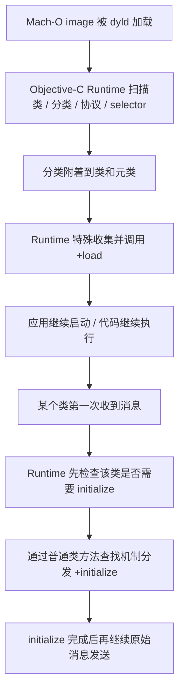
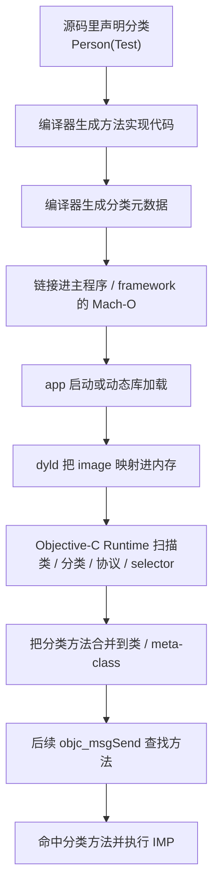
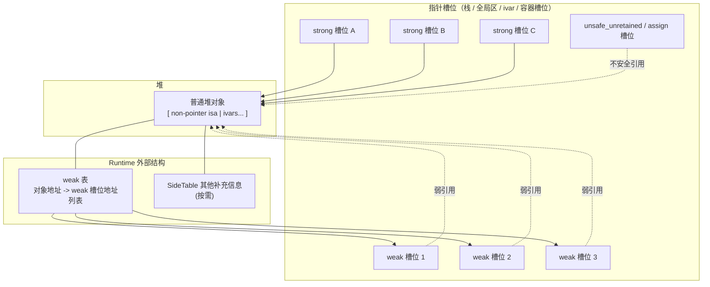
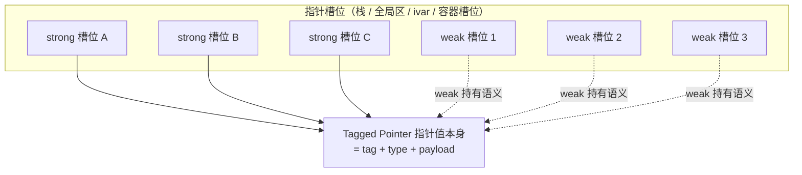
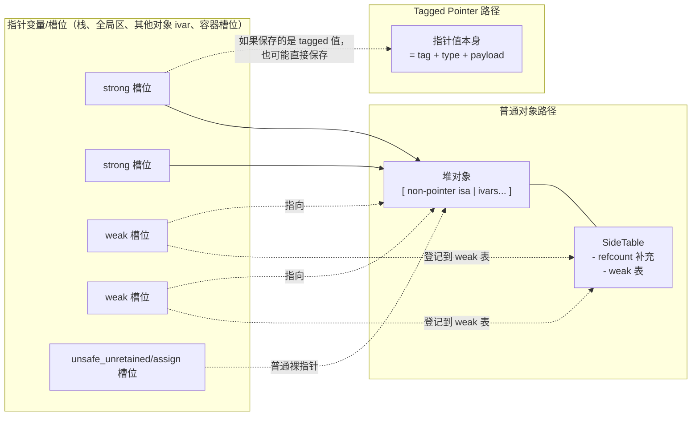
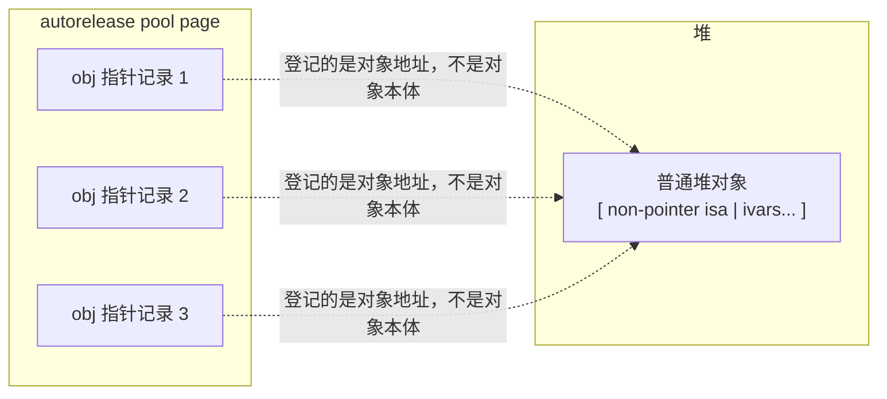
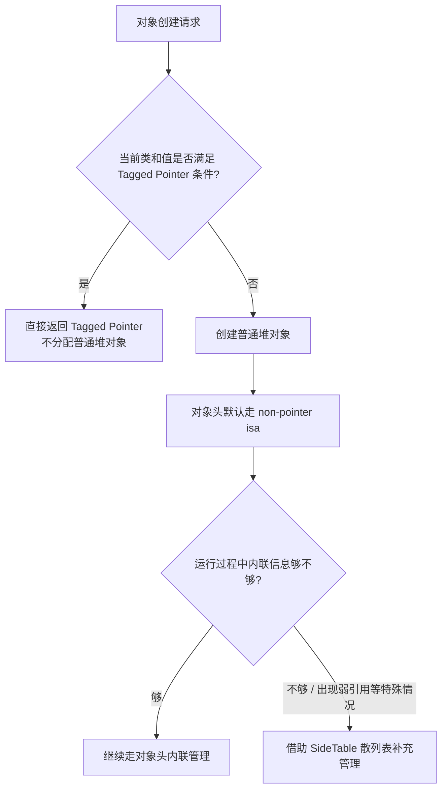

# Objective-C 语言特性面试文档

这份文档整理了上面几轮关于 Objective-C 语言特性的问答，重点围绕：

1. `@property` 有没有 `mutableCopy`
2. 分类到底是在什么时机加载和决议
3. 分类加载后内存会不会释放
4. 为什么分类明明已经编译进二进制了，还说是“运行时决议”
5. `+load` 和 `+initialize` 在类和分类里为什么表现不同
6. 为什么说 Objective-C 是动态语言，这和“编译后已经成机器码”并不矛盾

---

## 1. `@property` 有没有 `mutableCopy`

**没有。**

Objective-C 的 `@property` 常见内存语义关键字是：

- `assign`
- `strong`
- `weak`
- `copy`
- `unsafe_unretained`
- `atomic`
- `nonatomic`

这里面**没有** `mutableCopy` 这个内置关键字。

### 1.1 如果我就是想要 `mutableCopy` 的效果怎么办

要自己写 setter。

```objc
@interface Person : NSObject
@property (nonatomic, strong) NSMutableString *name;
@end

@implementation Person

- (void)setName:(NSMutableString *)name {
    _name = [name mutableCopy];
}

@end
```

### 1.2 为什么 `NSMutableString` / `NSMutableArray` 不建议直接写 `copy`

因为 `copy` 之后很可能得到的是不可变对象。

例如：

```objc
@property (nonatomic, copy) NSMutableString *name;
```

这个写法就不合适。setter 内部会调用 `copy`，结果通常得到的是 `NSString`，而不是 `NSMutableString`，类型语义就错了。

### 1.3 一句话记忆

> Objective-C 属性关键字里没有 `mutableCopy`；如果想要设置时自动做 `mutableCopy`，需要自己重写 setter。

---

## 2. 分类是在 app 启动时加载，还是第一次调用时才加载

先说结论：

**分类不是等到第一次调用方法时才懒加载进去的。**

更准确地说：

- 如果分类所在的可执行文件 / framework 是 app 启动时就加载的  
  那么分类通常就在 **app 启动阶段** 被 Runtime 处理并挂到类上

- 如果分类所在的是后面才加载的 bundle / 动态库  
  那么它会在 **那个 image 被加载时** 再挂到类上

所以：

**分类的挂载时机取决于“它所在的 image 什么时候被加载”，而不是“方法第一次什么时候被调用”。**

### 2.1 更完整的过程

#### 阶段 A：编译期

你写：

```objc
@interface Person (Test)
- (void)run;
@end
```

编译器会：

1. 把 `-run` 编译成机器码
2. 生成“这个方法属于 `Person` 的某个 category”的元数据

#### 阶段 B：image 被加载

当主程序或某个 framework/bundle 被 dyld 加载到内存时，Objective-C Runtime 会扫描里面的：

- 类
- 分类
- 协议
- selector
- method list

这时 Runtime 才会做真正的“分类合并”：

- 找到 `Person`
- 找到 `Person(Test)`
- 把分类实例方法并到 `Person`
- 把分类类方法并到 `Person` 的 meta-class

#### 阶段 C：消息发送

后面真正调用：

```objc
[person run];
```

才进入 `objc_msgSend` 的查找、缓存、调度过程。

### 2.2 和 `+load` / `+initialize` 的关系

这两个特别容易和分类加载时机混淆。

#### `+load`

- 在类/分类所在 image 被加载时调用
- 偏“加载时机”
- 和分类被 Runtime 读取、合并是同一类时机问题

#### `+initialize`

- 在类第一次收到消息前才懒调用
- 偏“首次使用时机”

所以：

**分类挂载不是 `+initialize` 这种“第一次使用才发生”的懒行为。**

### 2.3 一句话记忆

> 分类的方法挂载是在它所在 Mach-O image 被 Runtime 加载处理时完成的，不是等到方法第一次调用时才懒挂载。

---

## 3. 分类加载完以后，它的内存会释放吗

通常**不会**，至少不是“加载完就 `free` 掉”这种理解。

### 3.1 为什么不会

分类本身不是你平时理解的“对象实例”。

它更像：

- 一份分类元数据
- 一份方法列表描述
- 一组和类之间的关联信息

这些数据和分类方法实现代码一起，跟着 Mach-O image 被映射进进程内存。

只要这个 image 还在进程里：

- 方法实现代码 `IMP` 还在
- 分类元数据通常也还在

### 3.2 什么时候才可能不在

只有比较特殊的情况，比如：

- 这个分类所在的 bundle / 动态库被卸载

但在 iOS App 常见场景里：

- 主程序不会被卸载
- 大多数 framework 也不会中途卸载

所以面试里你可以直接简单记：

> 分类加载后，它的元数据通常随着整个 image 常驻进程内存，不是加载完就释放。

---

## 4. 为什么分类都已经编译进二进制了，还说它是“运行时决议”

这点最容易觉得矛盾，其实一点都不矛盾。

关键要把下面两件事分开：

1. **代码和元数据有没有被编译进二进制**
2. **Runtime 什么时候把这些元数据真正合并到类结构里**

### 4.1 编译进二进制，不等于编译期就已经把类结构固定死了

编译器做的是：

- 生成方法实现代码
- 生成分类元数据

但它不会在编译期真的把这个 category“写回原类定义”。

真正的类结构组装，是 Runtime 在 image 加载时做的。

### 4.2 “运行时决议”说的到底是什么

这里的“运行时决议”不是说：

- 代码直到运行时才存在

而是说：

- Runtime 在运行时才把 category 方法挂到类上
- Runtime 在运行时决定最终类的方法列表长什么样
- 如果有同名方法，最终消息发送阶段查到谁，也是运行时才体现出来

### 4.3 一句话类比

- 编译期：像是“零件已经装箱”
- 运行时：像是“Runtime 把零件真正装到机器上”

所以不矛盾：

- 零件早就有了
- 但机器结构是在运行时组装完成的

---

## 5. `+load` 和 `+initialize` 在类和分类里为什么表现不同

先说结论：

1. **分类里的 `+initialize` 其实也会合并到元类的方法列表里**
2. **`+load` 和 `+initialize` 的根本区别，不在“是否合并”，而在“调用机制不同”**
3. **`+load` 是 Runtime 在 image load 阶段的特殊回调，不走普通消息发送**
4. **`+initialize` 是类第一次收到消息前，通过普通类方法查找机制懒调用**

### 5.1 分类里的 `+initialize` 会不会合并进去

**会。**

分类里的类方法，本质上都会挂到**元类**上，包括：

- `+test`
- `+foo`
- `+load`
- `+initialize`

所以不能理解成：

- `+load` 会合并
- `+initialize` 不会合并

更准确地说是：

> 两者作为“分类里的类方法”，都会在分类附着时并到元类的方法列表体系里。

### 5.2 为什么 `+load` 和 `+initialize` 表现不一样

差别不在“有没有进入方法列表”，而在 Runtime 后面**怎么调用它们**。

#### `+load`

- 在 image 被加载时，Runtime 会扫描谁实现了 `+load`
- 然后把这些 `IMP` 收集起来
- 按 Runtime 规则直接调用

它更像一套：

**“加载阶段专用回调机制”**

而不是普通的：

**“给类发一个 `load` 消息”**

所以类和分类都能各自执行自己的 `+load`，这不是普通同名方法覆盖的结果。

#### `+initialize`

- `+initialize` 是在类第一次收到消息前才触发
- 它走的是普通类方法查找/派发逻辑
- 只是 Runtime 帮你保证“每个类初始化一次”

所以它更接近：

```objc
objc_msgSend(cls, @selector(initialize))
```

只不过触发时机是 Runtime 控制的。

因此：

- 分类里的 `+initialize` 会像普通同名类方法一样参与查找
- 最终通常只会命中一个实现

### 5.3 为什么 `+load` 类和分类都能执行，而 `+initialize` 通常只执行一个

因为语义不同：

#### `+load` 的语义

是：

> 谁实现了 `+load`，谁在 image load 阶段收到自己的特殊回调。

所以：

- 类实现了，调类的
- 分类实现了，调分类的
- 多个分类实现了，多个都可能执行

#### `+initialize` 的语义

是：

> 这个类第一次被使用前，需要完成一次类初始化。

所以这里只关心：

**“这个类最终响应哪个 `+initialize` 实现”**

而不是关心：

**“类和分类是不是都各执行一次”**

### 5.4 `+load` 会不会进入方法列表

会，它作为类方法的元数据同样存在，并最终属于元类的方法列表体系。

但要注意：

> Runtime 调 `+load` 时，不依赖普通方法查找决定调用谁，而是单独扫描并直接调用。

所以从“数据结构”角度看它是类方法，从“调用机制”角度看它又是特殊回调。

### 5.5 自动 `+load` 和手动 `[Class load]` 有什么区别

这两个非常容易被混在一起，但它们其实不是同一套机制。

#### Runtime 自动调用 `+load`

当 image 被加载时，Runtime 会：

- 扫描类和分类里谁实现了 `+load`
- 收集各自的 `IMP`
- 按 Runtime 规则直接调用

所以这里的特点是：

- 类的 `+load` 会调
- 分类的 `+load` 也会调
- 不是普通同名方法覆盖
- 不是 `objc_msgSend`

#### 手动写 `[MyClass load]`

这时候就不再是 Runtime 的“特殊回调流程”了，而是一次**普通类方法调用**。

也就是说它会：

- 走普通类方法查找
- 在元类方法列表里找 `+load`
- 最终命中哪个实现，就执行哪个

所以手动调用时：

- **不会像 Runtime 自动调用那样把类和分类的 `+load` 都调一遍**
- **只会执行普通方法查找最终命中的那个 `+load` 实现**

最直白的理解是：

- 自动 `+load`：Runtime 点名，类和分类各自执行自己的回调
- 手动 `[Class load]`：普通打电话，只接通最终命中的那个方法实现

#### 为什么不建议手动调 `+load`

因为你一旦手动调用：

- 语义已经从“image 加载时回调”变成了“普通类方法调用”
- 可能和 Runtime 自动执行过的初始化逻辑重复
- 还容易让人误以为会把类和分类的 `+load` 全部重新执行一遍

所以工程上最稳的原则是：

> **不要手动调用 `+load`。**

### 5.6 同名方法覆盖顺序看什么

这里要分两类说。

#### 对 `+load`

不要用“普通方法覆盖”去理解。

更稳的记法是：

- 父类 `+load` 先于子类
- 类的 `+load` 先于分类的 `+load`
- 多个分类的 `+load` 调用顺序**不要作为业务依赖**

#### 对普通同名方法，包括分类里的 `+initialize`

这才有普通方法覆盖的问题。

分类方法附着到类/元类后，实践里通常会看到：

- 分类里的同名方法会覆盖原类里的同名方法

但如果涉及：

- 多个分类
- 不同 image / framework
- 多个同名实现

那最终谁生效，会和：

- 分类附着顺序
- image 加载顺序
- Runtime 内部实现细节

有关。

所以工程上最稳的结论是：

> **不要依赖多个分类同名方法的覆盖顺序，也不要依赖多个分类 `+load` 的相对执行顺序。**

### 5.7 一张完整流程图



### 5.8 一句话记忆

> 分类里的 `+initialize` 也会并到元类方法列表里，`+load` 和 `+initialize` 的关键区别不在“是否合并”，而在“调用机制”：`+load` 是 image load 时 Runtime 特殊扫描并直接调用的回调，而 `+initialize` 是类第一次收到消息前，通过普通类方法查找机制懒调用的初始化方法。

---

## 6. Objective-C 为什么说是动态语言

Objective-C 不是“不编译”，而是：

**编译后仍然保留了大量信息和调度权给 Runtime。**

### 6.1 动态体现在哪

常见的动态点包括：

1. 方法调用不是静态绑定函数地址，而是经过 `objc_msgSend`
2. 类、分类、协议会在运行时注册
3. 分类会在运行时挂载到类上
4. 可以方法交换 `method swizzling`
5. 可以动态加方法 `resolveInstanceMethod:`
6. 可以消息转发

### 6.2 所以“动态”不是说什么

不是说：

- 编译后什么都没定

而是说：

- **编译后仍有一部分绑定、组装、查找、替换，是在运行时完成的**

### 6.3 一个很重要的修正

很多人会说：

> 分类都已经编译到代码段了，怎么还动态？

这里要更严谨一点：

- **方法实现代码** 会编译成机器码，放到代码相关区域
- **分类和类的关系、方法列表等信息** 是元数据

Runtime 的动态性，依赖的关键不是“那段函数代码是不是已经有了”，而是：

**这些元数据在运行时如何被读取、合并、查找、替换。**

---

## 7. 分类从源码到方法调用的完整链路



这张图最关键的点是：

- **代码和元数据在编译期就存在**
- **真正合并到类结构是在运行时**
- **最终消息发送查找也是运行时行为**

---

## 8. 一组适合直接背的面试答案

### 8.1 Objective-C 属性里有 `mutableCopy` 吗

> 没有。Objective-C 的 `@property` 没有 `mutableCopy` 这个内置关键字，常见的是 `assign`、`strong`、`weak`、`copy` 等。如果想要设置时自动做 `mutableCopy`，需要自己重写 setter。

### 8.2 分类是在 app 启动时加载，还是第一次调用时才加载

> 分类不是等到第一次调用方法时才懒加载。它的挂载时机取决于所在 Mach-O image 的加载时机：如果分类所在主程序或 framework 在 app 启动时被加载，那么分类就在启动阶段被 Runtime 合并到类上；如果分类在后续动态加载的 bundle 或动态库里，那么就在那个 image 被加载时合并。

### 8.3 分类加载后内存会释放吗

> 通常不会。分类本身不是普通 OC 对象实例，而是一份 Runtime 会读取的元数据描述。只要它所在的 image 还在进程里，这些分类元数据和方法实现通常都会常驻内存，不是加载完就释放。

### 8.4 为什么分类已经编译进二进制了，还说是运行时决议

> 因为“编译进二进制”和“运行时决议”并不矛盾。编译期只是把分类的方法实现和元数据生成出来；真正把分类挂到哪个类上、并入类的方法列表，是 Runtime 在 image 加载时做的，所以这一步仍然属于运行时决议。

### 8.5 `+load` 和 `+initialize` 在类和分类里为什么表现不同

> 分类里的 `+initialize` 其实也会合并到元类的方法列表里，和其他类方法一样；`+load` 和 `+initialize` 的根本区别不在“是否合并”，而在调用机制。`+load` 是 Runtime 在 image 加载时特殊扫描并直接调用的回调，不走普通消息发送，所以类和分类各自的 `+load` 都会执行；`+initialize` 则是在类第一次收到消息前，通过普通类方法查找机制懒调用，因此分类里的 `+initialize` 会像普通同名类方法一样参与覆盖，通常只会命中一个实现。注意如果你手动写 `[Class load]`，这就退化成一次普通类方法分发，只会执行最终查找到的那个 `+load`，不会把类和分类的 `+load` 都重新调一遍。

### 8.6 Objective-C 为什么说是动态语言

> Objective-C 的动态性不在于“不编译”，而在于编译后仍然保留大量绑定和调度给 Runtime，比如 `objc_msgSend`、分类挂载、方法交换、动态加方法和消息转发。也就是说，代码已经被编译，但类结构组装、方法查找和一部分行为决议仍然发生在运行时。

---

## 9. Swift 是动态语言吗，它也有运行时特性吗

先说结论：

**Swift 不算典型的动态语言，但 Swift 也确实有运行时特性。**

更准确地说：

- Swift 是一门以**静态类型、编译期决议**为主的语言
- 但它也保留了一部分运行时能力，用来支撑类型系统、协议、多态、泛型和与 Objective-C 的互操作

### 9.1 为什么说 Swift 不是典型动态语言

Swift 的主设计方向是：

- 静态类型检查
- 更多编译期确定
- 更多值类型
- 更强的类型安全
- 尽量使用静态分发或更高效的调用路径

所以和 Objective-C 相比：

- Objective-C 更依赖 Runtime 做消息发送和行为决议
- Swift 更依赖编译器在编译期提前把很多事情定下来

因此面试里最稳的说法是：

> Swift 不是像 Objective-C 那样的典型动态语言，它主要是静态语言，但具备部分运行时能力。

### 9.2 Swift 有哪些运行时特性

虽然 Swift 没有 Objective-C 那么“动态”，但它并不是完全没有运行时。

#### 1. 类型元数据（Type Metadata）

Swift 在运行时会维护类型相关信息，比如：

- 当前对象的真实类型
- 泛型实例化后的类型信息
- 某些继承和布局信息

这也是为什么可以做：

```swift
type(of: obj)
```

#### 2. 协议一致性和 witness table

Swift 协议调用很多时候并不是简单的静态函数调用。

底层会涉及：

- protocol conformance metadata
- witness table

这本身就是 Swift Runtime 的一部分。

#### 3. 动态派发仍然存在

Swift 不是所有调用都静态分发。

这些场景里仍然可能存在动态派发：

- `class` 可重写方法
- `protocol` 类型调用
- `@objc dynamic`
- 与 Objective-C Runtime 互操作的方法

所以 Swift 只是“动态性更弱”，不是“完全没有动态派发”。

#### 4. 反射能力

Swift 有 `Mirror`：

```swift
Mirror(reflecting: value)
```

可以拿到：

- 属性
- 子节点
- 某些类型结构信息

只是它的反射能力通常不如 Objective-C Runtime 那么强。

#### 5. 泛型运行时支持

Swift 泛型不是简单的“完全擦除”。

很多场景里，运行时仍然会保留：

- 泛型参数相关元数据
- 协议一致性信息
- 特化/实例化后的支持结构

#### 6. 与 Objective-C Runtime 的桥接

如果你写：

```swift
@objc dynamic
class func foo() {}
```

或者类型继承自 `NSObject`，那么很多行为会进入 Objective-C Runtime 世界，例如：

- selector
- `responds(to:)`
- KVC / KVO
- method swizzling（通常只限 `@objc dynamic` 那套）

这说明 Swift 在 Apple 平台上，某些场景下也会借助 Objective-C Runtime。

### 9.3 Swift 和 Objective-C 的运行时差别

可以直接这样对比：

#### Objective-C Runtime 更强的地方

- `objc_msgSend`
- 分类运行时挂载
- 动态加方法
- 消息转发
- method swizzling
- 关联对象
- KVC/KVO 深度依赖 Runtime

#### Swift Runtime 更偏支持型

- 类型元数据
- 协议 witness table
- 泛型支持
- 有限反射
- 某些类方法的动态派发
- 与 Objective-C Runtime 的桥接

一句话理解：

> Objective-C 的 Runtime 更像“语言核心机制的一部分”；Swift 的 Runtime 更像“语言实现和高级特性支持层的一部分”。

### 9.4 为什么这不矛盾

有些同学会把“有运行时”直接等同于“动态语言”，这不准确。

更准确的是：

- Swift 仍然是静态类型语言
- 编译器在 Swift 里做了大量提前决议
- 但为了支撑多态、协议、泛型、反射和桥接，它仍然需要运行时系统

所以：

**Swift 是以静态为主，但具备部分运行时能力；Objective-C 是动态性更强、Runtime 参与更深。**

---

## 10. 一组适合直接背的 Swift/OC 对照答案

### 10.1 Swift 是动态语言吗

> 不是典型动态语言。Swift 本质上是静态类型语言，很多信息尽量在编译期确定，但它保留了部分运行时能力。  

### 10.2 Swift 有运行时特性吗

> 有。Swift 有类型元数据、协议 witness table、部分类方法的动态派发、`Mirror` 反射、泛型运行时支持，以及通过 `@objc dynamic` 与 Objective-C Runtime 的互操作能力。  

### 10.3 Swift 和 Objective-C Runtime 的最大区别是什么

> Objective-C 的 Runtime 更像语言核心机制的一部分，很多行为依赖消息发送和运行时决议；Swift 则是以静态为主，Runtime 更多是为类型系统、协议、多态、泛型和桥接提供支持。  

### 10.4 一句话总结 OC 和 Swift 的动态性差别

> Objective-C 是动态性更强、Runtime 参与更深的语言；Swift 主要是静态语言，但具备一部分运行时特性。  

---

## 11. Objective-C 内存管理里的 Tagged Pointer / non-pointer isa / SideTable

这一块最容易混的点是：

- `Tagged Pointer`
- `non-pointer isa`
- `SideTable` 散列表

看起来像 3 套平级方案，但更准确地说，它们是**分层决策**。

### 11.1 先说最稳的总结构

不是编译器在三选一，而主要是 **Runtime / Foundation 在运行时分层决定**：

1. **对象创建时**
   - 先判断这个值能不能做成 `Tagged Pointer`
2. **如果不能做成 `Tagged Pointer`**
   - 那它就是普通堆对象
   - 在现代 64 位 Objective-C Runtime 下，普通堆对象默认采用 **`non-pointer isa`**
3. **普通堆对象后续在运行过程中**
   - 如果对象头里的内联信息不够了
   - 或者遇到弱引用、引用计数溢出等特殊情况
   - 再借助 **`SideTable` 散列表** 做补充存储

一句话记忆：

> 先判断“能不能是 Tagged Pointer”；如果不是，就走普通堆对象；普通堆对象里再是“`non-pointer isa` 优先，`SideTable` 兜底”。

### 11.2 `Tagged Pointer` 用得多吗

**很多。**

但它主要是系统在 Foundation 层自动帮你用，业务代码一般不会手动指定“这个对象必须是 tagged pointer”。

常见应用对象通常包括：

- `NSNumber`
- 短字符串 `NSString`
- 某些小型 `NSDate`

它特别适合：

- 对象数量很多
- 生命周期短
- 值本身很小
- 不可变
- 创建/销毁特别频繁

比如：

- 列表里大量小整数
- 很多短文本
- 高频生成的小日期对象

### 11.3 `Tagged Pointer` 的核心特点

它的本质不是：

```text
指针 -> 堆上的对象内存
```

而更像：

```text
指针值本身 = 标记位 + 类型位 + payload 数据
```

也就是说：

- 很多时候**没有单独堆对象**
- 也就不需要普通对象那种 `malloc -> retain/release -> dealloc -> free` 完整流程

#### 优点

- 不需要单独 `malloc`
- 不需要额外堆内存
- 创建/销毁成本低
- `retain/release` 开销通常很轻
- 对高频小对象特别友好

#### 限制

- 只能承载足够小的值
- 只对少数支持 tagged pointer 的类启用
- 一般更适合不可变对象
- 具体编码方式属于系统实现细节，业务代码不应依赖

### 11.4 `Tagged Pointer` 的“对象”在栈里、堆里还是哪里

这个问题要分两层：

1. **指针变量本身放在哪**
2. **这个“对象内容”是否有单独堆内存**

比如：

```objc
NSNumber *num = @42;
```

这里：

- `num` 这个局部变量本身通常在**栈上**
- 但 `num` 里装的值如果是 tagged pointer，那它**不是一个再指向堆对象的普通地址**

如果这个指针值放在：

- 局部变量里，它就在栈上
- 对象的 ivar / property 里，它就在那个堆对象的内存里
- 全局变量里，它就在全局区

所以更准确的说法是：

> `Tagged Pointer` 不是在讨论“指针变量在栈里还是堆里”，而是在说“这个指针值本身就编码了对象内容，不需要再指向一块普通堆对象内存”。

### 11.5 `Tagged Pointer` 怎么“释放”，还有 strong/weak 这种说法吗

#### 1. 它怎么释放

通常没有“释放堆对象”这一步。

因为：

- 它本来就没有单独的堆对象
- 值直接编码在指针里

所以当变量生命周期结束时，本质上只是：

- 这个指针值不再被使用
- 或者保存它的那块内存被新值覆盖

Runtime 在 `retain/release` 时会先识别它是不是 tagged pointer：

- 如果是，通常走很轻的快速路径
- 不会去 `dealloc/free` 一块堆对象

#### 2. 还有 strong/weak 这种说法吗

**从代码语义上有，从底层对象生命周期上没那么重要。**

比如：

```objc
@property (nonatomic, strong) NSNumber *count;
```

这里的 `strong` 语义仍然成立，因为这是**变量的持有语义**。  
但如果这个 `NSNumber` 实际上是 tagged pointer，Runtime 不会按普通堆对象那套管理方式去真的回收一块对象内存。

所以更准确地说：

> `strong/weak` 说的是“变量怎么持有值”，不是说“这个值背后一定对应一块普通堆对象”。

### 11.6 它是不是只给“临时变量 + 常量值”用

**不是。**

`Tagged Pointer` 不是由“是不是临时变量”决定的，也不是由“是不是编译期常量”决定的。

真正更像是由这几件事决定：

1. 这个类是否支持 tagged pointer
2. 这个值是否足够小，能塞进指针 payload 里
3. 当前系统/架构/Runtime 是否启用了这套优化

所以这些场景都可能拿到 tagged pointer：

```objc
NSNumber *a = @(42);
self.count = @(42);
[array addObject:@(42)];
NSDictionary *dict = @{@"n": @(42)};
```

即使值不是编译期常量，也可能是：

```objc
NSInteger x = arc4random_uniform(100);
NSNumber *n = @(x);
```

这里 `x` 是运行时算出来的，但只要值足够小、类型支持，仍然可能是 tagged pointer。

### 11.7 10 个常见“可能命中 Tagged Pointer”的例子

下面这些更准确的说法是：**常见可能命中 tagged pointer 的例子，不是 100% 保证。**

1. `@(0)`
2. `@(1)`
3. `@(42)`
4. `@(-7)`
5. `@(YES)`
6. `@(3.14)`
7. `@(123456)`
8. 短字符串 `@"a"`
9. 短字符串 `@"hello"`
10. `[NSDate dateWithTimeIntervalSince1970:0]`

如果你想在实验里观察，可以打印类名或对象地址特征，但这些都属于实现细节，不应该作为业务依赖。

### 11.8 `non-pointer isa` 是什么

普通堆对象创建出来以后，对象头里会有 `isa`。

传统上 `isa` 更像“纯类指针”，但现代 64 位 Objective-C Runtime 里，它通常是 **non-pointer isa**，也就是：

- 类信息
- 一些对象状态位
- 部分引用计数信息

会被压在一个机器字里。

也就是说，普通堆对象仍然是：

```text
堆对象:
[ isa | ivars... ]
```

只是这里的 `isa` 不再只是“单纯指向类对象的裸指针”。

它优化的重点是：

- 更快拿到类信息
- 内联一部分对象状态
- 内联一部分引用计数
- 尽量减少额外查表成本

### 11.8.1 `Tagged Pointer` 和 `non-pointer isa` 都是 64 位吗

在 **64 位 iOS Runtime** 下，可以近似理解成：**是的，它们都基于 64 位机器字**，但不是同一个位置。

#### `Tagged Pointer`

这里说的是：

- 变量里保存的“对象指针值”本身
- 在 64 位进程里，指针宽度就是 64 位
- Runtime 会在这 64 位里编码：
  - 标记位
  - 类型信息
  - payload 数据

#### `non-pointer isa`

这里说的是：

- 普通堆对象头里的 `isa` 字段
- 在 64 位进程里，这个字段通常也是一个 64 位机器字
- 只是这里面编码的是：
  - 类信息
  - 状态位
  - 一部分引用计数位

所以最重要的一句话是：

> `Tagged Pointer` 用的是“对象指针值本身”的 64 位；`non-pointer isa` 用的是“普通堆对象头里的 isa 字段”的 64 位。它们都可以说是 64 位，但不是同一个位置。

### 11.8.2 什么叫“isa 里的内联引用计数不够了”

对普通堆对象来说，Runtime 不会把全部引用计数都单独放到外部表里，而是通常先把**一部分引用计数位直接塞进 `isa` 里**。这就叫：

- 内联引用计数
- 或者：对象头里自带的一小段引用计数存储空间

但 `isa` 里的空间有限，因为它还要装：

- 类信息
- `deallocating`
- `weakly_referenced`
- `has_assoc`
- `has_sidetable_rc`
- 以及其他状态位

所以：

> “内联引用计数不够了”，就是对象的 retain/strong 持有计数继续增加时，`isa` 里给引用计数预留的 bit 已经装不下了。

这时候 Runtime 才会把多出来的那部分信息放到 `SideTable` 里。

你可以把它理解成：

- `isa` 里先放一个小计数器
- 小计数器满了，再去外面查账本

### 11.8.3 这里的“引用计数”指的是什么

这里说的引用计数，指的是：

**对象当前被 retain / strong 持有的大致计数值。**

但要注意：

1. 这个值不一定等于你源码肉眼能数出来的变量个数
2. 也不适合拿来精确推理业务逻辑

因为它还会受这些影响：

- ARC 优化
- autorelease 池
- 容器持有
- 临时对象
- bridge 行为
- Runtime 自身实现细节

所以更稳的理解是：

> Runtime 维护的是“计数值”和“对象状态”，而不是一张精确的人类可读引用名单。

### 11.8.4 能看到“是哪几个 strong 指针在引用这个对象”吗

**通常不能。**

Runtime 更像只知道：

```text
这个对象当前大概被持有了 N 次
```

但它不会记录：

- 是哪个局部变量持有的
- 是哪个 ivar / property 持有的
- 是哪个数组元素持有的
- 是哪个全局变量持有的

因为如果要维护“所有谁在引用我”的完整反向列表，代价太高了。

所以：

- `retainCount` / `isa` / `SideTable` 维护的是数量和状态
- **不维护完整的 strong 引用来源清单**

如果你在 Xcode 里看到引用链，那通常是：

- `Memory Graph`
- Instruments
- 调试器扫描对象图

这些工具在帮你“还原引用关系”，不是对象自己存了一张“谁引用我”的名单。

### 11.8.5 为什么 weak 引用要借助外部表

因为 weak 不只是一个“数量”问题，而是需要一张：

```text
对象地址 -> 所有 weak 指针位置
```

的映射表。

这样对象销毁时，Runtime 才知道去哪里把这些 weak 指针自动置为 `nil`。

这类信息显然不可能塞进 `isa` 那几十个位里，所以必须借助外部结构，这也是 `SideTable` 一类弱引用表存在的重要原因之一。

### 11.8.6 有弱引用表，那有强引用表吗？有 `unsafe_unretained/assign` 表吗

#### 1. 没有“强引用表”

Runtime 通常不会维护：

```text
对象地址 -> 所有 strong 指针位置
```

这种完整的反向引用清单。

它更关心的是：

- 这个对象当前大致还活不活
- retain/strong 计数有没有归零
- 对象是不是正在释放

所以：

> 有 weak 表，但没有对应意义上的 strong 表。

#### 2. 也没有 `unsafe_unretained/assign` 表

因为这两种语义都不要求 Runtime 帮你善后。

- `unsafe_unretained`：不增加引用计数，对象释放后也不会自动置 `nil`
- `assign`：对对象来说，效果和 `unsafe_unretained` 很像；对基础类型则只是普通赋值

所以它们只是：

> 一个普通指针值拷贝，不会登记到 weak 表，也没有单独的 assign/unsafe 表。

### 11.8.7 普通堆对象 + 3 个 strong + 3 个 weak 的关系图

下面这张图最适合回答：

- 一个对象有 3 个 strong，是不是 3 个对象？
- weak 表到底在记录什么？
- strong / weak / unsafe 槽位和堆对象是什么关系？



这张图要这样读：

- `3 strong`：只是 3 个不同位置的指针槽位，保存同一个对象地址
- `3 weak`：也是 3 个槽位，但 Runtime 会把这些槽位地址登记到 weak 表
- `unsafe_unretained/assign`：只是普通裸指针，不登记，也不会自动置 `nil`

所以一个对象有 3 个 strong 引用时：

> 仍然只有 **1 个堆对象**、**1 个 `isa` 字段**，不是 3 个 `non-pointer isa` 对象。

### 11.8.8 Tagged Pointer + 3 个 strong + 3 个 weak 的关系图

和普通堆对象相比，`Tagged Pointer` 最大的不同是：

- 通常没有普通堆对象
- 没有对象头里的 `isa`
- 指针值本身就编码了对象内容



这张图的关键结论是：

- `strong/weak` 外层仍然是“指针槽位”
- 这些槽位里保存的可能是同一个 tagged pointer 编码值
- 但这里通常没有普通堆对象可释放，也通常不需要普通堆对象那种 weak 表清理流程

所以：

> `Tagged Pointer` 不是“不能 weak”，而是“可以有 weak 变量指向它，只是通常不需要普通堆对象那套 weak 表和释放时置 nil 流程”。

### 11.8.9 一张总关系图：普通堆对象路径 vs Tagged Pointer 路径



这张图最适合串起来记：

- 普通堆对象路径：`指针槽位 -> 堆对象 -> SideTable(按需)`
- tagged pointer 路径：`指针槽位 -> 指针值本身就是对象`

### 11.8.10 autorelease pool 到底在管理什么

`autorelease pool` 管的不是“所有堆对象”，而是：

> **那些收到了 `autorelease` 的对象指针。**

也就是说，pool 里保存的不是对象本体，而是：

```text
以后需要再补一次 release 的对象地址
```

更像这样：



当 pool drain 时，会对这些登记进去的对象逐个发送一次 `release`：

- 如果对象此时没有别的 strong 持有了，就可能 `dealloc/free`
- 如果还有别的 strong 持有，它就继续活着

所以最稳的理解是：

> `autorelease pool` 更像“延迟 release 的待办列表”，不是“对象生命总管理中心”。

### 11.8.11 Tagged Pointer 会进 autorelease pool 吗

通常不会按普通堆对象那样真正进 pool 管理。

因为：

- `Tagged Pointer` 往往没有普通堆对象
- 也没有真正的 `dealloc/free` 流程
- `autorelease` 对它通常更接近轻量快速路径，而不是“登记进 pool，稍后再 release 一次”

所以你可以把它记成：

> 普通堆对象进 autorelease pool，是为了后面真的补一次 `release`；`Tagged Pointer` 通常没有这件事可做，所以一般不需要像普通堆对象那样被 pool 真正托管。

### 11.8.12 `[ non-pointer isa | ivars... ]` 里的 `ivars` 到底指什么

这里的 `ivars`，就是：

> **这个对象实例自己的成员变量存储区。**

如果某个 `NSObject` 子类里有成员变量：

```objc
@interface Person : NSObject {
    NSString *_name;
    NSInteger _age;
    CGRect _frame;
}
@end
```

那么这个对象实例在堆上的布局可以粗略理解成：

```text
[ isa | _name | _age | _frame ]
```

但要注意两点：

#### 1. `ivars` 不一定都是“对象指针”

它们可能是：

- 对象类型 ivar：槽位里存对象指针值
- 基础类型 ivar：槽位里存值本身
- 结构体 ivar：槽位里存结构体内容本身

所以：

> `ivars` 不是“全都是其他对象的指针”，而是“这个实例自己的成员变量存储区”。

#### 2. 对象实例内存还会包含父类继承下来的 ivars

所以更完整的理解是：

```text
[ isa | 父类 ivars | 本类 ivars ]
```

### 11.8.13 为什么这里只有 `ivars`，类方法/实例方法/协议去哪了

因为：

```text
[ non-pointer isa | ivars... ]
```

描述的是：

> **某一个对象实例自己的堆内存布局**

而不是“整个类系统的所有信息”。

#### 对象实例里通常只放两类东西

1. **我是谁**
   - 通过 `isa` 知道自己属于哪个类
2. **我这次实例自己的数据是什么**
   - 通过 `ivars` 保存自己这一份成员变量值

#### 方法、协议、属性这些不会放进每个实例里

因为这些信息对同一个类的所有实例通常都是共享的，没必要每个对象都存一份。

更粗略地看：

##### 实例对象

```text
[ isa | ivars... ]
```

##### 类对象

里面会有类似：

- 实例方法列表
- 属性信息
- 协议信息
- ivar 描述信息
- cache

##### 元类对象

里面主要会有：

- 类方法列表

所以一句话记忆：

> 实例对象主要装“实例数据”，类对象/元类对象主要装“方法和类元数据”。

### 11.8.14 类对象和元类对象也是 `non-pointer isa` 这种内存管理语境吗

要分两层回答。

#### 1. 从 Runtime 角度，它们也是对象，也有 `isa`

关系大致是：

- 实例对象的 `isa` -> 类对象
- 类对象的 `isa` -> 元类对象
- 元类对象的 `isa` -> 根元类

所以它们当然也属于 Objective-C Runtime 的对象体系。

#### 2. 但不要把它们直接套进“普通实例对象内存管理”话术

前面整节讨论的这些：

- `Tagged Pointer`
- `non-pointer isa`
- `SideTable`
- weak 表
- autorelease pool
- `retain/release`

主要是在讲：

> **普通实例对象的内存管理和生命周期**

而类对象/元类对象更像是：

- Runtime 长驻的元数据对象
- 启动/加载时建立
- 主要服务于方法查找、协议、属性、类结构组织

所以更稳的说法是：

> 类对象和元类对象也有 `isa`，也是 Runtime 对象；但我们平时说 weak 表、SideTable、autorelease pool、3 个 strong/3 个 weak 这些，主要是在讲实例对象，不是在讲类对象/元类对象的生命周期管理。

### 11.9 `SideTable` 散列表是独立第三种方案吗

如果只是为了教学记忆，可以粗略分成 3 个词：

1. `Tagged Pointer`
2. `non-pointer isa`
3. `SideTable`

但更严谨地说：

- `Tagged Pointer` 是一大类
- 普通堆对象是另一大类
- `SideTable` 不是独立替代 `non-pointer isa` 的完全平级方案
- 它更像是普通堆对象管理里的**外置补充层**

也就是：

```text
普通堆对象
= 对象本体 + non-pointer isa（主路径）
+ SideTable（溢出 / 弱引用 / 特殊情况的补充账本）
```

所以可以这样记：

> `SideTable` 不是把 `non-pointer isa` 替代掉，而是普通堆对象在特殊情况下的外置散列表补充。

### 11.10 `Tagged Pointer` / `non-pointer isa` / `SideTable` 的区别

| 项目 | Tagged Pointer | non-pointer isa | SideTable |
|---|---|---|---|
| 是否是普通堆对象 | 通常不是 | 是 | 服务于普通堆对象 |
| 是否需要 `malloc` | 通常不需要 | 需要 | 不负责创建对象 |
| 主要优化目标 | 小对象值对象化成本 | 普通对象头部与状态管理 | 普通对象的外置补充存储 |
| 常见使用场景 | 小 `NSNumber`、短 `NSString`、某些 `NSDate` | 几乎所有普通堆对象 | 引用计数溢出、弱引用等特殊情况 |
| 与另外两者的关系 | 与普通堆对象二选一 | 普通堆对象主路径 | 普通堆对象兜底/补充路径 |

### 11.11 到底是编译时决定，还是运行时决定

**主要是运行时决定。**

编译器做的更多是：

- 生成对象创建代码
- 生成字面量/装箱调用

但最终某个值到底是：

- tagged pointer
- 还是普通堆对象
- 普通堆对象后续会不会落到 side table

都不是编译器静态拍板。

#### 分层看：

##### A. `Tagged Pointer`

是在**对象创建时**决定的。

Runtime / Foundation 会看：

- 这个类是否支持 tagged pointer
- 这个值能不能编码进指针位

满足就直接返回 tagged pointer；不满足就回退成普通堆对象。

##### B. `non-pointer isa`

这是普通堆对象在现代 64 位 Runtime 下的默认头部管理方案。

也就是说，一旦对象已经走到堆分配，它通常就按这套结构来管理。

##### C. `SideTable`

这是对象在**运行过程中按需启用**的补充结构。

比如：

- `isa` 里的内联引用计数不够了
- 出现弱引用
- 某些额外状态需要外置存储

这时才会借助 SideTable。

### 11.12 一张总决策图



### 11.13 一组适合直接背的答案

#### 11.13.1 Tagged Pointer 用得多吗

> 用得很多，但主要是系统在 Foundation 层自动使用，常见于小 `NSNumber`、短 `NSString`、某些 `NSDate` 这类高频、小值、不可变对象。  

#### 11.13.2 Tagged Pointer 和 non-pointer isa 的区别

> `Tagged Pointer` 的核心是把对象值直接编码在指针本身里，很多时候不分配普通堆对象；`non-pointer isa` 则是普通堆对象上的对象头优化，对象仍在堆上，只是 `isa` 不再是纯类指针，而是类信息加状态位的位域结构。  

#### 11.13.2.1 它们是不是都“64 位”

> 在 64 位 iOS Runtime 下，两者都基于 64 位机器字，但不是同一个位置：`Tagged Pointer` 用的是对象指针值本身的 64 位，`non-pointer isa` 用的是普通堆对象头里 `isa` 字段的 64 位。  

#### 11.13.3 散列表是不是第三种完全独立方案

> 更严谨地说不是。`SideTable` 是普通堆对象管理里的外置补充层，不是和 `non-pointer isa` 平行替代的另一套对象模型。普通堆对象通常是“`non-pointer isa` 优先，`SideTable` 兜底”。  

#### 11.13.4 三者是编译时决定还是运行时决定

> 主要是运行时决定。对象创建时先判断能不能做成 `Tagged Pointer`；如果不能，就走普通堆对象；普通堆对象默认采用 `non-pointer isa`，后续在引用计数溢出、弱引用等特殊场景下，再借助 `SideTable`。  

#### 11.13.5 Tagged Pointer 怎么释放

> Tagged Pointer 通常没有单独的堆对象，所以也不存在普通对象那种真正的 `dealloc/free` 流程。Runtime 会识别它是不是 tagged pointer，如果是，通常只走轻量快速路径；变量失效时，本质上只是这个指针值不再被使用，而不是回收一块堆对象内存。  

#### 11.13.6 什么叫“内联引用计数不够了”

> 指的是普通堆对象的 `isa` 位域里只给引用计数预留了一小部分 bit。对象被持续 retain/strong 持有后，如果这几位已经装不下更大的计数值，Runtime 就会把超出来的部分转移到 `SideTable` 这类外部结构里。  

#### 11.13.7 为什么看不到“是哪几个 strong 指针在引用对象”

> Runtime 维护的是引用计数值和对象状态，不会维护“所有 strong 引用来源”的完整清单。你在调试器里看到的引用链，通常是 Xcode Memory Graph 这类工具扫描对象图后推导出来的，不是对象自己的 `isa` 或 `SideTable` 里存着一份强引用名单。  

#### 11.13.8 有强引用表吗？有 `unsafe_unretained/assign` 表吗

> 没有。Runtime 通常不会维护“对象地址 -> 所有 strong 指针位置”的强引用表；`unsafe_unretained/assign` 也只是普通裸指针拷贝，不会登记到 weak 表，也没有自己单独的管理表。  

#### 11.13.9 一个对象有 3 个 strong 引用，是 3 个 `non-pointer isa` 对象吗

> 不是。仍然只有 1 个普通堆对象和 1 个 `isa` 字段，只是外部有 3 个不同的指针槽位同时保存了同一个对象地址。  

#### 11.13.10 autorelease pool 在管理什么

> autorelease pool 管的不是所有堆对象，而是那些收到了 `autorelease` 的对象指针。pool 里保存的是对象地址，drain 时再统一对这些对象发送一次 `release`。  

#### 11.13.11 Tagged Pointer 会像普通对象一样进 autorelease pool 吗

> 通常不会。`Tagged Pointer` 往往没有普通堆对象，也没有真正的 `dealloc/free` 路径，所以 `autorelease` 对它通常更接近轻量快速路径，而不是像普通堆对象那样真正登记进 pool、等之后再补一次 `release`。  

#### 11.13.12 `[ isa | ivars... ]` 里的 `ivars` 指什么

> 指的是这个对象实例自己的成员变量存储区，不一定全是对象指针。对象类型 ivar 存的是指针值，基础类型和结构体 ivar 存的是值本身；而且实例内存里还会包含父类继承下来的 ivars。  

#### 11.13.13 为什么实例布局里只有 `ivars`，没有方法/协议

> 因为 `[ isa | ivars... ]` 只是在描述对象实例自己的堆内存。方法列表、协议、属性、cache 这类共享信息不会放进每个实例里，而是放在类对象、元类对象和 Runtime 元数据结构里统一管理。  

#### 11.13.14 类对象和元类对象也按普通实例对象那套内存管理理解吗

> 它们从 Runtime 角度也是对象，也有 `isa`；但不要直接把它们套进普通实例对象那套 weak 表、SideTable、autorelease pool、retain/release 生命周期语境。类对象和元类对象更像 Runtime 常驻的元数据对象，重点是组织方法、协议、属性和类关系。  
