# Objective-C 语言特性面试文档

这份文档整理了上面几轮关于 Objective-C 语言特性的问答，重点围绕：

1. `@property` 有没有 `mutableCopy`
2. 分类到底是在什么时机加载和决议
3. 分类加载后内存会不会释放
4. 为什么分类明明已经编译进二进制了，还说是“运行时决议”
5. `+load` 和 `+initialize` 在类和分类里为什么表现不同
6. 为什么说 Objective-C 是动态语言，这和“编译后已经成机器码”并不矛盾
7. Swift 和 Objective-C Runtime / 方法分发 / hook 点的区别
8. Objective-C 内存管理里的 `Tagged Pointer`、`non-pointer isa`、`SideTable`、ARC 和 autorelease pool

---

## 1. `@property` 有没有 `mutableCopy`

**没有。**

Objective-C 的 `@property` 常见内存语义关键字是：

- `assign`
- `strong`
- `weak`
- `copy`
- `unsafe_unretained`
- `atomic`
- `nonatomic`

这里面**没有** `mutableCopy` 这个内置关键字。

### 1.1 如果我就是想要 `mutableCopy` 的效果怎么办

要自己写 setter。

```objc
@interface Person : NSObject
@property (nonatomic, strong) NSMutableString *name;
@end

@implementation Person

- (void)setName:(NSMutableString *)name {
    _name = [name mutableCopy];
}

@end
```

### 1.2 为什么 `NSMutableString` / `NSMutableArray` 不建议直接写 `copy`

因为 `copy` 之后很可能得到的是不可变对象。

例如：

```objc
@property (nonatomic, copy) NSMutableString *name;
```

这个写法就不合适。setter 内部会调用 `copy`，结果通常得到的是 `NSString`，而不是 `NSMutableString`，类型语义就错了。

### 1.3 一句话记忆

> Objective-C 属性关键字里没有 `mutableCopy`；如果想要设置时自动做 `mutableCopy`，需要自己重写 setter。

---

## 2. 分类是在 app 启动时加载，还是第一次调用时才加载

先说结论：

**分类不是等到第一次调用方法时才懒加载进去的。**

更准确地说：

- 如果分类所在的可执行文件 / framework 是 app 启动时就加载的  
  那么分类通常就在 **app 启动阶段** 被 Runtime 处理并挂到类上

- 如果分类所在的是后面才加载的 bundle / 动态库  
  那么它会在 **那个 image 被加载时** 再挂到类上

所以：

**分类的挂载时机取决于“它所在的 image 什么时候被加载”，而不是“方法第一次什么时候被调用”。**

### 2.1 更完整的过程

#### 阶段 A：编译期

你写：

```objc
@interface Person (Test)
- (void)run;
@end
```

编译器会：

1. 把 `-run` 编译成机器码
2. 生成“这个方法属于 `Person` 的某个 category”的元数据

#### 阶段 B：image 被加载

当主程序或某个 framework/bundle 被 dyld 加载到内存时，Objective-C Runtime 会扫描里面的：

- 类
- 分类
- 协议
- selector
- method list

这时 Runtime 才会做真正的“分类合并”：

- 找到 `Person`
- 找到 `Person(Test)`
- 把分类实例方法并到 `Person`
- 把分类类方法并到 `Person` 的 meta-class

#### 阶段 C：消息发送

后面真正调用：

```objc
[person run];
```

才进入 `objc_msgSend` 的查找、缓存、调度过程。

### 2.2 和 `+load` / `+initialize` 的关系

这两个特别容易和分类加载时机混淆。

#### `+load`

- 在类/分类所在 image 被加载时调用
- 偏“加载时机”
- 和分类被 Runtime 读取、合并是同一类时机问题

#### `+initialize`

- 在类第一次收到消息前才懒调用
- 偏“首次使用时机”

所以：

**分类挂载不是 `+initialize` 这种“第一次使用才发生”的懒行为。**

### 2.3 一句话记忆

> 分类的方法挂载是在它所在 Mach-O image 被 Runtime 加载处理时完成的，不是等到方法第一次调用时才懒挂载。

---

## 3. 分类加载完以后，它的内存会释放吗

通常**不会**，至少不是“加载完就 `free` 掉”这种理解。

### 3.1 为什么不会

分类本身不是你平时理解的“对象实例”。

它更像：

- 一份分类元数据
- 一份方法列表描述
- 一组和类之间的关联信息

这些数据和分类方法实现代码一起，跟着 Mach-O image 被映射进进程内存。

只要这个 image 还在进程里：

- 方法实现代码 `IMP` 还在
- 分类元数据通常也还在

### 3.2 什么时候才可能不在

只有比较特殊的情况，比如：

- 这个分类所在的 bundle / 动态库被卸载

但在 iOS App 常见场景里：

- 主程序不会被卸载
- 大多数 framework 也不会中途卸载

所以面试里你可以直接简单记：

> 分类加载后，它的元数据通常随着整个 image 常驻进程内存，不是加载完就释放。

---

## 4. 为什么分类都已经编译进二进制了，还说它是“运行时决议”

这点最容易觉得矛盾，其实一点都不矛盾。

关键要把下面两件事分开：

1. **代码和元数据有没有被编译进二进制**
2. **Runtime 什么时候把这些元数据真正合并到类结构里**

### 4.1 编译进二进制，不等于编译期就已经把类结构固定死了

编译器做的是：

- 生成方法实现代码
- 生成分类元数据

但它不会在编译期真的把这个 category“写回原类定义”。

真正的类结构组装，是 Runtime 在 image 加载时做的。

### 4.2 “运行时决议”说的到底是什么

这里的“运行时决议”不是说：

- 代码直到运行时才存在

而是说：

- Runtime 在运行时才把 category 方法挂到类上
- Runtime 在运行时决定最终类的方法列表长什么样
- 如果有同名方法，最终消息发送阶段查到谁，也是运行时才体现出来

### 4.3 一句话类比

- 编译期：像是“零件已经装箱”
- 运行时：像是“Runtime 把零件真正装到机器上”

所以不矛盾：

- 零件早就有了
- 但机器结构是在运行时组装完成的

---

## 5. `+load` 和 `+initialize` 在类和分类里为什么表现不同

先说结论：

1. **分类里的 `+initialize` 其实也会合并到元类的方法列表里**
2. **`+load` 和 `+initialize` 的根本区别，不在“是否合并”，而在“调用机制不同”**
3. **`+load` 是 Runtime 在 image load 阶段的特殊回调，不走普通消息发送**
4. **`+initialize` 是类第一次收到消息前，通过普通类方法查找机制懒调用**

### 5.1 分类里的 `+initialize` 会不会合并进去

**会。**

分类里的类方法，本质上都会挂到**元类**上，包括：

- `+test`
- `+foo`
- `+load`
- `+initialize`

所以不能理解成：

- `+load` 会合并
- `+initialize` 不会合并

更准确地说是：

> 两者作为“分类里的类方法”，都会在分类附着时并到元类的方法列表体系里。

### 5.2 为什么 `+load` 和 `+initialize` 表现不一样

差别不在“有没有进入方法列表”，而在 Runtime 后面**怎么调用它们**。

#### `+load`

- 在 image 被加载时，Runtime 会扫描谁实现了 `+load`
- 然后把这些 `IMP` 收集起来
- 按 Runtime 规则直接调用

它更像一套：

**“加载阶段专用回调机制”**

而不是普通的：

**“给类发一个 `load` 消息”**

所以类和分类都能各自执行自己的 `+load`，这不是普通同名方法覆盖的结果。

#### `+initialize`

- `+initialize` 是在类第一次收到消息前才触发
- 它走的是普通类方法查找/派发逻辑
- 只是 Runtime 帮你保证“每个类初始化一次”

所以它更接近：

```objc
objc_msgSend(cls, @selector(initialize))
```

只不过触发时机是 Runtime 控制的。

因此：

- 分类里的 `+initialize` 会像普通同名类方法一样参与查找
- 最终通常只会命中一个实现

### 5.3 为什么 `+load` 类和分类都能执行，而 `+initialize` 通常只执行一个

因为语义不同：

#### `+load` 的语义

是：

> 谁实现了 `+load`，谁在 image load 阶段收到自己的特殊回调。

所以：

- 类实现了，调类的
- 分类实现了，调分类的
- 多个分类实现了，多个都可能执行

#### `+initialize` 的语义

是：

> 这个类第一次被使用前，需要完成一次类初始化。

所以这里只关心：

**“这个类最终响应哪个 `+initialize` 实现”**

而不是关心：

**“类和分类是不是都各执行一次”**

### 5.4 `+load` 会不会进入方法列表

会，它作为类方法的元数据同样存在，并最终属于元类的方法列表体系。

但要注意：

> Runtime 调 `+load` 时，不依赖普通方法查找决定调用谁，而是单独扫描并直接调用。

所以从“数据结构”角度看它是类方法，从“调用机制”角度看它又是特殊回调。

### 5.5 自动 `+load` 和手动 `[Class load]` 有什么区别

这两个非常容易被混在一起，但它们其实不是同一套机制。

#### Runtime 自动调用 `+load`

当 image 被加载时，Runtime 会：

- 扫描类和分类里谁实现了 `+load`
- 收集各自的 `IMP`
- 按 Runtime 规则直接调用

所以这里的特点是：

- 类的 `+load` 会调
- 分类的 `+load` 也会调
- 不是普通同名方法覆盖
- 不是 `objc_msgSend`

#### 手动写 `[MyClass load]`

这时候就不再是 Runtime 的“特殊回调流程”了，而是一次**普通类方法调用**。

也就是说它会：

- 走普通类方法查找
- 在元类方法列表里找 `+load`
- 最终命中哪个实现，就执行哪个

所以手动调用时：

- **不会像 Runtime 自动调用那样把类和分类的 `+load` 都调一遍**
- **只会执行普通方法查找最终命中的那个 `+load` 实现**

最直白的理解是：

- 自动 `+load`：Runtime 点名，类和分类各自执行自己的回调
- 手动 `[Class load]`：普通打电话，只接通最终命中的那个方法实现

#### 为什么不建议手动调 `+load`

因为你一旦手动调用：

- 语义已经从“image 加载时回调”变成了“普通类方法调用”
- 可能和 Runtime 自动执行过的初始化逻辑重复
- 还容易让人误以为会把类和分类的 `+load` 全部重新执行一遍

所以工程上最稳的原则是：

> **不要手动调用 `+load`。**

### 5.6 同名方法覆盖顺序看什么

这里要分两类说。

#### 对 `+load`

不要用“普通方法覆盖”去理解。

更稳的记法是：

- 父类 `+load` 先于子类
- 类的 `+load` 先于分类的 `+load`
- 多个分类的 `+load` 调用顺序**不要作为业务依赖**

#### 对普通同名方法，包括分类里的 `+initialize`

这才有普通方法覆盖的问题。

分类方法附着到类/元类后，实践里通常会看到：

- 分类里的同名方法会覆盖原类里的同名方法

但如果涉及：

- 多个分类
- 不同 image / framework
- 多个同名实现

那最终谁生效，会和：

- 分类附着顺序
- image 加载顺序
- Runtime 内部实现细节

有关。

所以工程上最稳的结论是：

> **不要依赖多个分类同名方法的覆盖顺序，也不要依赖多个分类 `+load` 的相对执行顺序。**

### 5.7 一张完整流程图

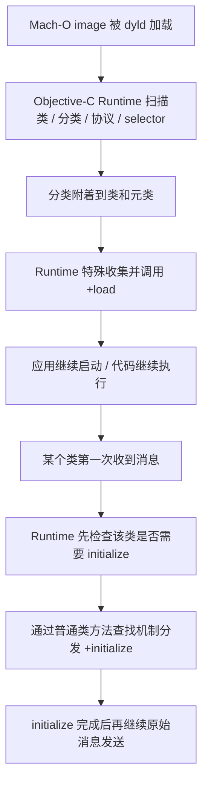

### 5.8 一句话记忆

> 分类里的 `+initialize` 也会并到元类方法列表里，`+load` 和 `+initialize` 的关键区别不在“是否合并”，而在“调用机制”：`+load` 是 image load 时 Runtime 特殊扫描并直接调用的回调，而 `+initialize` 是类第一次收到消息前，通过普通类方法查找机制懒调用的初始化方法。

---

## 6. Objective-C 为什么说是动态语言

Objective-C 不是“不编译”，而是：

**编译后仍然保留了大量信息和调度权给 Runtime。**

### 6.1 动态体现在哪

常见的动态点包括：

1. 方法调用不是静态绑定函数地址，而是经过 `objc_msgSend`
2. 类、分类、协议会在运行时注册
3. 分类会在运行时挂载到类上
4. 可以方法交换 `method swizzling`
5. 可以动态加方法 `resolveInstanceMethod:`
6. 可以消息转发

### 6.2 所以“动态”不是说什么

不是说：

- 编译后什么都没定

而是说：

- **编译后仍有一部分绑定、组装、查找、替换，是在运行时完成的**

### 6.3 一个很重要的修正

很多人会说：

> 分类都已经编译到代码段了，怎么还动态？

这里要更严谨一点：

- **方法实现代码** 会编译成机器码，放到代码相关区域
- **分类和类的关系、方法列表等信息** 是元数据

Runtime 的动态性，依赖的关键不是“那段函数代码是不是已经有了”，而是：

**这些元数据在运行时如何被读取、合并、查找、替换。**

### 6.4 `method_exchangeImplementations` 之后，消息传递机制到底变了什么

先说结论：

> `method_exchangeImplementations` 并不会把 Objective-C 的消息传递流程改成另一套流程；它改的是“某个 selector 最终命中的 IMP 是谁”。

也就是说：

- `SEL` 没变
- 查找顺序没变
- cache -> 当前类方法列表 -> 父类方法列表 -> 消息转发 这条链没变
- **变的是命中后最终执行的函数实现地址**

#### 交换前后最核心的变化

交换前：

```text
selectorA -> impA
selectorB -> impB
```

交换后：

```text
selectorA -> impB
selectorB -> impA
```

所以：

- 外面发的消息名字没变
- Runtime 查找流程没变
- 但最后 `Invoke` 跳转到的函数体变了

#### 对照消息传递流程图来看

如果对照你常见的那张“消息传递流程图”，变化点不在前面的：

- 缓存是否命中
- 当前类方法列表是否命中
- 父类方法列表是否命中

这些 YES/NO 分支结构都没变。

真正变化的是：

> **命中以后取到的 `IMP` 已经被交换了，所以最终 `Invoke` 执行的是另一段实现。**

#### 一个最直白的例子

假设有两个方法：

```objc
- (void)viewWillAppear:(BOOL)animated;      // 原方法
- (void)xxx_viewWillAppear:(BOOL)animated;  // 你的替换方法
```

交换前：

```text
viewWillAppear:      -> imp_original
xxx_viewWillAppear:  -> imp_swizzled
```

执行：

```objc
method_exchangeImplementations(m1, m2);
```

交换后：

```text
viewWillAppear:      -> imp_swizzled
xxx_viewWillAppear:  -> imp_original
```

所以外面再发：

```objc
[self viewWillAppear:YES];
```

消息分发流程照旧跑，但最终 `Invoke` 执行的是 `imp_swizzled`。

而在 swizzled 方法里如果你再写：

```objc
[self xxx_viewWillAppear:animated];
```

表面看像是在调自己，实际上由于 `SEL -> IMP` 已经交换，这里最终会跳到原来的 `imp_original`，所以不会形成你以为的那种死递归。

#### cache 这一层怎么理解

因为 `objc_msgSend` 优先查 cache，所以从效果上看，swizzle 之后后续的：

```text
selector -> IMP
```

映射也必须体现新的结果，否则 swizzle 就没有意义。

面试里最稳的说法是：

> swizzling 不只是改方法列表里的 `IMP`，从消息分发效果上看，后续 cache 命中也必须体现新的 `selector -> IMP` 映射。

#### 父类查找和消息转发变了吗

**没变。**

- 如果当前类还是找不到这个 selector，仍然会沿父类链往上找
- 如果整条继承链都找不到，仍然会进入动态方法解析、快速转发、完整消息转发

### 6.5 iOS 消息转发完整流程图

先只看“已经确认常规方法查找失败以后”的消息转发流程。

这里最容易画错的是第一步：

> `resolveInstanceMethod:` / `resolveClassMethod:` 的关键不是“返回 YES 就表示消息已处理”，而是**有没有真的把方法实现动态添加到类里，并且重查后能找到 IMP**。

如果只是：

```objc
+ (BOOL)resolveInstanceMethod:(SEL)sel {
    return YES;
}
```

但没有调用：

```objc
class_addMethod(self, sel, imp, "v@:");
```

那消息并没有被真正处理。Runtime 会重试普通方法查找，还是找不到，就继续进入后面的消息转发链。

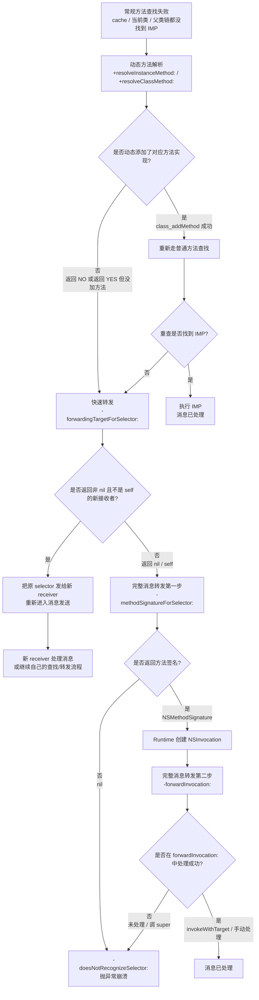

这张图的核心是：

1. `resolve...` 是**动态补方法**阶段，不是“返回 YES 就吞掉消息”
2. `class_addMethod` 添加的是**类的方法列表**
3. 添加成功后 Runtime 会**重试普通方法查找**
4. 第一次通常从方法列表找到 IMP，并顺手填充 cache
5. 第二次同一个 selector 才更可能优先命中 cache
6. 如果没补上方法，就继续走 `forwardingTargetForSelector:`、`methodSignatureForSelector:`、`forwardInvocation:`

### 6.6 iOS 消息传递 + 消息转发总流程图

下面这张图把：

- `objc_msgSend`
- cache 查找
- 当前类 / 父类方法列表查找
- 动态方法解析
- 快速转发
- 完整消息转发
- `doesNotRecognizeSelector:`

串成一条完整链路。

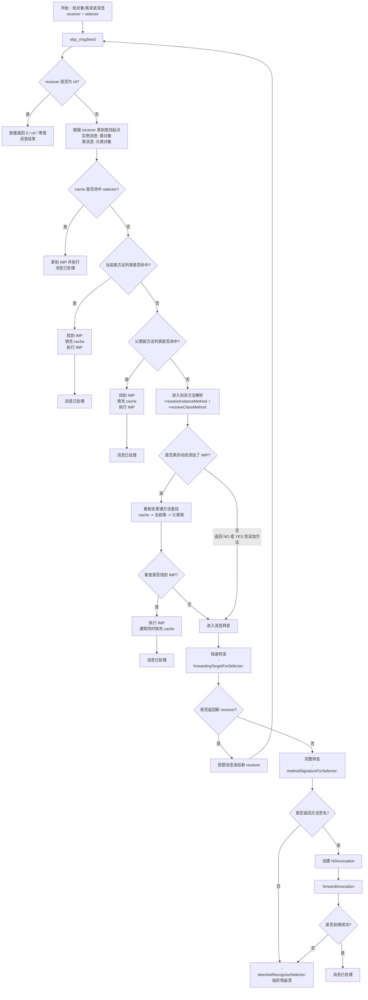

这张总图最值得记的 5 句话是：

1. **消息传递主线**：`objc_msgSend -> cache -> 当前类方法列表 -> 父类链`
2. `cache` 是加速层，不是方法定义的来源
3. `class_addMethod` 把 IMP 加到**方法列表**，后续查找到以后才可能填充到 cache
4. **找不到方法先不一定崩溃**，Runtime 会先给动态解析和消息转发机会
5. `resolve...` 只 `return YES` 但没添加方法，仍然会继续走后面的转发流程

一句话理解：

> Objective-C 消息机制不是“找不到就立刻崩”，而是“先正常查找，查不到再给 Runtime 几层补救机会”；但补救是否成功，看的是最终有没有可执行的 IMP 或有没有在转发阶段真正处理消息，而不是只看某个方法是否返回 YES。

所以：

> swizzling 改的不是“消息查找规则”，而是“查找到 selector 后执行哪一个 IMP”。

### 6.7 一张 `SEL -> IMP` 映射变化图

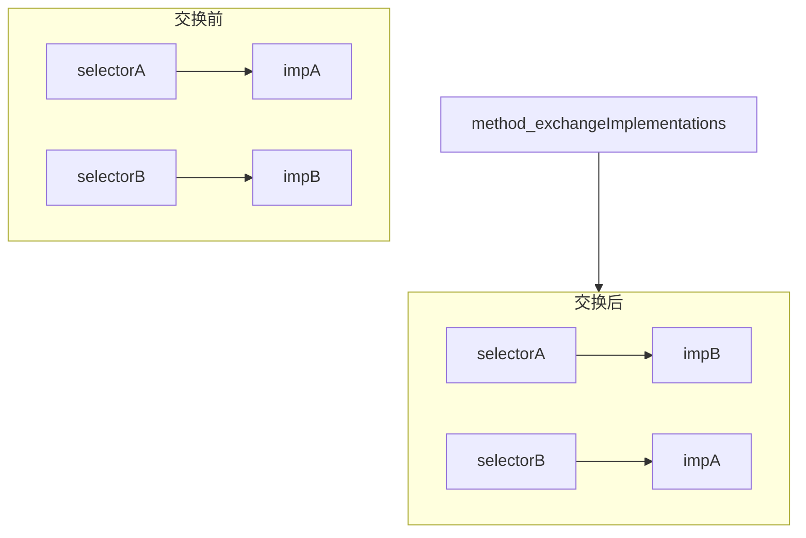

一句话记忆：

> swizzling 不是改 `objc_msgSend` 的流程，而是改“selector 最终对应哪个 IMP”，所以消息分发的大框架不变，变的是最后 `Invoke` 执行的实现。

---

## 7. 分类从源码到方法调用的完整链路

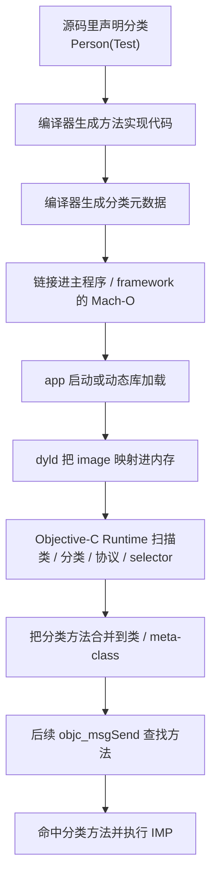

这张图最关键的点是：

- **代码和元数据在编译期就存在**
- **真正合并到类结构是在运行时**
- **最终消息发送查找也是运行时行为**

---

## 8. 一组适合直接背的面试答案

### 8.1 Objective-C 属性里有 `mutableCopy` 吗

> 没有。Objective-C 的 `@property` 没有 `mutableCopy` 这个内置关键字，常见的是 `assign`、`strong`、`weak`、`copy` 等。如果想要设置时自动做 `mutableCopy`，需要自己重写 setter。

### 8.2 分类是在 app 启动时加载，还是第一次调用时才加载

> 分类不是等到第一次调用方法时才懒加载。它的挂载时机取决于所在 Mach-O image 的加载时机：如果分类所在主程序或 framework 在 app 启动时被加载，那么分类就在启动阶段被 Runtime 合并到类上；如果分类在后续动态加载的 bundle 或动态库里，那么就在那个 image 被加载时合并。

### 8.3 分类加载后内存会释放吗

> 通常不会。分类本身不是普通 OC 对象实例，而是一份 Runtime 会读取的元数据描述。只要它所在的 image 还在进程里，这些分类元数据和方法实现通常都会常驻内存，不是加载完就释放。

### 8.4 为什么分类已经编译进二进制了，还说是运行时决议

> 因为“编译进二进制”和“运行时决议”并不矛盾。编译期只是把分类的方法实现和元数据生成出来；真正把分类挂到哪个类上、并入类的方法列表，是 Runtime 在 image 加载时做的，所以这一步仍然属于运行时决议。

### 8.5 `+load` 和 `+initialize` 在类和分类里为什么表现不同

> 分类里的 `+initialize` 其实也会合并到元类的方法列表里，和其他类方法一样；`+load` 和 `+initialize` 的根本区别不在“是否合并”，而在调用机制。`+load` 是 Runtime 在 image 加载时特殊扫描并直接调用的回调，不走普通消息发送，所以类和分类各自的 `+load` 都会执行；`+initialize` 则是在类第一次收到消息前，通过普通类方法查找机制懒调用，因此分类里的 `+initialize` 会像普通同名类方法一样参与覆盖，通常只会命中一个实现。注意如果你手动写 `[Class load]`，这就退化成一次普通类方法分发，只会执行最终查找到的那个 `+load`，不会把类和分类的 `+load` 都重新调一遍。

### 8.6 Objective-C 为什么说是动态语言

> Objective-C 的动态性不在于“不编译”，而在于编译后仍然保留大量绑定和调度给 Runtime，比如 `objc_msgSend`、分类挂载、方法交换、动态加方法和消息转发。也就是说，代码已经被编译，但类结构组装、方法查找和一部分行为决议仍然发生在运行时。

### 8.7 `method_exchangeImplementations` 之后，消息传递机制变了什么

> `method_exchangeImplementations` 不会改变 Objective-C 消息传递的查找流程，cache -> 当前类方法列表 -> 父类方法列表 -> 消息转发 这条链本身不变。它真正改变的是 selector 和 IMP 的映射关系：交换前是 `selA -> impA, selB -> impB`，交换后变成 `selA -> impB, selB -> impA`。所以从消息传递流程图上看，变化点不在前面的查找分支，而在“命中后拿到哪个 IMP”以及最终 `Invoke` 执行哪个实现。  

### 8.8 Objective-C 消息传递和消息转发的完整主线是什么

> Objective-C 发消息时先走 `objc_msgSend`，然后按 `cache -> 当前类方法列表 -> 父类方法列表` 这条主线查找实现；如果整条继承链都没找到，不会立刻崩溃，而是先进入动态方法解析 `resolve...`，再进入快速转发 `forwardingTargetForSelector:`，最后进入完整消息转发 `methodSignatureForSelector:` + `forwardInvocation:`。如果这些补救步骤都失败，最终才会走 `doesNotRecognizeSelector:` 崩溃。要注意：`resolve...` 阶段真正有用的是“动态添加了方法并能重查到 IMP”，不是单纯返回 `YES`。  

### 8.9 `resolveInstanceMethod:` 返回 YES 但不添加方法，会怎样

> 不会死循环，也不代表消息已经处理成功。Runtime 会认为动态解析阶段已经尝试过，然后重试一次普通方法查找；如果仍然找不到 IMP，就继续进入 `forwardingTargetForSelector:`、`methodSignatureForSelector:`、`forwardInvocation:` 这条消息转发链。只有在 `resolveInstanceMethod:` 里通过 `class_addMethod` 真的把方法实现加到类的方法列表，并且重查找能找到 IMP，消息才会在这个阶段被处理。  

### 8.10 `class_addMethod` 添加的方法是进 cache 还是进方法列表

> `class_addMethod` 添加的是类的方法列表，不是直接塞进 Runtime 的方法 cache。添加成功并返回 `YES` 后，Runtime 会重新走普通方法查找；第一次通常从方法列表里找到这个 IMP，然后执行并填充 cache。后续同一个 selector 再发送时，才更可能优先命中 cache。  

---

## 9. Swift 是动态语言吗，它也有运行时特性吗

先说结论：

**Swift 不算典型的动态语言，但 Swift 也确实有运行时特性。**

更准确地说：

- Swift 是一门以**静态类型、编译期决议**为主的语言
- 但它也保留了一部分运行时能力，用来支撑类型系统、协议、多态、泛型和与 Objective-C 的互操作

### 9.1 为什么说 Swift 不是典型动态语言

Swift 的主设计方向是：

- 静态类型检查
- 更多编译期确定
- 更多值类型
- 更强的类型安全
- 尽量使用静态分发或更高效的调用路径

所以和 Objective-C 相比：

- Objective-C 更依赖 Runtime 做消息发送和行为决议
- Swift 更依赖编译器在编译期提前把很多事情定下来

因此面试里最稳的说法是：

> Swift 不是像 Objective-C 那样的典型动态语言，它主要是静态语言，但具备部分运行时能力。

### 9.2 Swift 有哪些运行时特性

虽然 Swift 没有 Objective-C 那么“动态”，但它并不是完全没有运行时。

#### 1. 类型元数据（Type Metadata）

Swift 在运行时会维护类型相关信息，比如：

- 当前对象的真实类型
- 泛型实例化后的类型信息
- 某些继承和布局信息

这也是为什么可以做：

```swift
type(of: obj)
```

#### 2. 协议一致性和 witness table

Swift 协议调用很多时候并不是简单的静态函数调用。

底层会涉及：

- protocol conformance metadata
- witness table

这本身就是 Swift Runtime 的一部分。

#### 3. 动态派发仍然存在

Swift 不是所有调用都静态分发。

这些场景里仍然可能存在动态派发：

- `class` 可重写方法
- `protocol` 类型调用
- `@objc dynamic`
- 与 Objective-C Runtime 互操作的方法

所以 Swift 只是“动态性更弱”，不是“完全没有动态派发”。

#### 4. 反射能力

Swift 有 `Mirror`：

```swift
Mirror(reflecting: value)
```

可以拿到：

- 属性
- 子节点
- 某些类型结构信息

只是它的反射能力通常不如 Objective-C Runtime 那么强。

#### 5. 泛型运行时支持

Swift 泛型不是简单的“完全擦除”。

很多场景里，运行时仍然会保留：

- 泛型参数相关元数据
- 协议一致性信息
- 特化/实例化后的支持结构

#### 6. 与 Objective-C Runtime 的桥接

如果你写：

```swift
@objc dynamic
class func foo() {}
```

或者类型继承自 `NSObject`，那么很多行为会进入 Objective-C Runtime 世界，例如：

- selector
- `responds(to:)`
- KVC / KVO
- method swizzling（通常只限 `@objc dynamic` 那套）

这说明 Swift 在 Apple 平台上，某些场景下也会借助 Objective-C Runtime。

### 9.3 Swift 和 Objective-C 的运行时差别

可以直接这样对比：

#### Objective-C Runtime 更强的地方

- `objc_msgSend`
- 分类运行时挂载
- 动态加方法
- 消息转发
- method swizzling
- 关联对象
- KVC/KVO 深度依赖 Runtime

#### Swift Runtime 更偏支持型

- 类型元数据
- 协议 witness table
- 泛型支持
- 有限反射
- 某些类方法的动态派发
- 与 Objective-C Runtime 的桥接

一句话理解：

> Objective-C 的 Runtime 更像“语言核心机制的一部分”；Swift 的 Runtime 更像“语言实现和高级特性支持层的一部分”。

### 9.4 为什么这不矛盾

有些同学会把“有运行时”直接等同于“动态语言”，这不准确。

更准确的是：

- Swift 仍然是静态类型语言
- 编译器在 Swift 里做了大量提前决议
- 但为了支撑多态、协议、泛型、反射和桥接，它仍然需要运行时系统

所以：

**Swift 是以静态为主，但具备部分运行时能力；Objective-C 是动态性更强、Runtime 参与更深。**

### 9.5 Objective-C 方法调用 vs Swift 方法调用 vs 各自 hook 点

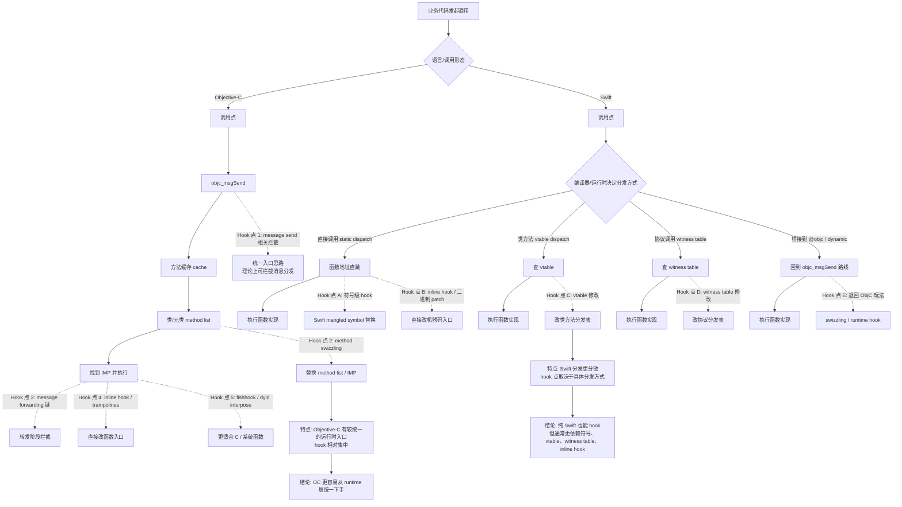

### 9.6 为什么 Swift hook 比 Objective-C 更分散

核心原因不是“Swift 不能 hook”，而是：

> Swift 没有像 Objective-C 那样一个特别统一、特别好下手的消息发送总入口。

#### Objective-C 为什么相对集中

很多 Objective-C 实例方法调用，最终都会收敛到：

- `objc_msgSend`
- cache 查找
- method list

所以常见 hook 思路会比较集中在：

- swizzling
- 消息转发
- `IMP` 替换
- 函数入口拦截

#### Swift 为什么更分散

Swift 里的调用可能走很多不同分发方式：

- 静态分发
- vtable 分发
- witness table 分发
- `@objc dynamic` 桥接回 Objective-C Runtime
- 编译器内联
- 泛型特化后的专用实现

所以你做 Swift hook 时，第一步通常不是“直接像 OC 一样 swizzle”，而是先判断：

> 这段调用到底是怎么分发的。

#### 对 hook 的直接影响

这会导致 Swift 的 hook 点更分散：

- 有的要改符号入口
- 有的要改 vtable
- 有的要改 witness table
- 有的只能做 inline hook / 二进制 patch
- 有的如果桥接到了 `@objc`，又可以退回 Objective-C 那套玩法

一句话记忆：

> Objective-C 更像“很多路最终汇到一条总干道”；Swift 更像“分成多条支路，得先判断你当前走的是哪一条”。

---

## 10. 一组适合直接背的 Swift/OC 对照答案

### 10.1 Swift 是动态语言吗

> 不是典型动态语言。Swift 本质上是静态类型语言，很多信息尽量在编译期确定，但它保留了部分运行时能力。  

### 10.2 Swift 有运行时特性吗

> 有。Swift 有类型元数据、协议 witness table、部分类方法的动态派发、`Mirror` 反射、泛型运行时支持，以及通过 `@objc dynamic` 与 Objective-C Runtime 的互操作能力。  

### 10.3 Swift 和 Objective-C Runtime 的最大区别是什么

> Objective-C 的 Runtime 更像语言核心机制的一部分，很多行为依赖消息发送和运行时决议；Swift 则是以静态为主，Runtime 更多是为类型系统、协议、多态、泛型和桥接提供支持。  

### 10.4 一句话总结 OC 和 Swift 的动态性差别

> Objective-C 是动态性更强、Runtime 参与更深的语言；Swift 主要是静态语言，但具备一部分运行时特性。  

### 10.5 为什么 Swift hook 比 Objective-C 更分散

> Objective-C 很多方法调用最终都会收敛到 `objc_msgSend` 这条主线，所以 hook 点相对集中；Swift 则可能走静态分发、vtable、witness table、`@objc dynamic` 桥接、内联和泛型特化等多条路径，所以纯 Swift 代码也能 hook，但通常要先判断具体分发方式，再决定从符号、vtable、witness table 还是机器码入口下手。  

---

## 11. Objective-C 内存管理里的 Tagged Pointer / non-pointer isa / SideTable

这一块最容易混的点是：

- `Tagged Pointer`
- `non-pointer isa`
- `SideTable` 散列表

看起来像 3 套平级方案，但更准确地说，它们是**分层决策**。

### 11.1 先说最稳的总结构

不是编译器在三选一，而主要是 **Runtime / Foundation 在运行时分层决定**：

1. **对象创建时**
   - 先判断这个值能不能做成 `Tagged Pointer`
2. **如果不能做成 `Tagged Pointer`**
   - 那它就是普通堆对象
   - 在现代 64 位 Objective-C Runtime 下，普通堆对象默认采用 **`non-pointer isa`**
3. **普通堆对象后续在运行过程中**
   - 如果对象头里的内联信息不够了
   - 或者遇到弱引用、引用计数溢出等特殊情况
   - 再借助 **`SideTable` 散列表** 做补充存储

一句话记忆：

> 先判断“能不能是 Tagged Pointer”；如果不是，就走普通堆对象；普通堆对象里再是“`non-pointer isa` 优先，`SideTable` 兜底”。

### 11.2 `Tagged Pointer` 用得多吗

**很多。**

但它主要是系统在 Foundation 层自动帮你用，业务代码一般不会手动指定“这个对象必须是 tagged pointer”。

常见应用对象通常包括：

- `NSNumber`
- 短字符串 `NSString`
- 某些小型 `NSDate`

它特别适合：

- 对象数量很多
- 生命周期短
- 值本身很小
- 不可变
- 创建/销毁特别频繁

比如：

- 列表里大量小整数
- 很多短文本
- 高频生成的小日期对象

### 11.3 `Tagged Pointer` 的核心特点

它的本质不是：

```text
指针 -> 堆上的对象内存
```

而更像：

```text
指针值本身 = 标记位 + 类型位 + payload 数据
```

也就是说：

- 很多时候**没有单独堆对象**
- 也就不需要普通对象那种 `malloc -> retain/release -> dealloc -> free` 完整流程

#### 优点

- 不需要单独 `malloc`
- 不需要额外堆内存
- 创建/销毁成本低
- `retain/release` 开销通常很轻
- 对高频小对象特别友好

#### 限制

- 只能承载足够小的值
- 只对少数支持 tagged pointer 的类启用
- 一般更适合不可变对象
- 具体编码方式属于系统实现细节，业务代码不应依赖

### 11.4 `Tagged Pointer` 的“对象”在栈里、堆里还是哪里

这个问题要分两层：

1. **指针变量本身放在哪**
2. **这个“对象内容”是否有单独堆内存**

比如：

```objc
NSNumber *num = @42;
```

这里：

- `num` 这个局部变量本身通常在**栈上**
- 但 `num` 里装的值如果是 tagged pointer，那它**不是一个再指向堆对象的普通地址**

如果这个指针值放在：

- 局部变量里，它就在栈上
- 对象的 ivar / property 里，它就在那个堆对象的内存里
- 全局变量里，它就在全局区

所以更准确的说法是：

> `Tagged Pointer` 不是在讨论“指针变量在栈里还是堆里”，而是在说“这个指针值本身就编码了对象内容，不需要再指向一块普通堆对象内存”。

### 11.5 `Tagged Pointer` 怎么“释放”，还有 strong/weak 这种说法吗

#### 1. 它怎么释放

通常没有“释放堆对象”这一步。

因为：

- 它本来就没有单独的堆对象
- 值直接编码在指针里

所以当变量生命周期结束时，本质上只是：

- 这个指针值不再被使用
- 或者保存它的那块内存被新值覆盖

Runtime 在 `retain/release` 时会先识别它是不是 tagged pointer：

- 如果是，通常走很轻的快速路径
- 不会去 `dealloc/free` 一块堆对象

#### 2. 还有 strong/weak 这种说法吗

**从代码语义上有，从底层对象生命周期上没那么重要。**

比如：

```objc
@property (nonatomic, strong) NSNumber *count;
```

这里的 `strong` 语义仍然成立，因为这是**变量的持有语义**。  
但如果这个 `NSNumber` 实际上是 tagged pointer，Runtime 不会按普通堆对象那套管理方式去真的回收一块对象内存。

所以更准确地说：

> `strong/weak` 说的是“变量怎么持有值”，不是说“这个值背后一定对应一块普通堆对象”。

### 11.6 它是不是只给“临时变量 + 常量值”用

**不是。**

`Tagged Pointer` 不是由“是不是临时变量”决定的，也不是由“是不是编译期常量”决定的。

真正更像是由这几件事决定：

1. 这个类是否支持 tagged pointer
2. 这个值是否足够小，能塞进指针 payload 里
3. 当前系统/架构/Runtime 是否启用了这套优化

所以这些场景都可能拿到 tagged pointer：

```objc
NSNumber *a = @(42);
self.count = @(42);
[array addObject:@(42)];
NSDictionary *dict = @{@"n": @(42)};
```

即使值不是编译期常量，也可能是：

```objc
NSInteger x = arc4random_uniform(100);
NSNumber *n = @(x);
```

这里 `x` 是运行时算出来的，但只要值足够小、类型支持，仍然可能是 tagged pointer。

### 11.7 10 个常见“可能命中 Tagged Pointer”的例子

下面这些更准确的说法是：**常见可能命中 tagged pointer 的例子，不是 100% 保证。**

1. `@(0)`
2. `@(1)`
3. `@(42)`
4. `@(-7)`
5. `@(YES)`
6. `@(3.14)`
7. `@(123456)`
8. 短字符串 `@"a"`
9. 短字符串 `@"hello"`
10. `[NSDate dateWithTimeIntervalSince1970:0]`

如果你想在实验里观察，可以打印类名或对象地址特征，但这些都属于实现细节，不应该作为业务依赖。

### 11.8 `non-pointer isa` 是什么

普通堆对象创建出来以后，对象头里会有 `isa`。

传统上 `isa` 更像“纯类指针”，但现代 64 位 Objective-C Runtime 里，它通常是 **non-pointer isa**，也就是：

- 类信息
- 一些对象状态位
- 部分引用计数信息

会被压在一个机器字里。

也就是说，普通堆对象仍然是：

```text
堆对象:
[ isa | ivars... ]
```

只是这里的 `isa` 不再只是“单纯指向类对象的裸指针”。

它优化的重点是：

- 更快拿到类信息
- 内联一部分对象状态
- 内联一部分引用计数
- 尽量减少额外查表成本

### 11.8.1 `Tagged Pointer` 和 `non-pointer isa` 都是 64 位吗

在 **64 位 iOS Runtime** 下，可以近似理解成：**是的，它们都基于 64 位机器字**，但不是同一个位置。

#### `Tagged Pointer`

这里说的是：

- 变量里保存的“对象指针值”本身
- 在 64 位进程里，指针宽度就是 64 位
- Runtime 会在这 64 位里编码：
  - 标记位
  - 类型信息
  - payload 数据

#### `non-pointer isa`

这里说的是：

- 普通堆对象头里的 `isa` 字段
- 在 64 位进程里，这个字段通常也是一个 64 位机器字
- 只是这里面编码的是：
  - 类信息
  - 状态位
  - 一部分引用计数位

所以最重要的一句话是：

> `Tagged Pointer` 用的是“对象指针值本身”的 64 位；`non-pointer isa` 用的是“普通堆对象头里的 isa 字段”的 64 位。它们都可以说是 64 位，但不是同一个位置。

### 11.8.2 什么叫“isa 里的内联引用计数不够了”

对普通堆对象来说，Runtime 不会把全部引用计数都单独放到外部表里，而是通常先把**一部分引用计数位直接塞进 `isa` 里**。这就叫：

- 内联引用计数
- 或者：对象头里自带的一小段引用计数存储空间

但 `isa` 里的空间有限，因为它还要装：

- 类信息
- `deallocating`
- `weakly_referenced`
- `has_assoc`
- `has_sidetable_rc`
- 以及其他状态位

所以：

> “内联引用计数不够了”，就是对象的 retain/strong 持有计数继续增加时，`isa` 里给引用计数预留的 bit 已经装不下了。

这时候 Runtime 才会把多出来的那部分信息放到 `SideTable` 里。

你可以把它理解成：

- `isa` 里先放一个小计数器
- 小计数器满了，再去外面查账本

### 11.8.3 这里的“引用计数”指的是什么

这里说的引用计数，指的是：

**对象当前被 retain / strong 持有的大致计数值。**

但要注意：

1. 这个值不一定等于你源码肉眼能数出来的变量个数
2. 也不适合拿来精确推理业务逻辑

因为它还会受这些影响：

- ARC 优化
- autorelease 池
- 容器持有
- 临时对象
- bridge 行为
- Runtime 自身实现细节

所以更稳的理解是：

> Runtime 维护的是“计数值”和“对象状态”，而不是一张精确的人类可读引用名单。

### 11.8.4 能看到“是哪几个 strong 指针在引用这个对象”吗

**通常不能。**

Runtime 更像只知道：

```text
这个对象当前大概被持有了 N 次
```

但它不会记录：

- 是哪个局部变量持有的
- 是哪个 ivar / property 持有的
- 是哪个数组元素持有的
- 是哪个全局变量持有的

因为如果要维护“所有谁在引用我”的完整反向列表，代价太高了。

所以：

- `retainCount` / `isa` / `SideTable` 维护的是数量和状态
- **不维护完整的 strong 引用来源清单**

如果你在 Xcode 里看到引用链，那通常是：

- `Memory Graph`
- Instruments
- 调试器扫描对象图

这些工具在帮你“还原引用关系”，不是对象自己存了一张“谁引用我”的名单。

### 11.8.5 为什么 weak 引用要借助外部表

因为 weak 不只是一个“数量”问题，而是需要一张：

```text
对象地址 -> 所有 weak 指针位置
```

的映射表。

这样对象销毁时，Runtime 才知道去哪里把这些 weak 指针自动置为 `nil`。

这类信息显然不可能塞进 `isa` 那几十个位里，所以必须借助外部结构，这也是 `SideTable` 一类弱引用表存在的重要原因之一。

### 11.8.6 有弱引用表，那有强引用表吗？有 `unsafe_unretained/assign` 表吗

#### 1. 没有“强引用表”

Runtime 通常不会维护：

```text
对象地址 -> 所有 strong 指针位置
```

这种完整的反向引用清单。

它更关心的是：

- 这个对象当前大致还活不活
- retain/strong 计数有没有归零
- 对象是不是正在释放

所以：

> 有 weak 表，但没有对应意义上的 strong 表。

#### 2. 也没有 `unsafe_unretained/assign` 表

因为这两种语义都不要求 Runtime 帮你善后。

- `unsafe_unretained`：不增加引用计数，对象释放后也不会自动置 `nil`
- `assign`：对对象来说，效果和 `unsafe_unretained` 很像；对基础类型则只是普通赋值

所以它们只是：

> 一个普通指针值拷贝，不会登记到 weak 表，也没有单独的 assign/unsafe 表。

### 11.8.7 普通堆对象 + 3 个 strong + 3 个 weak 的关系图

下面这张图最适合回答：

- 一个对象有 3 个 strong，是不是 3 个对象？
- weak 表到底在记录什么？
- strong / weak / unsafe 槽位和堆对象是什么关系？

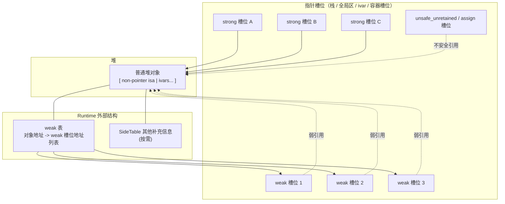

这张图要这样读：

- `3 strong`：只是 3 个不同位置的指针槽位，保存同一个对象地址
- `3 weak`：也是 3 个槽位，但 Runtime 会把这些槽位地址登记到 weak 表
- `unsafe_unretained/assign`：只是普通裸指针，不登记，也不会自动置 `nil`

所以一个对象有 3 个 strong 引用时：

> 仍然只有 **1 个堆对象**、**1 个 `isa` 字段**，不是 3 个 `non-pointer isa` 对象。

### 11.8.8 Tagged Pointer + 3 个 strong + 3 个 weak 的关系图

和普通堆对象相比，`Tagged Pointer` 最大的不同是：

- 通常没有普通堆对象
- 没有对象头里的 `isa`
- 指针值本身就编码了对象内容

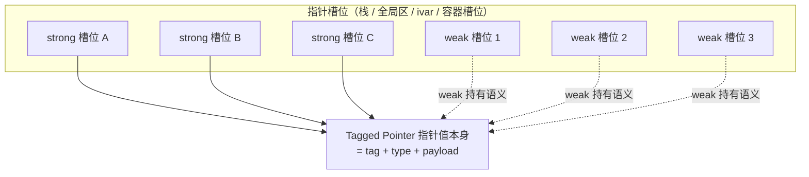

这张图的关键结论是：

- `strong/weak` 外层仍然是“指针槽位”
- 这些槽位里保存的可能是同一个 tagged pointer 编码值
- 但这里通常没有普通堆对象可释放，也通常不需要普通堆对象那种 weak 表清理流程

所以：

> `Tagged Pointer` 不是“不能 weak”，而是“可以有 weak 变量指向它，只是通常不需要普通堆对象那套 weak 表和释放时置 nil 流程”。

### 11.8.8.1 局部 tagged pointer 赋给单例 strong 属性，会不会随着栈变量销毁而失效

不会。

关键点是：

> `singleton.num = a;` 保存的是 `a` 里面的“指针值”，不是保存 `a` 这个局部变量槽位的地址。

示例代码：

```objc
void foo(void) {
    NSNumber *a = @(3);
    singleton.num = a;
}
```

如果 `@(3)` 命中了 tagged pointer，`a` 只是栈上的一个局部变量槽位，槽位里装着 tagged pointer 编码值。

赋值前：

```text
栈内存：foo 的栈帧

NSNumber *a
┌────────────────────────────┐
│ 0xb000000000000032         │
│ tagged pointer 编码值       │
└────────────────────────────┘
```

执行：

```objc
singleton.num = a;
```

strong setter 的语义仍然是“持有新值、释放旧值、保存新值”，但对 tagged pointer 来说，`retain/release` 通常是轻量快速路径，不会真的管理一块堆对象内存。最终效果更像：

```text
栈内存：foo 的栈帧

NSNumber *a
┌────────────────────────────┐
│ 0xb000000000000032         │
└────────────────────────────┘
              │
              │ 复制这个指针值
              ▼

堆内存：单例对象

Singleton object
┌────────────────────────────┐
│ isa                        │
├────────────────────────────┤
│ _num                       │
│ 0xb000000000000032         │
│ tagged pointer 编码值       │
└────────────────────────────┘
```

`foo` 返回以后，消失的是 `a` 这个栈变量槽位：

```text
foo 栈帧销毁
NSNumber *a 变量槽位不存在了
```

但单例里的 `_num` 仍然保存着那份 tagged pointer 编码值：

```text
堆内存：单例对象

Singleton object
┌────────────────────────────┐
│ isa                        │
├────────────────────────────┤
│ _num                       │
│ 0xb000000000000032         │
└────────────────────────────┘
```

它不会变成悬垂指针，因为 `_num` 没有指向 `a` 这个局部变量，而是复制了 `a` 里面的值。可以类比：

```objc
NSInteger x = 3;
singleton.value = x;
```

局部变量 `x` 结束后没了，但 `singleton.value` 里已经保存了一份 `3`。

#### 同一行代码在普通堆对象下是什么样

如果值不能编码成 tagged pointer，例如：

```objc
void foo(void) {
    NSNumber *a = @(999999999999999999);
    singleton.num = a;
}
```

这时 `a` 里装的是普通堆对象地址：

```text
栈内存：foo 的栈帧

NSNumber *a
┌────────────────────────────┐
│ 0x600003a812c0             │
│ NSNumber 堆对象地址         │
└────────────────────────────┘
              │
              │ 指向
              ▼

堆内存：NSNumber 对象

NSNumber object at 0x600003a812c0
┌────────────────────────────┐
│ isa_t                      │
│ non-pointer isa            │
│ class bits + flags + rc    │
├────────────────────────────┤
│ 数值存储                   │
│ 999999999999999999         │
└────────────────────────────┘
```

执行 `singleton.num = a;` 后，strong 属性保存同一个堆对象地址，并让该对象引用计数增加：

```text
栈内存：foo 的栈帧

NSNumber *a
┌────────────────────────────┐
│ 0x600003a812c0             │
└────────────────────────────┘
              │
              │
              ▼

堆内存：NSNumber 对象

NSNumber object at 0x600003a812c0
┌────────────────────────────┐
│ non-pointer isa            │
│ 里面可能包含引用计数信息     │
├────────────────────────────┤
│ 数值存储                   │
└────────────────────────────┘
       ▲
       │
       │ 同一个对象地址
       │
堆内存：单例对象

Singleton object
┌────────────────────────────┐
│ isa                        │
├────────────────────────────┤
│ _num                       │
│ 0x600003a812c0             │
└────────────────────────────┘
```

`foo` 返回以后，`a` 这个栈变量没了，但堆上的 `NSNumber` 仍然活着，因为单例的 strong 属性还保存着它的对象地址，并对它形成强持有。

所以两种情况都安全：

```text
tagged pointer:
_num 里存的是“对象值本身的编码”
没有 NSNumber 堆对象要保活

普通堆对象:
_num 里存的是“NSNumber 堆对象地址”
strong retain 这个堆对象，保证它继续活着
```

### 11.8.9 一张总关系图：普通堆对象路径 vs Tagged Pointer 路径

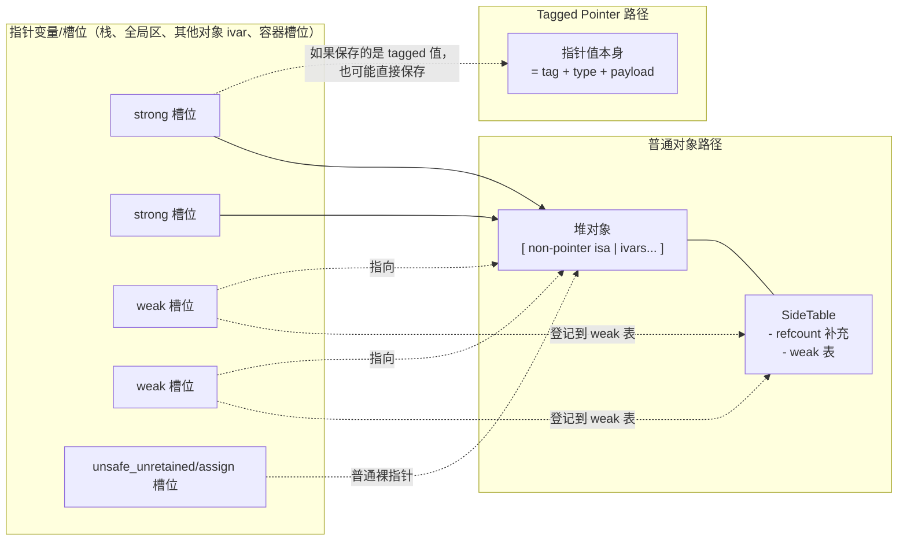

这张图最适合串起来记：

- 普通堆对象路径：`指针槽位 -> 堆对象 -> SideTable(按需)`
- tagged pointer 路径：`指针槽位 -> 指针值本身就是对象`

### 11.8.10 autorelease pool 到底在管理什么

`autorelease pool` 管的不是“所有堆对象”，而是：

> **那些收到了 `autorelease` 的对象指针。**

也就是说，pool 里保存的不是对象本体，而是：

```text
以后需要再补一次 release 的对象地址
```

底层可以粗略理解为当前线程维护一组 `AutoreleasePoolPage`，page 之间有 parent/child 关系，page 内部像栈一样记录对象指针和边界标记。它不是“每个对象自己挂进一个双向链表节点”那种模型。

更像这样：

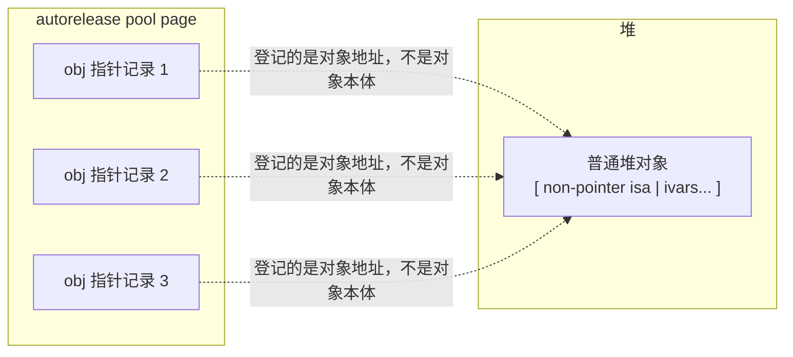

当 pool drain 时，会对这些登记进去的对象逐个发送一次 `release`：

- 如果对象此时没有别的 strong 持有了，就可能 `dealloc/free`
- 如果还有别的 strong 持有，它就继续活着

所以最稳的理解是：

> `autorelease pool` 更像“延迟 release 的待办列表”，不是“对象生命总管理中心”。

### 11.8.10.1 引用计数归零的判断在哪里，是 autorelease pool 做的吗

不是。

**引用计数是否归零，是在 `release` 过程中判断的。**

可以把流程粗略理解成：

```objc
[obj release];
```

Runtime 内部会进入类似 `objc_release` / `rootRelease` 的逻辑：

1. 先判断是不是 tagged pointer
   - 如果是，通常直接走快速路径，不做普通引用计数管理
2. 如果是普通堆对象，把引用计数减 1
   - 引用计数可能在 `non-pointer isa` 的内联位里
   - 也可能有一部分在 `SideTable` 里
3. 如果减完发现没有强持有了
   - 进入 `dealloc`
   - 清理 strong ivar、weak 表、关联对象等
   - 最后释放堆内存

而 `autorelease pool` 做的事情只是：

```text
先记住这个对象指针
等 pool drain 时，再对它发送一次 release
```

所以如果某个对象是 autoreleased 的，真正发生“引用计数减 1、判断是否为 0、是否 dealloc/free”的地方，仍然是 pool drain 时触发的那次 `release` 里面。

一句话记忆：

> autorelease pool 不负责判断引用计数是否归零；它只负责延迟触发 `release`。归零判断和释放触发点在 Runtime 的 `release` 实现里。

### 11.8.10.2 ARC 里还能有 autorelease 吗

有。

ARC 下不能手写：

```objc
[obj retain];
[obj release];
[obj autorelease];
```

但 ARC 不是取消了这些语义，而是由编译器和 Runtime 自动插入对应调用，例如：

```text
objc_retain(...)
objc_release(...)
objc_autorelease(...)
objc_autoreleaseReturnValue(...)
objc_retainAutoreleasedReturnValue(...)
objc_storeStrong(...)
objc_storeWeak(...)
objc_loadWeakRetained(...)
objc_autoreleasePoolPush()
objc_autoreleasePoolPop()
```

最典型的 autorelease 场景是：

> 方法内部创建了一个 `+1` 对象，但方法名不属于 `alloc/new/copy/mutableCopy` 家族，返回值按约定要交给调用方一个 `+0` 对象。

例如：

```objc
- (NSString *)name {
    NSString *s = [[NSString alloc] initWithFormat:@"abc"];
    return s;
}
```

`[[NSString alloc] init...]` 得到的是 `+1`，但 `-name` 不是拥有返回方法族，所以返回值语义应该是 `+0`。ARC 会在生成代码时做类似：

```text
return objc_autoreleaseReturnValue(s);
```

调用方如果马上用 strong 变量接住：

```objc
NSString *x = [obj name];
```

编译器可能生成类似：

```text
x = objc_retainAutoreleasedReturnValue([obj name]);
```

这两个 runtime 调用之间有返回值优化，很多时候可以避免对象真的进入 autorelease pool，但语义上仍然是“把 callee 的 `+1` 返回调整成 caller 看到的 `+0` 返回”。

所以：

> ARC 里没有你手写的 `[obj autorelease]`，但仍然有编译器插入的 autorelease 语义和 Runtime 调用。

### 11.8.10.3 ARC 编译器常见会插入什么

下面这些不是一一对应的固定源码替换，而是帮助理解 ARC 生成代码时会维护哪些所有权语义。

#### 1. 局部 strong 变量离开作用域

```objc
NSObject *obj = [[NSObject alloc] init];
```

如果对象是 `alloc/init` 得到的 `+1` 对象，ARC 通常不需要额外 retain，但会在变量生命周期结束时释放：

```text
作用域结束时:
objc_storeStrong(&obj, nil)
```

#### 2. strong 属性或 strong ivar 赋值

```objc
self.obj = newObj;
_obj = newObj;
```

语义类似：

```text
retain 新值
release 旧值
保存新值
```

Runtime 层常见形式是：

```text
objc_storeStrong(&_obj, newObj)
```

#### 3. weak 变量存储和读取

```objc
__weak id weakObj = obj;
id x = weakObj;
```

ARC 会通过 weak runtime 维护弱引用表，常见调用包括：

```text
objc_storeWeak(&weakObj, obj)
objc_loadWeakRetained(&weakObj)
objc_release(tmp)
```

这样可以避免读取 weak 的瞬间对象刚好被释放导致不安全。

#### 4. 方法返回值所有权

方法族决定返回值是 `+1` 还是 `+0`：

```text
alloc / new / copy / mutableCopy -> 通常返回 +1
普通方法名 -> 通常返回 +0
```

如果普通方法内部返回了一个新建的 `+1` 对象，ARC 会用 `objc_autoreleaseReturnValue` 一类调用把它调整成 `+0` 返回。

#### 5. block 捕获对象

```objc
id obj = self.obj;
self.block = ^{
    NSLog(@"%@", obj);
};
```

block 捕获强引用对象时，block 被 copy 到堆上会 retain 捕获对象；block 销毁时会 release 捕获对象。如果捕获的是 `__weak`，则不会强持有。

#### 6. `dealloc`

ARC 下可以写：

```objc
- (void)dealloc {
    // 清理 C 资源、移除通知、关闭文件等
}
```

但不能手写：

```objc
[super dealloc];
```

编译器会自动处理 strong ivar 的释放，并自动衔接父类 `dealloc`。你只负责清理 ARC 管不到的非 Objective-C 资源。

#### 7. `@autoreleasepool`

```objc
@autoreleasepool {
    ...
}
```

编译器会生成类似：

```text
void *token = objc_autoreleasePoolPush();
...
objc_autoreleasePoolPop(token);
```

所以 `@autoreleasepool` 是显式边界，池里具体什么时候登记对象，则来自 ARC、Runtime 和返回值所有权规则。

### 11.8.11 Tagged Pointer 会进 autorelease pool 吗

通常不会按普通堆对象那样真正进 pool 管理。

因为：

- `Tagged Pointer` 往往没有普通堆对象
- 也没有真正的 `dealloc/free` 流程
- `autorelease` 对它通常更接近轻量快速路径，而不是“登记进 pool，稍后再 release 一次”

所以你可以把它记成：

> 普通堆对象进 autorelease pool，是为了后面真的补一次 `release`；`Tagged Pointer` 通常没有这件事可做，所以一般不需要像普通堆对象那样被 pool 真正托管。

### 11.8.11.1 Tagged Pointer 没有普通 `isa` 字段，那它怎么走 `objc_msgSend`

这里最容易混的点是：

- `Tagged Pointer` 没有普通堆对象头里的 `isa` 字段
- 但它**不是没有类**

更准确地说：

> `Tagged Pointer` 的类信息不是放在“对象头里的 isa 字段”里，而是由 Runtime 从指针值本身的 tag/type 信息解码出来。

#### 普通堆对象的消息发送

普通对象大致是：

```text
对象内存 = [ isa | ivars... ]
```

发送消息时，大致会：

1. 读取对象头里的 `isa`
2. 拿到类对象
3. 在类缓存 / 方法列表里查实例方法
4. 找不到再沿 `superclass` 往上查

#### Tagged Pointer 的消息发送

对 tagged pointer，Runtime 会先走一条特殊分支：

1. 判断接收者是不是 tagged pointer
2. 如果是，就不去读对象头里的 `isa`
3. 而是从指针值本身解出：
   - 这是 tagged pointer
   - 它属于哪种对象类型
4. 再通过内部的 tagged class table 拿到对应的类对象
5. 拿到类对象后，后面的实例方法查找流程就和普通对象一样了

所以：

> `Tagged Pointer` 不是“没有 class”，而是“class 不是从普通对象头里的 isa 字段取出来的，而是由 Runtime 从指针编码里解出来的”。

#### 以 `NSNumber *s = @12` 为例

如果 `@12` 命中了 tagged pointer，可以粗略理解成：

```text
s 这个指针值
= [tagged 标记][NSNumber 类型槽位][payload = 12]
```

当你调用：

```objc
[s description];
```

Runtime 大致会：

1. 发现 `s` 是 tagged pointer
2. 从 `s` 的 bit 模式里读出“这是 `NSNumber` 这一类”
3. 从 tagged class table 拿到 `NSNumber` 的类对象
4. 去 `NSNumber` 的类缓存 / 方法列表里找 `description`
5. 命中后执行对应 `IMP`

#### 元类对象是怎么找到的

这里还要再澄清一句：

> 实例对象消息发送时，先关心的是“它属于哪个类对象”；类方法查找时，才需要再通过类对象的 `isa` 找到元类对象。

所以对 tagged pointer 的链路更准确地说是：

```text
tagged 实例
-> Runtime 解出类对象
-> 实例方法查找
```

如果后面需要找类方法，才继续：

```text
类对象
-> 类对象自己的 isa
-> 元类对象
```

#### 一张流程图

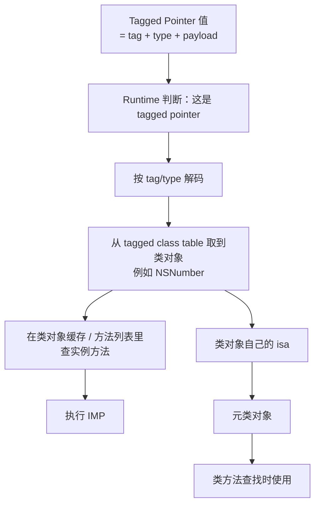

### 11.8.11.2 从指针变量、强引用、对象内存、isa 到 `objc_msgSend`/消息转发的一张总图

如果把前面几张图和消息传递流程全部串起来，可以把 Objective-C 对象世界粗略理解成下面这张总图：

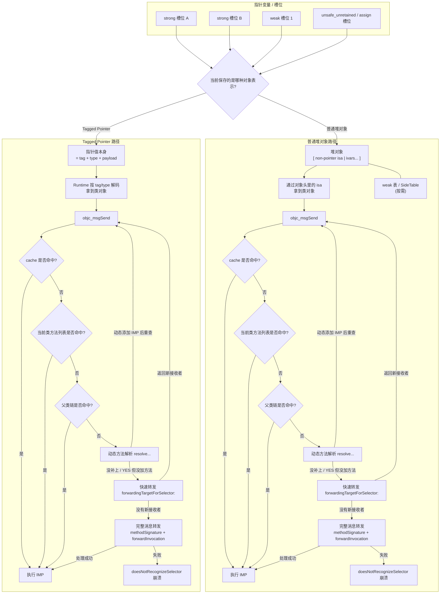

这张图最适合这样记：

1. **先看变量槽位里装的到底是普通堆对象地址，还是 tagged pointer 编码值**
2. **普通堆对象** 通过对象头里的 `isa` 找类对象；**Tagged Pointer** 通过 `tag/type` 解码类对象
3. **一旦拿到类对象后**，后面的 `objc_msgSend -> cache -> 当前类 -> 父类链 -> resolve -> forwarding` 大框架其实是一致的；`resolve` 真正成功的标志是动态添加了 IMP 并重查能找到
4. 差别主要在“类对象是怎么拿到的”，不是在“后面的消息查找规则完全不同”

一句话总结：

> Objective-C 从“指针变量如何持有对象”到“消息最终怎么发出去”可以拆成两段：前半段先判断对象表示是普通堆对象还是 tagged pointer，并据此拿到类对象；后半段再统一进入 `objc_msgSend` 的查找、补救和转发链路。

### 11.8.12 `[ non-pointer isa | ivars... ]` 里的 `ivars` 到底指什么

这里的 `ivars`，就是：

> **这个对象实例自己的成员变量存储区。**

如果某个 `NSObject` 子类里有成员变量：

```objc
@interface Person : NSObject {
    NSString *_name;
    NSInteger _age;
    CGRect _frame;
}
@end
```

那么这个对象实例在堆上的布局可以粗略理解成：

```text
[ isa | _name | _age | _frame ]
```

但要注意两点：

#### 1. `ivars` 不一定都是“对象指针”

它们可能是：

- 对象类型 ivar：槽位里存对象指针值
- 基础类型 ivar：槽位里存值本身
- 结构体 ivar：槽位里存结构体内容本身

所以：

> `ivars` 不是“全都是其他对象的指针”，而是“这个实例自己的成员变量存储区”。

#### 2. 对象实例内存还会包含父类继承下来的 ivars

所以更完整的理解是：

```text
[ isa | 父类 ivars | 本类 ivars ]
```

### 11.8.13 为什么这里只有 `ivars`，类方法/实例方法/协议去哪了

因为：

```text
[ non-pointer isa | ivars... ]
```

描述的是：

> **某一个对象实例自己的堆内存布局**

而不是“整个类系统的所有信息”。

#### 对象实例里通常只放两类东西

1. **我是谁**
   - 通过 `isa` 知道自己属于哪个类
2. **我这次实例自己的数据是什么**
   - 通过 `ivars` 保存自己这一份成员变量值

#### 方法、协议、属性这些不会放进每个实例里

因为这些信息对同一个类的所有实例通常都是共享的，没必要每个对象都存一份。

更粗略地看：

##### 实例对象

```text
[ isa | ivars... ]
```

##### 类对象

里面会有类似：

- 实例方法列表
- 属性信息
- 协议信息
- ivar 描述信息
- cache

##### 元类对象

里面主要会有：

- 类方法列表

所以一句话记忆：

> 实例对象主要装“实例数据”，类对象/元类对象主要装“方法和类元数据”。

### 11.8.13.1 类对象也是对象，那方法列表在哪里

类对象当然也是对象，但不要理解成：

```text
类对象本体里直接内联塞满所有方法列表
```

更准确地说，类对象本体里放的是一组固定字段，其中有一个字段能找到 Runtime 的类数据。

粗略结构是：

```text
Class cls = [Person class]
        │
        ▼
objc_class / 类对象本体
┌────────────────────┐
│ isa                │
├────────────────────┤
│ superclass         │
├────────────────────┤
│ cache              │
├────────────────────┤
│ class_data_bits_t  │───┐
└────────────────────┘   │
                         │ 通过 mask 去掉低位 flags
                         ▼
                    class_rw_t *
                    ┌────────────────────┐
                    │ ro -> class_ro_t   │
                    │ methods            │───┐
                    │ properties         │   │
                    │ protocols          │   │
                    │ flags              │   │
                    └────────────────────┘   │
                                             ▼
                                      method_list_t
                                      ┌──────────────┐
                                      │ SEL          │
                                      │ types        │
                                      │ IMP          │───► 函数代码地址
                                      └──────────────┘
```

所以“类对象的方法列表”可以理解成：

```text
类对象本体
  -> class_data_bits_t
      -> class_rw_t
          -> methods
              -> method_list_t
```

而不是：

```text
类对象本体 = [ isa | superclass | cache | 所有方法数组... ]
```

#### 实例方法和类方法分别放在哪里

```text
实例方法:
Person 类对象 -> class_rw_t.methods

类方法:
Person 元类对象 -> class_rw_t.methods
```

也就是说：

- 对实例发消息，先由实例对象的 `isa` 找到类对象，再查类对象的方法列表
- 对类发消息，先由类对象的 `isa` 找到元类对象，再查元类对象的方法列表

### 11.8.13.2 `class_ro_t` 是只读的，那为什么还能动态添加方法

关键是：

> `class_ro_t` 里的是编译期原始类信息，不是 Runtime 后续所有方法的唯一存储位置。

可以分三层看：

#### 1. `class_ro_t`

偏编译期原始信息，通常来自 Mach-O 里的 Objective-C 元数据段。

里面会有类似：

```text
class_ro_t
├── name
├── baseMethods
├── ivars
├── baseProperties
└── baseProtocols
```

这里的 `baseMethods` 可以理解成“源码里编译出来的原始方法列表”。它偏只读。

#### 2. `class_rw_t`

偏 Runtime 可变信息。

里面会组织：

```text
class_rw_t
├── ro -> class_ro_t
├── methods
├── properties
├── protocols
└── flags
```

Runtime realize 类时，会把只读的 `class_ro_t` 作为基础，再用 `class_rw_t` 组织一份可变视图。

#### 3. `class_addMethod`

动态添加方法时，不是去改：

```text
class_ro_t.baseMethods
```

而是追加到：

```text
class_rw_t.methods
```

概念上是：

```text
class_addMethod(cls, @selector(run), (IMP)runIMP, "v@:")
    -> 创建/追加 method_list_t
    -> 挂到 cls 的 class_rw_t.methods
    -> 后续普通方法查找可以找到
    -> 找到后可能填充 cache
```

所以：

> `class_ro_t` 只读，不妨碍 `class_rw_t.methods` 可变。编译期原始方法在 ro 里；分类方法、动态添加方法等会通过 Runtime 可变结构参与最终查找。

### 11.8.13.3 `class_rw_t` 自己存在哪里，类对象怎么找到它

`class_rw_t` 不是 Objective-C 对象，它是 Runtime 内部的 C/C++ 元数据结构。

`Class` 本质上可以粗略理解成 `objc_class *`。Runtime 内部概念大致像：

```cpp
struct objc_class {
    Class isa;
    Class superclass;
    cache_t cache;
    class_data_bits_t bits;

    class_rw_t *data() const {
        return bits.data();
    }
};
```

`class_data_bits_t` 里通常不是一个纯指针，而更像：

```text
[class_rw_t 指针高位 | runtime flags 低位]
```

所以 Runtime 取 `class_rw_t *` 时，要先把低位 flag mask 掉：

```cpp
class_rw_t *data() {
    return (class_rw_t *)(bits & FAST_DATA_MASK);
}
```

概念上就是：

```text
Class cls
  -> objc_class.bits
      -> bits & mask
          -> class_rw_t 地址
```

`class_rw_t` 的内存通常是 Runtime 的可写元数据内存，由 Runtime 在类 realize / 动态创建类时准备和维护；它不是某个实例对象的一部分，也不是你业务代码应该直接访问的公开结构。

公开 API 一般只能间接操作或观察这些结构：

```objc
class_copyMethodList(cls, &count);
class_getInstanceMethod(cls, sel);
class_addMethod(cls, sel, imp, types);
class_copyIvarList(cls, &count);
```

但不能稳定、安全地依赖：

```cpp
cls->bits.data()
```

因为这些都是 Runtime 私有实现细节，不同系统版本可能变化。

### 11.8.13.4 动态创建的类能添加实例变量吗，编译后的类能吗

#### 1. 动态创建的类可以在注册前添加 ivar

典型流程是：

```objc
Class cls = objc_allocateClassPair([NSObject class], "Dog", 0);
class_addIvar(cls, "_age", sizeof(int), log2(sizeof(int)), @encode(int));
objc_registerClassPair(cls);
```

重点是：

> `class_addIvar` 必须发生在 `objc_registerClassPair` 之前。

注册前，类还没正式投入使用，Runtime 还能调整它的实例大小、ivar 偏移、ivar layout。

#### 2. 已经注册/编译好的类不能动态添加普通 ivar

比如：

```objc
class_addIvar([Person class], "_score", sizeof(int), log2(sizeof(int)), @encode(int));
```

通常会失败。

原因不是“ivar 元数据放在哪里”这么简单，而是对象实例内存布局已经固定了：

```text
Person 实例对象:
[ isa | 父类 ivars | 本类 ivars ]
```

类注册后，这些信息已经确定：

- `instanceSize`
- 每个 ivar 的 offset
- strong/weak ivar layout
- 子类 ivar 偏移
- 已经创建出来的实例对象大小

如果注册后再加 `_score`，你想要的布局变成：

```text
[ isa | _name | _age | _score ]
```

但已有对象可能已经按旧布局分配好了：

```text
[ isa | _name | _age ]
```

对象本体里没有 `_score` 的存储空间。

#### 3. 动态添加的 ivar 元数据和值分别在哪里

要分清两件事：

```text
ivar 元数据:
记录 _age 的名字、类型编码、offset 等
存在类结构的 ivar list 里

ivar 的值:
每个实例对象自己那一份数据
存在实例对象内存里的对应 offset 上
```

也就是说：

```text
类对象相关元数据:
ivar list 记录 "_age 在 offset X，类型是 int"

某个 Dog 实例:
[ isa | offset X 处存这个对象自己的 _age 值 ]
```

如果想给已存在的类“动态挂数据”，常用的是关联对象：

```objc
objc_setAssociatedObject(obj, key, value, OBJC_ASSOCIATION_RETAIN_NONATOMIC);
objc_getAssociatedObject(obj, key);
```

但关联对象不是普通内联 ivar，它更像 Runtime 外部表：

```text
对象地址 -> key -> value
```

### 11.8.13.5 如果把 ivars 放到 `class_rw_t`，能不能注册后添加实例变量

只把 `ivars` 元数据放到 `class_rw_t`，仍然不能自然支持注册后添加普通实例变量。

因为这只解决了：

```text
类结构里能不能写一条新的 ivar 描述
```

没有解决：

```text
每个已经存在的实例对象内存里有没有这块存储空间
```

普通 ivar 是内联存储在实例对象里的：

```text
原来:
[ isa | _name | _age ]

想追加:
[ isa | _name | _age | _score ]
```

已有对象已经按旧大小分配，Runtime 不能安全地把所有对象都扩容。

如果放开当前 Objective-C Runtime 设计，理论上有几种方案：

#### 方案 1：对象可移动 / handle 模型

Runtime 重新分配更大的对象，把旧对象内容拷过去，再更新所有引用。

这要求语言和 Runtime 能找到并更新所有指向旧地址的引用。但 Objective-C 里对象引用本质上是稳定地址指针，到处都可能有裸指针，所以很难安全实现。

#### 方案 2：每个对象预留扩展空间

对象创建时多分配 padding：

```text
[ isa | 原始 ivars | reserved space ]
```

以后新增 ivar 就放进预留空间。问题是浪费内存，而且预留多少很难判断。

#### 方案 3：外部表存储

类似关联对象：

```text
对象地址 -> 动态字段名/key -> value
```

这能实现“动态挂数据”，但已经不是普通内联 ivar；访问性能、内存布局、ivar offset 语义都和真正 ivar 不一样。

所以结论是：

> 注册后添加普通 ivar 的难点不在 `class_ro_t` 是否只读，而在对象实例内存布局已经固定。要支持它，就要换对象内存模型；在当前 Objective-C “稳定对象地址 + ivar 内联存储”的模型下，注册后不能添加真正普通 ivar。

### 11.8.13.6 方法为什么不改变实例大小，方法改变的是什么

方法不存放在每个实例对象里。

实例对象大概是：

```text
Person 实例对象
┌────────────┐
│ isa        │
├────────────┤
│ _name      │
├────────────┤
│ _age       │
└────────────┘
```

也就是：

```text
实例对象 = isa + ivars
```

方法放在类对象 / 元类对象的 Runtime 数据结构里。方法本质上是一条映射：

```text
SEL -> IMP
```

比如：

```objc
class_addMethod([Person class], @selector(run), (IMP)runIMP, "v@:");
```

改变的是：

```text
Person 类对象的 class_rw_t.methods
新增:
run -> runIMP
```

而某个 `person` 实例对象仍然是：

```text
[ isa | _name | _age ]
```

没有变成：

```text
[ isa | _name | _age | run 方法... ]
```

发送消息时才通过 `isa` 找到类对象，再查方法：

```text
person 实例对象
    -> isa
        -> Person 类对象
            -> cache / methods
                -> run -> runIMP
                    -> 执行 runIMP(person, @selector(run))
```

所以：

> 添加方法改变的是类对象/元类对象上的方法集合，不改变每个实例对象的内存布局；添加 ivar 改变的是每个实例对象需要拥有的数据槽，所以会影响实例大小。

### 11.8.14 类对象和元类对象也是 `non-pointer isa` 这种内存管理语境吗

要分两层回答。

#### 1. 从 Runtime 角度，它们也是对象，也有 `isa`

关系大致是：

- 实例对象的 `isa` -> 类对象
- 类对象的 `isa` -> 元类对象
- 元类对象的 `isa` -> 根元类

所以它们当然也属于 Objective-C Runtime 的对象体系。

#### 2. 但不要把它们直接套进“普通实例对象内存管理”话术

前面整节讨论的这些：

- `Tagged Pointer`
- `non-pointer isa`
- `SideTable`
- weak 表
- autorelease pool
- `retain/release`

主要是在讲：

> **普通实例对象的内存管理和生命周期**

而类对象/元类对象更像是：

- Runtime 长驻的元数据对象
- 启动/加载时建立
- 主要服务于方法查找、协议、属性、类结构组织

所以更稳的说法是：

> 类对象和元类对象也有 `isa`，也是 Runtime 对象；但我们平时说 weak 表、SideTable、autorelease pool、3 个 strong/3 个 weak 这些，主要是在讲实例对象，不是在讲类对象/元类对象的生命周期管理。

### 11.8.15 子类发类方法时，是怎么沿元类链一直查到根元类的

这个问题最容易混的点是：

1. **给实例发消息**，是从“类对象链”查
2. **给类发消息**，是从“元类对象链”查
3. **到了根元类还没找到**，才会继续落到**根类对象**那边查

#### 先澄清 `NSObject` 和 `NSObject` 元类

- `NSObject` 这个我们平时写的，是 **类对象**
- `NSObject` 还有一个对应的 **元类对象**
- 这个元类对象就是 **根元类（root metaclass）**

关系可以粗略理解成：

```text
实例对象 --isa--> 子类类对象 --isa--> 子类元类对象
子类类对象 --superclass--> 父类类对象 --superclass--> NSObject类对象
子类元类对象 --superclass--> 父类元类对象 --superclass--> NSObject元类对象
```

其中：

- `NSObject` 类对象：是根类（root class）
- `NSObject` 元类对象：是根元类（root metaclass）

#### 类方法查找的正常链路

比如：

```objc
[SubClass alloc]
```

这个消息的真正接收者是 `SubClass` 这个**类对象**，  
但类方法查找不会从 `SubClass` 类对象本身的方法列表开始，而是从它的：

- `isa`
- 也就是 `SubClass` 的**元类对象**

开始查。

所以查找链大致是：

```text
SubClass(meta)
-> SuperClass(meta)
-> NSObject(meta)
-> 如果还没找到，再到 NSObject(class)
```

#### 一张流程图

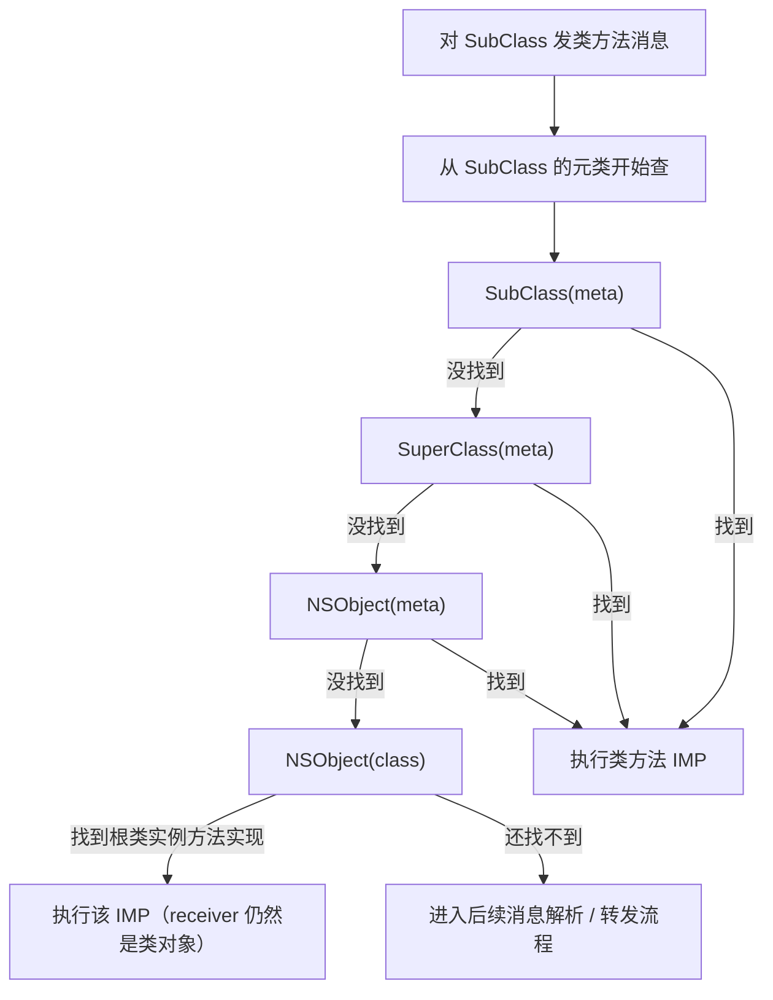

#### 如果 `NSObject` 自己有类方法，会命中哪一层

最典型的例子是：

```objc
[SubClass alloc]
```

`+alloc` 是 `NSObject` 的类方法，所以查找时会在：

```text
SubClass(meta)
-> SuperClass(meta)
-> NSObject(meta)
```

这一层命中。

所以这时执行的是：

> **`NSObject` 元类对象里的类方法实现**

#### 如果元类链都没有，但 `NSObject` 类对象里有同名实例方法呢

这时才会出现你问的那种“落到根类对象”的情况。

例如你人为写一个只存在于 `NSObject` 实例方法里的方法：

```objc
@interface NSObject (Demo)
- (void)cl_rootOnlyInstanceMethod;
@end

@implementation NSObject (Demo)
- (void)cl_rootOnlyInstanceMethod {
    NSLog(@"receiver = %@", self);
}
@end
```

然后你故意对类对象发这个消息：

```objc
[SubClass performSelector:@selector(cl_rootOnlyInstanceMethod)];
```

查找链会变成：

```text
SubClass(meta)
-> 父类(meta)
-> NSObject(meta)
-> NSObject(class)
```

如果前面的元类链都没找到，但 `NSObject(class)` 的实例方法列表里有：

```objc
- cl_rootOnlyInstanceMethod
```

那最终执行的就是：

> **`NSObject` 类对象里的实例方法实现**

但要注意：

- 这里执行的虽然是实例方法 IMP
- `self` 依然可能是一个**类对象**

所以一句话总结：

> 子类发类方法消息时，先沿着元类链查找类方法；如果在 `NSObject` 元类里找到了，就执行类方法；如果连根元类都没找到，因为根元类的 `superclass` 会接到根类 `NSObject`，查找还可能继续落到 `NSObject` 类对象的实例方法列表里，所以最终命中的既可能是根元类里的类方法，也可能是根类里的实例方法，这取决于 selector 最后在哪一层被找到。

### 11.9 `SideTable` 散列表是独立第三种方案吗

如果只是为了教学记忆，可以粗略分成 3 个词：

1. `Tagged Pointer`
2. `non-pointer isa`
3. `SideTable`

但更严谨地说：

- `Tagged Pointer` 是一大类
- 普通堆对象是另一大类
- `SideTable` 不是独立替代 `non-pointer isa` 的完全平级方案
- 它更像是普通堆对象管理里的**外置补充层**

也就是：

```text
普通堆对象
= 对象本体 + non-pointer isa（主路径）
+ SideTable（溢出 / 弱引用 / 特殊情况的补充账本）
```

所以可以这样记：

> `SideTable` 不是把 `non-pointer isa` 替代掉，而是普通堆对象在特殊情况下的外置散列表补充。

### 11.10 `Tagged Pointer` / `non-pointer isa` / `SideTable` 的区别

| 项目 | Tagged Pointer | non-pointer isa | SideTable |
|---|---|---|---|
| 是否是普通堆对象 | 通常不是 | 是 | 服务于普通堆对象 |
| 是否需要 `malloc` | 通常不需要 | 需要 | 不负责创建对象 |
| 主要优化目标 | 小对象值对象化成本 | 普通对象头部与状态管理 | 普通对象的外置补充存储 |
| 常见使用场景 | 小 `NSNumber`、短 `NSString`、某些 `NSDate` | 几乎所有普通堆对象 | 引用计数溢出、弱引用等特殊情况 |
| 与另外两者的关系 | 与普通堆对象二选一 | 普通堆对象主路径 | 普通堆对象兜底/补充路径 |

### 11.11 到底是编译时决定，还是运行时决定

**主要是运行时决定。**

编译器做的更多是：

- 生成对象创建代码
- 生成字面量/装箱调用

但最终某个值到底是：

- tagged pointer
- 还是普通堆对象
- 普通堆对象后续会不会落到 side table

都不是编译器静态拍板。

#### 分层看：

##### A. `Tagged Pointer`

是在**对象创建时**决定的。

Runtime / Foundation 会看：

- 这个类是否支持 tagged pointer
- 这个值能不能编码进指针位

满足就直接返回 tagged pointer；不满足就回退成普通堆对象。

##### B. `non-pointer isa`

这是普通堆对象在现代 64 位 Runtime 下的默认头部管理方案。

也就是说，一旦对象已经走到堆分配，它通常就按这套结构来管理。

##### C. `SideTable`

这是对象在**运行过程中按需启用**的补充结构。

比如：

- `isa` 里的内联引用计数不够了
- 出现弱引用
- 某些额外状态需要外置存储

这时才会借助 SideTable。

### 11.12 一张总决策图

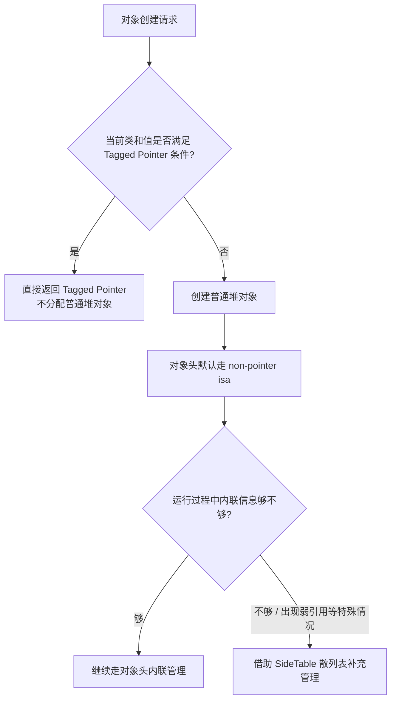

### 11.13 一组适合直接背的答案

#### 11.13.1 Tagged Pointer 用得多吗

> 用得很多，但主要是系统在 Foundation 层自动使用，常见于小 `NSNumber`、短 `NSString`、某些 `NSDate` 这类高频、小值、不可变对象。  

#### 11.13.2 Tagged Pointer 和 non-pointer isa 的区别

> `Tagged Pointer` 的核心是把对象值直接编码在指针本身里，很多时候不分配普通堆对象；`non-pointer isa` 则是普通堆对象上的对象头优化，对象仍在堆上，只是 `isa` 不再是纯类指针，而是类信息加状态位的位域结构。  

#### 11.13.2.1 它们是不是都“64 位”

> 在 64 位 iOS Runtime 下，两者都基于 64 位机器字，但不是同一个位置：`Tagged Pointer` 用的是对象指针值本身的 64 位，`non-pointer isa` 用的是普通堆对象头里 `isa` 字段的 64 位。  

#### 11.13.3 散列表是不是第三种完全独立方案

> 更严谨地说不是。`SideTable` 是普通堆对象管理里的外置补充层，不是和 `non-pointer isa` 平行替代的另一套对象模型。普通堆对象通常是“`non-pointer isa` 优先，`SideTable` 兜底”。  

#### 11.13.4 三者是编译时决定还是运行时决定

> 主要是运行时决定。对象创建时先判断能不能做成 `Tagged Pointer`；如果不能，就走普通堆对象；普通堆对象默认采用 `non-pointer isa`，后续在引用计数溢出、弱引用等特殊场景下，再借助 `SideTable`。  

#### 11.13.5 Tagged Pointer 怎么释放

> Tagged Pointer 通常没有单独的堆对象，所以也不存在普通对象那种真正的 `dealloc/free` 流程。Runtime 会识别它是不是 tagged pointer，如果是，通常只走轻量快速路径；变量失效时，本质上只是这个指针值不再被使用，而不是回收一块堆对象内存。  

#### 11.13.6 什么叫“内联引用计数不够了”

> 指的是普通堆对象的 `isa` 位域里只给引用计数预留了一小部分 bit。对象被持续 retain/strong 持有后，如果这几位已经装不下更大的计数值，Runtime 就会把超出来的部分转移到 `SideTable` 这类外部结构里。  

#### 11.13.7 为什么看不到“是哪几个 strong 指针在引用对象”

> Runtime 维护的是引用计数值和对象状态，不会维护“所有 strong 引用来源”的完整清单。你在调试器里看到的引用链，通常是 Xcode Memory Graph 这类工具扫描对象图后推导出来的，不是对象自己的 `isa` 或 `SideTable` 里存着一份强引用名单。  

#### 11.13.8 有强引用表吗？有 `unsafe_unretained/assign` 表吗

> 没有。Runtime 通常不会维护“对象地址 -> 所有 strong 指针位置”的强引用表；`unsafe_unretained/assign` 也只是普通裸指针拷贝，不会登记到 weak 表，也没有自己单独的管理表。  

#### 11.13.9 一个对象有 3 个 strong 引用，是 3 个 `non-pointer isa` 对象吗

> 不是。仍然只有 1 个普通堆对象和 1 个 `isa` 字段，只是外部有 3 个不同的指针槽位同时保存了同一个对象地址。  

#### 11.13.9.1 局部 tagged pointer 赋给单例 strong 属性，局部变量销毁后会悬垂吗

> 不会。strong 属性保存的是局部变量 `a` 里面的“指针值”，不是保存 `a` 这个栈变量槽位的地址。若 `a` 是 tagged pointer，单例 ivar 里复制的是 tagged pointer 编码值本身；函数返回后销毁的是 `a` 的栈槽位，不影响单例里那份编码值。若 `a` 是普通堆对象，单例 strong 属性保存的是堆对象地址，并 retain 这个堆对象。  

#### 11.13.10 autorelease pool 在管理什么

> autorelease pool 管的不是所有堆对象，而是那些收到了 `autorelease` 的对象指针。pool 里保存的是对象地址，drain 时再统一对这些对象发送一次 `release`。  

#### 11.13.10.1 引用计数为 0 的判断在哪里触发

> 在 `release` 过程中触发，不是在 autorelease pool 里触发。`autorelease pool` 只是延迟保存对象指针，并在 drain 时给这些对象发送 `release`；真正的引用计数减 1、是否归零、是否进入 `dealloc/free`，发生在 Runtime 的 `objc_release` / `rootRelease` 这类释放逻辑里。  

#### 11.13.10.2 ARC 里没有手写 autorelease，那 autorelease 是谁加的

> ARC 下不能手写 `[obj autorelease]`，但编译器仍然会根据所有权规则生成 `objc_autorelease`、`objc_autoreleaseReturnValue` 等 Runtime 调用。典型场景是方法内部创建了 `+1` 对象，但方法名不是 `alloc/new/copy/mutableCopy` 家族，返回值语义要变成 `+0`，编译器就会用 autorelease return value 相关调用完成转换。  

#### 11.13.10.3 ARC 编译器大致会插入哪些内存管理动作

> ARC 会围绕所有权语义插入 retain、release、autorelease、strong 存储、weak 存储/读取、返回值优化、block 捕获管理和 autorelease pool push/pop。常见 Runtime 调用包括 `objc_retain`、`objc_release`、`objc_storeStrong`、`objc_storeWeak`、`objc_loadWeakRetained`、`objc_autoreleaseReturnValue`、`objc_retainAutoreleasedReturnValue`、`objc_autoreleasePoolPush`、`objc_autoreleasePoolPop`。  

#### 11.13.11 Tagged Pointer 会像普通对象一样进 autorelease pool 吗

> 通常不会。`Tagged Pointer` 往往没有普通堆对象，也没有真正的 `dealloc/free` 路径，所以 `autorelease` 对它通常更接近轻量快速路径，而不是像普通堆对象那样真正登记进 pool、等之后再补一次 `release`。更准确地说，autorelease pool 也不是“每个对象组成双向链表”，而是 page 里记录待 release 的对象指针；tagged pointer 一般没有必要作为待 release 记录放进去。  

#### 11.13.11.1 Tagged Pointer 没有普通 `isa` 字段，为什么还能发消息

> 因为它不是没有类，而是类信息不放在普通堆对象头里的 `isa` 字段里。Runtime 会先判断接收者是不是 tagged pointer，如果是，就从指针值里的 tag/type 信息解码出类对象，再按普通对象那套缓存和方法列表查找流程继续做实例方法分发。若后面需要找类方法，再由这个类对象的 `isa` 找到元类对象。  

#### 11.13.11.2 怎么把 strong/weak、对象内存、isa 和消息传递串成一条线

> 可以分成两段记：先看变量槽位里装的是“普通堆对象地址”还是“tagged pointer 编码值”；普通堆对象通过对象头里的 `isa` 找类对象，tagged pointer 通过 `tag/type` 解码类对象。拿到类对象之后，再统一进入 `objc_msgSend -> cache -> 当前类 -> 父类链 -> 动态解析 -> 消息转发` 这条主线。也就是说，两种对象表示方式的差别主要在“类对象怎么拿到”，后面的消息传递和转发框架是同一套。  

#### 11.13.12 `[ isa | ivars... ]` 里的 `ivars` 指什么

> 指的是这个对象实例自己的成员变量存储区，不一定全是对象指针。对象类型 ivar 存的是指针值，基础类型和结构体 ivar 存的是值本身；而且实例内存里还会包含父类继承下来的 ivars。  

#### 11.13.13 为什么实例布局里只有 `ivars`，没有方法/协议

> 因为 `[ isa | ivars... ]` 只是在描述对象实例自己的堆内存。方法列表、协议、属性、cache 这类共享信息不会放进每个实例里，而是放在类对象、元类对象和 Runtime 元数据结构里统一管理。  

#### 11.13.13.1 类对象也是对象，那方法列表在类对象内存里吗

> 类对象本体里有固定字段，比如 `isa`、`superclass`、`cache`、`class_data_bits_t`，但完整方法列表不是直接内联塞在类对象本体里。Runtime 通过类对象的 `class_data_bits_t` 找到 `class_rw_t`，再从 `class_rw_t.methods` 找到一个或多个 `method_list_t`。所以更准确是：类对象本体保存通往 Runtime 类数据的入口，方法列表是额外的元数据结构。  

#### 11.13.13.2 `class_ro_t` 只读，为什么还能 `class_addMethod`

> `class_ro_t` 保存的是编译期原始类信息，比如原始方法列表、ivar 列表、属性、协议等，通常偏只读。`class_addMethod` 不会去改 `class_ro_t.baseMethods`，而是把新的 `SEL -> IMP` 方法记录追加到 Runtime 可写的 `class_rw_t.methods` 里。后续消息查找能从 `class_rw_t.methods` 找到它，找到后还可能填充 cache。  

#### 11.13.13.3 `class_rw_t` 自己在哪里，类对象怎么找到它

> `class_rw_t` 不是 Objective-C 对象，而是 Runtime 内部 C/C++ 元数据结构。`Class` 本质上是 `objc_class *`，`objc_class` 里有 `class_data_bits_t bits`；Runtime 会对 `bits` 做 mask，去掉低位 flags，得到 `class_rw_t *`。概念链路是：`Class -> objc_class.bits -> bits & mask -> class_rw_t`。业务代码不能用公开 API 直接稳定访问它，只能通过 `class_copyMethodList`、`class_getInstanceMethod`、`class_addMethod` 等 API 间接观察或修改。  

#### 11.13.13.4 动态创建的类能添加实例变量吗，编译后的类能吗

> 动态创建的类可以在 `objc_registerClassPair` 之前通过 `class_addIvar` 添加实例变量；一旦注册完成就不能再添加普通 ivar。编译好的类也不能在运行时追加普通 ivar，因为它的实例大小、ivar offset、strong/weak ivar layout、子类偏移和已有实例对象内存布局都已经固定。  

#### 11.13.13.5 动态添加的 ivar 存在哪里

> 要分两层：ivar 元数据存在类结构的 ivar list 里，记录名字、类型编码、offset 等；ivar 的值存在每个实例对象自己的内存里，也就是 `[ isa | 父类 ivars | 本类 ivars ]` 的某个 offset 上。关联对象能给已有对象动态挂数据，但它是外部表 `对象地址 -> key -> value`，不是普通内联 ivar。  

#### 11.13.13.6 如果 ivars 放到 `class_rw_t`，能不能注册后添加实例变量

> 仍然不能自然支持普通 ivar 的注册后追加。把 ivar 元数据做成可写，只解决“类结构里能不能记录新字段”，解决不了“每个已有实例对象有没有这块存储空间”。要支持注册后追加真正 ivar，需要换对象模型，比如对象可移动/handle 模型、每个对象预留空间，或者使用外部表；在 Objective-C 当前稳定对象地址和 ivar 内联存储的模型下不可行。  

#### 11.13.13.7 方法为什么不改变实例大小，方法改变的是什么

> 方法不存放在每个实例对象里，而是存放在类对象/元类对象的 Runtime 方法集合里。添加方法本质是给类的 `class_rw_t.methods` 增加一条 `SEL -> IMP` 映射，不会让每个实例对象多出一块内存。实例对象仍然只是 `isa + ivars`；发送消息时通过 `isa` 找类对象，再查 cache / methods 找到 IMP 执行。  

#### 11.13.14 类对象和元类对象也按普通实例对象那套内存管理理解吗

> 它们从 Runtime 角度也是对象，也有 `isa`；但不要直接把它们套进普通实例对象那套 weak 表、SideTable、autorelease pool、retain/release 生命周期语境。类对象和元类对象更像 Runtime 常驻的元数据对象，重点是组织方法、协议、属性和类关系。  

#### 11.13.15 子类发类方法时，到底会沿哪条链查

> 对类发消息时，不是从实例对象链查，而是从“子类元类 -> 父类元类 -> `NSObject` 元类”这条元类链查找类方法；如果连根元类都没找到，查找还可能继续落到根类 `NSObject` 类对象的实例方法列表里。所以最终命中的既可能是根元类里的类方法，也可能是根类里的实例方法，取决于 selector 最后在哪一层被找到。  
