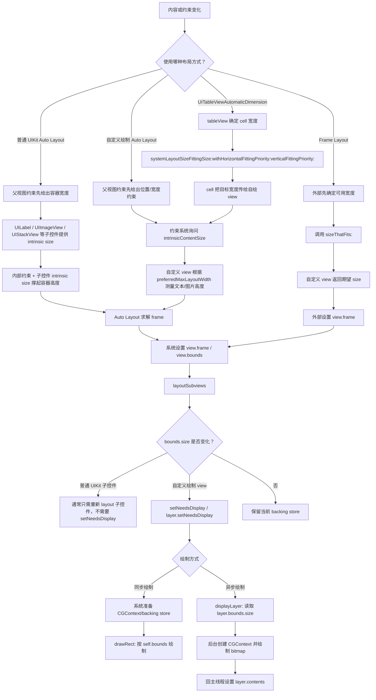

# UIView 布局与绘制流程

核心规则：布局先决定 `frame/bounds.size`，绘制再按 `bounds` 画内容。`drawRect:`、`displayLayer:` 不应该决定 view 有多大。

## 一句话结论

`UIView` 的大小不是由绘制方法决定的，而是由布局系统决定的：

- 手动 frame 布局：外部代码调用 `sizeThatFits:` 测量，再设置 `view.frame`。
- Auto Layout：约束系统结合外部约束、`intrinsicContentSize`、hugging/compression priority 求出 `frame`。
- TableView 自动高度：`UITableViewAutomaticDimension` 会通过 `systemLayoutSizeFittingSize:...` 问 cell 在指定宽度下需要多高。

绘制阶段只能拿已经确定的 `bounds` 去画：

- 同步绘制：系统准备好 `CGContext/backing store` 后回调 `drawRect:`。
- 异步绘制：`displayLayer:` 读到 `layer.bounds.size` 后，后台创建 bitmap，最后回主线程设置 `layer.contents`。
- 普通 UIKit 子控件布局：不重写 `drawRect:` / `displayLayer:`，通常不需要手动 `setNeedsDisplay`；宽度变化后 Auto Layout 重新 layout，`UILabel` 等控件根据自身 intrinsic size 参与计算。

## 总流程



## Auto Layout 下 View 大小怎么确定

普通 UIKit 组合 view 和自定义绘制 view 的差别在这里：

- 普通 UIKit 组合 view：内部是 `UILabel`、`UIImageView`、`UIStackView` 等子控件，父视图给宽度后，子控件通过自己的 intrinsic size 和约束自然撑起高度。
- 自定义绘制 view：内容都画在一张 backing store 上，Auto Layout 不知道文字和图片的真实高度，所以通常要自己实现 `intrinsicContentSize` 或提供高度约束。

以 `ADSizingAsyncCardView` 放进垂直 `UIStackView` 为例：

```objc
self.asyncCardView.translatesAutoresizingMaskIntoConstraints = NO;
self.asyncCardView.content = self.contents.firstObject;
[self.contentStack addArrangedSubview:self.asyncCardView];
```

这时 size 的来源是：

1. `contentStack` 自己先被父视图约束确定宽度。
2. 垂直 `UIStackView` 默认 `alignment = fill`，所以 arrangedSubview 横向填满 stackView。
3. `ADSizingAsyncCardView` 的宽度由 stackView 给出。
4. `ADSizingAsyncCardView` 通过 `intrinsicContentSize` 把“这个宽度下需要的高度”报给 Auto Layout。
5. Auto Layout 求解出最终 `frame`。
6. UIKit 设置 `view.bounds`。
7. `layoutSubviews` 读到最终 `self.bounds.size`。
8. 尺寸变了就 `setNeedsDisplay`，后续进入绘制阶段。

所以 `layoutSubviews` 里的 `self.bounds.size` 是布局结果，不是在 `layoutSubviews` 里算出来的。

## 方法分工

### `intrinsicContentSize`

用于 Auto Layout。它回答的是：

```text
如果没有明确的宽/高约束，我自己天然想要多大？
```

在自定义文本绘制 view 里，经常这样用：

```objc
- (CGSize)intrinsicContentSize {
    CGFloat width = self.preferredMaxLayoutWidth;
    CGFloat height = [self.class heightForContent:self.content width:width];
    return CGSizeMake(UIViewNoIntrinsicMetric, height);
}
```

这里返回 `UIViewNoIntrinsicMetric` 表示：宽度不由我决定，让父布局/约束决定；高度由我根据内容计算。

### `invalidateIntrinsicContentSize`

用于告诉 Auto Layout：

```text
我之前报过的 intrinsicContentSize 失效了，下次布局请重新问我。
```

常见触发点：

- 文本变了
- 图片有无变了
- 字体变了
- 可用宽度变了，换行高度也会变

它不会立刻重新布局，也不会立刻重绘，只是标记尺寸信息过期。

### `sizeThatFits:`

用于手动 frame 布局。它回答的是：

```text
如果外部给我这个可用 size，我希望自己多大？
```

例如 scrollView 中手动排卡片：

```objc
CGSize size = [cardView sizeThatFits:CGSizeMake(cardWidth, CGFLOAT_MAX)];
cardView.frame = CGRectMake(12.0, y, cardWidth, size.height);
```

注意：`sizeThatFits:` 只返回建议尺寸，不会自动修改 `frame`。

Auto Layout 默认不会自动调用自定义 `UIView` 的 `sizeThatFits:`。如果希望自定义 view 在 Auto Layout 下参与尺寸计算，通常应该实现 `intrinsicContentSize`，并在内容或可用宽度变化时调用 `invalidateIntrinsicContentSize`。

容易混淆的点：

- `sizeToFit` 会调用 `sizeThatFits:`，然后修改自己的 `bounds/frame.size`，但这是主动调用 `sizeToFit` 的结果。
- `UILabel`、`UIButton`、`UITextView` 等 UIKit 控件内部有自己的测量逻辑，某些 UIKit 组件也可能内部使用 `sizeThatFits:`，但这不是 Auto Layout 对所有 view 的统一规则。
- `UITableViewAutomaticDimension` 主要通过 Auto Layout fitting，也就是 `systemLayoutSizeFittingSize:...`，而不是直接靠自定义 view 的 `sizeThatFits:`。
- 在纯手动布局里，经常会在父 view 的 `layoutSubviews` 中主动调用子 view 的 `sizeThatFits:`，再设置子 view 的 `frame`。

### `systemLayoutSizeFittingSize:...`

用于 Auto Layout fitting。它回答的是：

```text
在 targetSize 和当前约束条件下，我最终需要多大？
```

`UITableViewAutomaticDimension` 算 cell 高度时，会走类似流程：

```objc
- (CGSize)systemLayoutSizeFittingSize:(CGSize)targetSize
        withHorizontalFittingPriority:(UILayoutPriority)horizontalFittingPriority
              verticalFittingPriority:(UILayoutPriority)verticalFittingPriority {
    CGFloat fittingWidth = targetSize.width - 32.0;
    self.cardView.preferredMaxLayoutWidth = fittingWidth;
    return [super systemLayoutSizeFittingSize:targetSize
                withHorizontalFittingPriority:horizontalFittingPriority
                      verticalFittingPriority:verticalFittingPriority];
}
```

这里先把 tableView 给出的目标宽度传给自绘 view，是因为文本高度依赖宽度。然后再让 Auto Layout 计算 cell 最终高度。

### `layoutSubviews`

`layoutSubviews` 被调用时，当前 view 的 `frame/bounds` 通常已经被外部布局系统设置好了。

它适合做：

- 根据最终 `bounds` 布局子 view
- 读取最终宽度并更新文本测量宽度
- 发现 `bounds.size` 变化后触发重绘

它不适合做：

- 大量绘制
- 同步耗时计算
- 试图在这里决定自己应该多大

### `setNeedsDisplay`

用于标记绘制内容失效：

```text
我的大小或内容变了，之前的 backing store 不可信了，请在后续绘制阶段重新画。
```

它不会立即调用 `drawRect:`，也不会触发布局。它只影响绘制阶段。

## 三个典型场景

### 普通 View 中

父视图通过约束给出宽度：

```text
父约束 -> stackView 宽度 -> 自绘 view 宽度 -> intrinsicContentSize 算高度 -> Auto Layout 设置 bounds -> drawRect/displayLayer 绘制
```

适合让自定义 view 自适应文本高度。

如果是普通 UIKit 子控件布局，流程更像：

```text
父约束 -> stackView 宽度 -> 普通容器 view 宽度 -> UILabel/UIImageView intrinsic size + 内部约束 -> Auto Layout 设置 bounds
```

这种场景没有自定义 backing store，不需要因为 `viewDidLayoutSubviews` 里宽度变化去调用 `setNeedsDisplay`。只有当你改了约束、文本、图片等布局相关内容时，系统会重新 layout；如果你自己手动改约束，也可以按需调用 `setNeedsLayout`。

### UIScrollView 中

如果是手动 frame 布局，scrollView 不会自动知道内容高度：

```text
确定 cardWidth -> sizeThatFits 算每个卡片高度 -> 设置每个 card.frame -> 更新 scrollView.contentSize
```

适合完全手动排版的复杂滚动内容。

### UITableViewCell 中

tableView 先确定 cell 宽度，再问 cell 高度：

```text
tableView width -> systemLayoutSizeFittingSize -> cell 内部约束 -> 自绘 view intrinsicContentSize -> row height
```

适合 `UITableViewAutomaticDimension` 自适应高度 cell。
