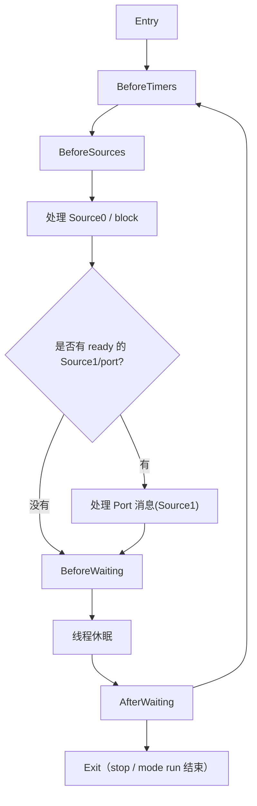

# test-runloop-demo

这是一个真正的 iOS app target，用来把 RunLoop 里最容易问到的几个概念放到同一页里做实验：

1. `run`
2. `Port / Source1`
3. `Source0`
4. `Timer`
5. `CFRunLoopPerformBlock`
6. `CFRunLoopObserver` 观察 6 个状态

## 这份 demo 对照的 RunLoop 总图

## 页面上每个按钮对应什么

| 按钮 | 作用 | 对应概念 |
| --- | --- | --- |
| 启动 worker RunLoop | 创建线程、拿到 RunLoop、加 observer/source/port，然后 `run(mode:before:)` | `run`、线程保活 |
| 停止 worker RunLoop | 在 worker 线程里调用 `CFRunLoopStop` | `exit` |
| Source0 只 signal | 只标记 Source0 ready，不主动叫醒线程 | `Source0` |
| Source0 signal + wakeUp | 标记 Source0 ready 并 `CFRunLoopWakeUp` | `Source0` + 唤醒 |
| 发送 Port 消息(Source1) | 主线程给 worker 的 `Port` 发消息 | `Source1 / port-based source` |
| 安排一次 Timer | 在 worker RunLoop 上动态加入一个 Timer | `Timer` |
| 投递一个 RunLoop block | 用 `CFRunLoopPerformBlock` 投递任务 | `block` |

## 观察点

这个 demo 会监听并打印全部 6 个 `CFRunLoopActivity` 状态：

- `entry`
- `beforeTimers`
- `beforeSources`
- `beforeWaiting`
- `afterWaiting`
- `exit`

你最适合这样看日志：

1. 启动后先观察 `Entry -> BeforeWaiting -> AfterWaiting`
2. 点 `Source0 只 signal`，看为什么它不马上执行
3. 点 `Source0 signal + wakeUp`，看 `BeforeSources -> Source0 perform`
4. 点 `发送 Port 消息(Source1)`，看 `AfterWaiting -> Port 回调`
5. 点 `安排一次 Timer`，看 `BeforeTimers -> Timer fired`
6. 点 `投递一个 RunLoop block`，看 `BeforeSources -> block 执行`

## 一句话结论

这个 app 最想证明的是：

> RunLoop 真正跑起来，需要线程里有 RunLoop、当前 mode 下有 source/timer 可以等待，并且显式调用 `run`。其中 `Source0` 自己不会把线程叫醒，`Port`/`Source1` 能直接唤醒，`Timer` 到点也能唤醒，而 `CFRunLoopPerformBlock` 则是向某个 RunLoop/mode 投递 block 的直接方式。
