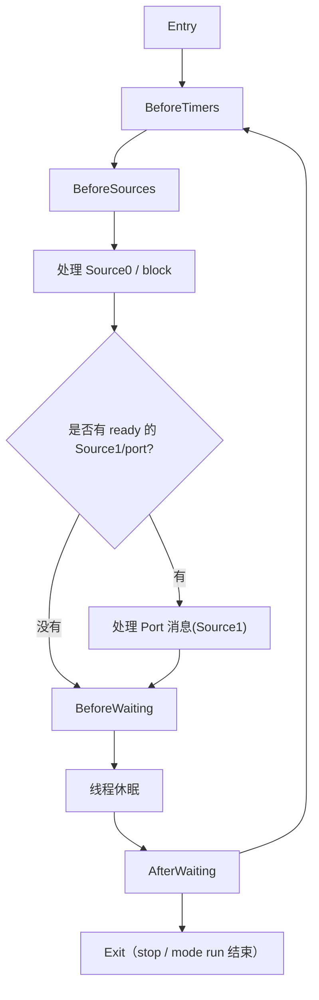

# test-runloop-demo

这是一个真正的 iOS app target，用来把 RunLoop 里最容易问到的几个概念放到同一页里做实验：

1. `run`
2. `Port / Source1`
3. `Source0`
4. `Timer`
5. `CFRunLoopPerformBlock`
6. `CFRunLoopObserver` 观察 6 个状态
7. 只添加 `CFRunLoopSource0`、不添加 `Port` 的线程保活实际场景
8. `run(mode:before:)` 退出条件实验

## 这份 demo 对照的 RunLoop 总图



## 页面上每个按钮对应什么

| 按钮 | 作用 | 对应概念 |
| --- | --- | --- |
| 启动 worker RunLoop | 创建线程、拿到 RunLoop、加 observer/source/port，然后 `run(mode:before:)` | `run`、线程保活 |
| 停止 worker RunLoop | 在 worker 线程里调用 `CFRunLoopStop` | `exit` |
| Source0 只 signal | 只标记 Source0 ready，不主动叫醒线程 | `Source0` |
| Source0 signal + wakeUp | 标记 Source0 ready 并 `CFRunLoopWakeUp` | `Source0` + 唤醒 |
| 发送 Port 消息(Source1) | 主线程给 worker 的 `Port` 发消息 | `Source1 / port-based source` |
| 安排一次 Timer | 在 worker RunLoop 上动态加入一个 Timer | `Timer` |
| 投递一个 RunLoop block | 用 `CFRunLoopPerformBlock` 投递任务 | `block` |
| 运行退出条件实验 | 依次测试空 RunLoop、只加 Observer、只加 Source0、Source0 signal+wakeUp、只加 Timer | RunLoop 是否会立即返回 |
| 启动日志线程 | 启动一个只添加自定义 Source0、不添加 Port 的 worker 线程 | `Source0` 保活 |
| 提交日志只 signal | 把业务日志压入队列，只调用 `CFRunLoopSourceSignal` | Source0 不会主动唤醒 |
| 提交日志并 wakeUp | 把业务日志压入队列，然后 `signal + CFRunLoopWakeUp` | Source0 任务立即处理 |

## RunLoop 不添加任何东西会不会退出

页面上的 `运行退出条件实验` 会分别启动临时线程并打印 `run(mode:before:)` 的返回值和耗时：

```text
case 1: 空 RunLoop
case 2: 只加 Observer
case 3: 只加 Source0，但不 signal、不 wakeUp
case 4: 加 Source0，延迟 signal + wakeUp
case 5: 只加 Timer
```

预期结果：

| 测试项 | 是否直接返回 | 原因 |
| --- | --- | --- |
| 空 RunLoop | 直接返回 | 当前 mode 下没有 Source/Timer，可等待对象为空 |
| 只加 Observer | 直接返回 | Observer 只是观察状态，不是输入源，也不是 Timer |
| 只加 Source0，不 signal | 不会直接返回 | Source0 已经让当前 mode 有可等待对象；如果 before 是有限时间，会一直等到 before 时间 |
| Source0 signal + wakeUp | 被唤醒并处理 Source0 后返回 | `signal` 标记 Source0 ready，`wakeUp` 唤醒睡眠线程 |
| 只加 Timer | 等 Timer 触发后返回 | Timer 到点会唤醒 RunLoop 并执行 callback |

如果把 `before` 写成 `.distantFuture`，那么“只加 Source0，不 signal”的场景会长期等待，不会自己返回；如果写成 `Date(timeIntervalSinceNow: 1)`，它会在 1 秒左右因为到达 before 时间而返回。

你应该重点看日志里的 `elapsed`：

- 几毫秒内返回：说明当前 mode 没有可等待对象，RunLoop 无法保活。
- 接近 timeout 才返回：说明当前 mode 有可等待对象，但没有事件到来。
- timeout 前返回并有 callback：说明 Source 或 Timer 被处理了。

面试里可以这么说：

> 如果当前 mode 里没有 Source/Timer 这类可等待对象，`run(mode:before:)` 会很快返回，线程入口函数执行完后线程就退出。Observer 只是观察 RunLoop 状态，本身不提供任务，也不能单独保活。添加 Source0 后，RunLoop 可以进入等待，所以线程不会立刻退出；但 Source0 不会主动唤醒睡眠线程，外部提交任务时通常要 `CFRunLoopSourceSignal(source)` 再 `CFRunLoopWakeUp(runLoop)`。

## Source0 不加 Port 的实际场景

新增的 `SourceOnlyLoggerLab` 模拟的是一个真实项目里可能出现的场景：主线程持续产生页面曝光、点击、调试日志等事件，但不想在主线程直接写文件，于是把日志压入队列，让一个常驻后台线程批量落盘。

这个 worker 线程只做三件事：

1. 在线程入口里获取当前线程的 RunLoop。
2. 添加一个自定义 `CFRunLoopSource0`，不添加 `Port`。
3. 使用 `while + run(mode:before:)` 让线程睡眠等待任务。

当主线程产生日志时：

```text
主线程产生日志
  -> 加锁压入 pendingEvents
  -> CFRunLoopSourceSignal(source)
  -> 如果希望马上写入，再 CFRunLoopWakeUp(runLoop)
  -> worker 在 Source0 callback 中批量写入 Caches/source-only-worker.log
```

关键观察点：

- `Source0` 可以让 RunLoop 有东西可等待，所以能用于线程保活。
- `CFRunLoopSourceSignal` 只是把 Source0 标记为 ready，不负责唤醒正在睡眠的线程。
- 如果 worker 已经在 `BeforeWaiting` 后睡着，只 signal 不 wakeUp，任务会堆在队列里。
- 调用 `CFRunLoopWakeUp` 后，worker 才会从睡眠中起来，在 `BeforeSources` 阶段执行 Source0 callback。
- 停止线程时，也通过同一个 Source0 发停止信号，并 `wakeUp`，最后在 worker 线程里调用 `CFRunLoopStop`。

## 观察点

这个 demo 会监听并打印全部 6 个 `CFRunLoopActivity` 状态：

- `entry`
- `beforeTimers`
- `beforeSources`
- `beforeWaiting`
- `afterWaiting`
- `exit`

你最适合这样看日志：

1. 启动后先观察 `Entry -> BeforeWaiting -> AfterWaiting`
2. 点 `Source0 只 signal`，看为什么它不马上执行
3. 点 `Source0 signal + wakeUp`，看 `BeforeSources -> Source0 perform`
4. 点 `发送 Port 消息(Source1)`，看 `AfterWaiting -> Port 回调`
5. 点 `安排一次 Timer`，看 `BeforeTimers -> Timer fired`
6. 点 `投递一个 RunLoop block`，看 `BeforeSources -> block 执行`
7. 点 `运行退出条件实验`，看空 RunLoop、只加 Observer、只加 Source0、只加 Timer 的返回耗时
8. 点 `启动日志线程`，再点 `提交日志只 signal`，观察日志先不落盘；再点 `提交日志并 wakeUp`，观察堆积日志被批量写入

## 一句话结论

这个 app 最想证明的是：

> RunLoop 真正跑起来，需要线程里有 RunLoop、当前 mode 下有 source/timer 可以等待，并且显式调用 `run`。其中 `Source0` 自己不会把线程叫醒，`Port`/`Source1` 能直接唤醒，`Timer` 到点也能唤醒，而 `CFRunLoopPerformBlock` 则是向某个 RunLoop/mode 投递 block 的直接方式。
