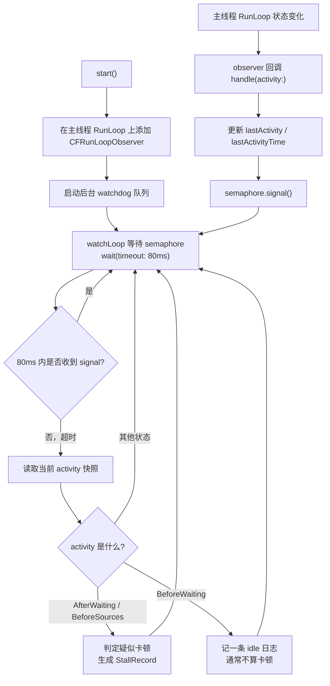
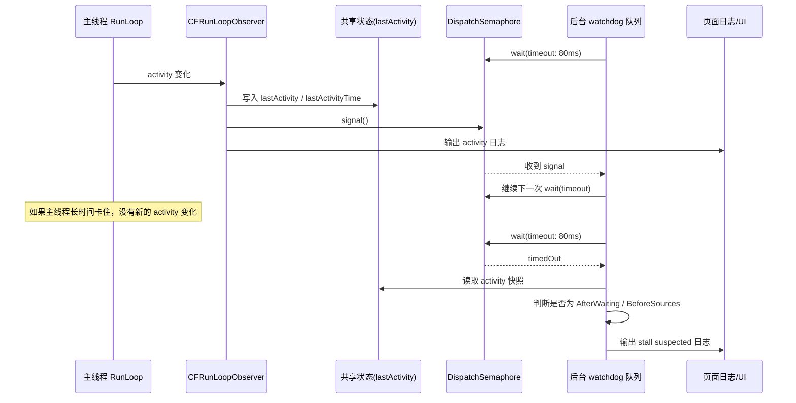

# RunLoopStallMonitor 实现原理

这份文档专门对照 [RunLoopStallMonitor.swift](/Users/huchu/Desktop/test-swift-program/test-runloop-monitor/RunLoopStallMonitor.swift:1) 来讲解这个 demo 的卡顿监控实现。

你可以先抓住一句总纲：

**它不是直接去“监控卡顿”，而是在监控主线程 RunLoop 有没有按预期继续流动。**

如果主线程 RunLoop 长时间停在某个关键阶段不动，就推测主线程被重活、锁等待、同步 IO、布局/绘制压力之类的事情卡住了。

---

## 1. 这个监控器到底做了什么

`RunLoopStallMonitor` 做了 3 件事：

1. 在主线程 RunLoop 上挂一个 `CFRunLoopObserver`
2. 每次 RunLoop 状态变化时，记录“现在在哪个阶段”和“这个阶段开始的时间”
3. 在后台 watchdog 队列里等信号；如果等超时了，就检查主线程是不是卡在关键阶段太久

对应代码位置：

- `start()`：创建 observer、加到主线程 RunLoop、启动后台 watchdog  
  见 [RunLoopStallMonitor.swift](/Users/huchu/Desktop/test-swift-program/test-runloop-monitor/RunLoopStallMonitor.swift:29)
- `handle(activity:)`：主线程 observer 回调，记录最新状态并 `signal`  
  见 [RunLoopStallMonitor.swift](/Users/huchu/Desktop/test-swift-program/test-runloop-monitor/RunLoopStallMonitor.swift:60)
- `watchLoop()`：后台 watchdog 等待超时并判断  
  见 [RunLoopStallMonitor.swift](/Users/huchu/Desktop/test-swift-program/test-runloop-monitor/RunLoopStallMonitor.swift:77)
- `processTimeout(_:)`：超时后根据状态决定是不是疑似卡顿  
  见 [RunLoopStallMonitor.swift](/Users/huchu/Desktop/test-swift-program/test-runloop-monitor/RunLoopStallMonitor.swift:91)

---

## 2. 为什么重点盯 `AfterWaiting / BeforeSources / BeforeWaiting`

这个 demo 虽然监听的是 `allActivities`，但重点只看 3 个阶段：

- `AfterWaiting`
- `BeforeSources`
- `BeforeWaiting`

### 2.1 `AfterWaiting`

表示主线程刚从休眠醒来。

如果长时间停在这里，通常说明：

- 刚醒来就遇到了重活
- 主线程后续要处理的事件/任务没有顺利推进
- 也可能是锁等待、主队列大块任务阻塞

### 2.2 `BeforeSources`

表示马上要处理 Source0 / 主线程任务 / 业务代码。

这是最容易卡住的地方之一，因为很多真正的业务重活都在这里发生，比如：

- 事件响应
- `dispatch_async(main)` 投过来的 block
- `performSelector`
- `reloadData`
- layout / display 触发链路

### 2.3 `BeforeWaiting`

表示这一轮大部分事情做完了，RunLoop 准备休眠。

这个状态通常不被当成“卡住入口”，更像一个**健康收尾点**：

- 如果超时发生在这里，很多时候说明主线程其实已经闲下来了
- 所以 demo 里只记日志，不把它判成疑似卡顿

对应逻辑见 [processTimeout(_:) ](/Users/huchu/Desktop/test-swift-program/test-runloop-monitor/RunLoopStallMonitor.swift:91)。

---

## 3. 这是不是“生产者-消费者”模型

**可以近似理解成“观察者生产信号，后台 watchdog 消费信号并做超时判断”的模型。**

但它不是传统意义上的“消息队列生产者消费者”，因为：

- 主线程没有把每一条 activity 事件都塞进一个真正的队列
- 后台线程也不是一条条把 activity 消息取出来消费

更准确地说，它是：

### 3.1 主线程 observer 是“信号生产者”

主线程 RunLoop 每发生一次 activity 变化，observer 就做这些事：

1. 更新共享状态：
   - `lastActivity`
   - `lastActivityTime`
2. `semaphore.signal()`

也就是说，主线程生产的不是完整事件队列，而是：

- “最新状态快照”
- “有新状态到了”的通知信号

### 3.2 后台 watchdog 是“超时消费者”

后台 watchdog 并不是忙等读取，而是在这里阻塞等待：

```swift
let result = semaphore.wait(timeout: .now() + timeoutInterval)
```

也就是说：

- 如果主线程不断推进 RunLoop 状态，后台线程会不断收到 `signal`
- 如果主线程很久没推进，后台线程会 `timedOut`
- 一旦超时，才去读取当前快照并判断是不是卡顿

所以更白话一点：

**主线程负责“报平安”，后台线程负责“如果很久没报平安，就去看看是不是出事了”。**

---

## 4. 它是不是“子线程一直在读主线程 RunLoop 状态”

**不是那种死循环不停读取。**

这是最容易误解的地方。

这个 demo 的后台 watchdog 不是这样：

```text
while true {
    反复读取主线程状态
}
```

它真正的工作方式是：

```text
1. 先睡着，等 semaphore
2. 主线程状态变化 -> signal
3. 收到 signal 就继续等下一次
4. 如果等超时了，才读取一次共享状态快照
5. 根据快照判断主线程是不是卡住了
```

所以它不是高频轮询模型，而是：

**“事件驱动 + 超时兜底”的 watchdog 模型。**

---

## 5. 这个后台线程是不是“守护线程”

严格说，这里用的不是手工创建的 `Thread`，而是一个串行 `DispatchQueue`：

```swift
private let watchQueue = DispatchQueue(label: "com.huchu.runloop.monitor", qos: .userInitiated)
```

所以更准确的叫法是：

- 后台 watchdog 队列
- 后台监控 worker
- 后台守护逻辑

如果你口语化地说“守护线程”，在面试里通常也能说通，但更严谨的表达是：

> 这是一个运行在后台串行 GCD 队列上的 watchdog 任务，不是手工常驻 `Thread` 死循环轮询。

---

## 6. 为什么要加锁

主线程 observer 和后台 watchdog 会同时访问这些共享数据：

- `lastActivity`
- `lastActivityTime`

所以需要 `NSLock` 保证快照一致性。

主线程写：

- 见 [handle(activity:)](/Users/huchu/Desktop/test-swift-program/test-runloop-monitor/RunLoopStallMonitor.swift:60)

后台读：

- 见 [currentSnapshot()](/Users/huchu/Desktop/test-swift-program/test-runloop-monitor/RunLoopStallMonitor.swift:84)

如果不加锁，后台线程可能会读到一半更新中的状态，或者时间和 activity 对不上。

---

## 7. 流程图



---

## 8. 时序图



---

## 9. 对照页面里的几个实验按钮怎么理解

页面在 [ViewController.swift](/Users/huchu/Desktop/test-swift-program/test-runloop-monitor/ViewController.swift:1)。

### 9.1 `block main 120ms / 600ms`

这两个按钮会让主线程做一段忙等：

- [busyLoop(for:)](/Users/huchu/Desktop/test-swift-program/test-runloop-monitor/ViewController.swift:166)

效果就是：

- 主线程 RunLoop 很久没有新的 activity 变化
- 后台 watchdog 等不到 `signal`
- 超时后判成疑似卡顿

### 9.2 `layout stress`

这个按钮不是死循环，而是故意制造：

- 文本布局
- Auto Layout
- 主线程 UI 压力

这样可以更接近真实业务里的卡顿，而不是纯 CPU 忙等。

### 9.3 `burst main queue`

这个按钮会一次性往主队列里塞很多 block。

它说明了一个重点：

**卡顿监控盯的不是某一种 source，而是主线程 RunLoop 有没有继续流动。**

即便来源是主队列 block，只要主线程推进变慢，watchdog 一样能感知到。

---

## 10. 最直白的理解方式

如果你不想先记那么多术语，就把这个监控理解成下面这个模型：

### 模型 A：主线程在“定期报平安”

主线程 RunLoop 每走到一个新阶段，就会通过 observer 留下一条记录：

- 我现在到了哪个阶段
- 我是什么时候到这个阶段的

同时发一个信号给后台 watchdog：

- “我还活着，我还在往前走”

### 模型 B：后台 watchdog 在“看你多久没报平安”

后台 watchdog 不会不停读主线程。

它只是：

- 先等一会儿
- 如果 80ms 内收到了主线程的新信号，说明主线程还在流动
- 如果 80ms 都没收到新信号，就说明主线程可能卡在某个地方了

然后它再去看：

- 你卡在哪个阶段
- 为什么这个阶段值得怀疑

### 模型 C：这不是“直接抓卡顿”，而是“抓 RunLoop 不流动”

所以它能抓住的本质是：

**主线程 RunLoop 长时间不推进。**

而不是：

- 只抓 `Source0`
- 只抓 `Timer`
- 只抓 `drawRect`

因为对它来说，来源不重要，结果才重要：

> 只要主线程很久没进入下一个 RunLoop 阶段，就说明可能卡了。

---

## 11. 一段最适合面试直接说的话

> 这个 `RunLoopStallMonitor` 的核心做法，是在主线程 RunLoop 上加一个 `CFRunLoopObserver`，监听状态变化并记录最近一次 activity 和时间戳；同时在后台开一个 watchdog 队列，用 `DispatchSemaphore.wait(timeout:)` 等主线程的“状态变化信号”。如果在阈值时间内一直等不到新的 signal，就读取主线程最近一次 RunLoop 状态快照：如果主线程长时间停在 `AfterWaiting` 或 `BeforeSources`，就认为它很可能被事件处理、主队列任务、业务代码、布局绘制或锁等待卡住了。这个模型不是忙轮询，而是“主线程报平安，后台超时检查”的 observer + watchdog 模型。`

