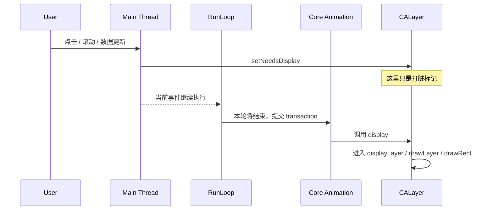

# iOS 异步绘制面试文档

这份文档的目标不是只让你记住几个 API，而是让你真正把这件事讲顺：

1. 系统默认绘制为什么大多会卡主线程
2. 异步绘制到底“异步”了什么，“没有异步”什么
3. `displayLayer:` 和“自定义 `CALayer` 重写 `display`”这两种方案，本质和差异分别是什么
4. 面试里怎么把这套逻辑讲清楚

当前工程里已经有一个可运行 demo：

- 入口界面：[ADViewController.m](/Users/huchu/Desktop/test-swift-program/test-async-draw-oc/ADViewController.m)
- 同步绘制路径：[ADSyncCardView.m](/Users/huchu/Desktop/test-swift-program/test-async-draw-oc/ADSyncCardView.m)
- 异步 `displayLayer:` 路径：[ADAsyncCardView.m](/Users/huchu/Desktop/test-swift-program/test-async-draw-oc/ADAsyncCardView.m)
- 异步 `layerClass + YYAsyncLayer` 路径：[ADYYAsyncCardView.m](/Users/huchu/Desktop/test-swift-program/test-async-draw-oc/ADYYAsyncCardView.m)
- 单独抽出的 `YYAsyncLayer` 最小实现：[YYAsyncLayer.m](/Users/huchu/Desktop/test-swift-program/test-async-draw-oc/YYAsyncLayer.m)
- `YYAsyncLayer` 使用的哨兵计数器：[YYSentinel.m](/Users/huchu/Desktop/test-swift-program/test-async-draw-oc/YYSentinel.m)
- 共用位图绘制逻辑：[ADCardRenderer.m](/Users/huchu/Desktop/test-swift-program/test-async-draw-oc/ADCardRenderer.m)

## 1. 一句话先讲明白

异步绘制并不是“让 UI 在后台线程更新”，而是：

**把耗时的位图绘制过程放到后台线程，最后仍然回主线程把结果挂到 `layer.contents` 或视图层级上。**

所以它优化的是：

- CPU 侧的位图生成
- 主线程在滚动、点击、布局时的阻塞

它没有直接优化的是：

- Auto Layout 本身
- UIKit 视图树的线程安全问题
- Core Animation 提交本身
- GPU 合成阶段

## 2. 先分清三件事

面试里最容易混的是把这三件事说成一件事：

1. `setNeedsDisplay`
2. CPU 生成 backing store
3. GPU / Render Server 合成显示

它们其实是三段不同的链路。

更准确的说法是：

- `setNeedsDisplay` 只是打脏标记
- backing store 的生成才是“绘制”本体
- 最终上屏还要经过 Core Animation 提交和合成

## 3. 系统默认的同步绘制是什么

### 3.1 默认路径

在系统默认模式下，像这些场景大多都属于同步绘制思路：

- 你自己重写 `drawRect:`
- `UILabel`、`UIImageView`、部分系统控件走 UIKit 默认显示流程
- `drawLayer:inContext:` 这类没有自己做异步派发的 layer delegate 绘制

这时候典型链路是：

1. 主线程上调用 `setNeedsDisplay`
2. 视图或 layer 被标记为 dirty
3. 当前 run loop 这一轮进入显示提交阶段。更严谨地说，通常可以近似理解为本次 run loop pass 走到 `BeforeWaiting` 附近，或在 loop 退出前，Core Animation 统一提交事务
4. 进入 `CALayer display`
5. 走到 `drawRect:` / `drawLayer:inContext:` / 默认控件内部的绘制逻辑
6. 这部分 CPU 绘制通常发生在主线程

### 3.2 为什么说默认绘制大多在主线程

因为 UIKit 的默认显示管线就是围绕主线程事件循环组织的：

- UI 事件在主线程
- 布局在主线程
- 视图树更新在主线程
- 绝大多数 UIView 默认显示回调也在主线程

所以默认情况下，一旦某个 view 的绘制很重，主线程就会被拖慢。

然后你会看到：

- 滚动掉帧
- 点击延迟
- 手势不跟手
- 列表复用时卡顿明显

### 3.3 一个重要的面试细节

不要把“默认绘制在主线程”讲成“所有渲染都在主线程”。

更准确的说法应该是：

- **CPU 侧生成位图 backing store**，在默认 UIKit 路径里大多压在主线程
- **最终合成和显示**，还会经过 Core Animation 和渲染服务，不是简单等于“主线程直接负责上屏”

这是一个很加分的表达。

## 4. `setNeedsDisplay` 到底什么时候真的开始画

这个点非常常问。

### 4.1 正确理解

`setNeedsDisplay` 不是立刻画。

它做的是：

- 标记“这个 view / layer 脏了”
- 等当前这轮 run loop 合适的显示提交时机再统一处理

通常可以理解成：

- 当前事件处理完
- run loop 准备进入 `BeforeWaiting`
- Core Animation 提交 transaction
- 然后才真正触发显示流程

### 4.2 一个简化时序图



### 4.3 “当前 run loop 这一轮快结束时”到底是什么意思

这句话是工程里的口语说法，不是说：

- run loop 已经彻底结束了
- 然后系统又临时把它拉回来干一件事

更准确的理解是：

- 一次 run loop pass 本来就包含多个固定阶段
- 事件处理只是其中一段
- 在这次 pass 真正准备休眠前，observer 仍然可以收到回调
- Core Animation 的自动事务提交，就发生在这个“本轮更新的后段”

所以“当前 run loop 这一轮快结束时”翻译成更严谨的话，大致就是：

- **本次 run loop 迭代已经处理完大部分输入、timer、source**
- **即将进入 `kCFRunLoopBeforeWaiting`，或者本次 loop 将直接退出**
- **这时会进入一次事务提交 / 显示提交阶段**

你可以把“一轮”理解成：

1. 被事件唤醒，或者刚进入 loop
2. 处理 timer / source / block / 主线程任务
3. 通知 observer：马上要 sleep 了
4. 如果没有更多事，就休眠等待下一次唤醒

所以这里不是“run loop 结束后还继续做事”，而是：

**“提交事务”本来就是这次 run loop pass 后半段里的一个阶段。**

### 4.4 这个说法的依据从哪里来

这一点最好分成三层来记，不要把不同层次的依据混在一起。

#### 第一层：Apple 官方对 `CATransaction` 的定义

Apple 在 QuartzCore 的官方头文件 `CATransaction.h` 里明确写了：

- 隐式事务会在没有显式 transaction 时自动创建
- **它们会在当前线程的 run loop 下一次迭代时自动提交**

也就是说：

- 改 layer tree 不会立刻每改一次就直接提交
- Core Animation 会等到 run loop 的某次迭代里的提交时机再统一 commit

这条依据非常硬，来自官方 SDK 头文件本身。

#### 第二层：Apple 官方对 RunLoop 阶段的定义

Apple 的 Run Loop 文档里明确写了 observer 会在这些特殊阶段收到通知：

- 进入 run loop
- 即将处理 timer
- 即将处理 source
- **线程即将休眠**
- 线程刚被唤醒
- 退出 run loop

并且在 “Run Loop Sequence of Events” 里给出了顺序：

1. 处理前面的 timers / sources
2. **通知 observer：thread is about to sleep**
3. 线程进入等待

这就是我们平时口语里说“这一轮快结束”的来源。它更严谨的名字其实是：

- `kCFRunLoopBeforeWaiting`

#### 第三层：头文件和历史开源源码能看到更具体的阶段名

在 Apple 的 `CFRunLoop.h` 里，你能直接看到这些 observer activity：

- `kCFRunLoopBeforeTimers`
- `kCFRunLoopBeforeSources`
- `kCFRunLoopBeforeWaiting`
- `kCFRunLoopAfterWaiting`
- `kCFRunLoopExit`

这说明 run loop 本身就把“即将休眠”和“退出”视为明确阶段。

另外，在 Apple 历史公开过的 CoreFoundation `CFRunLoop.c` 源码里，也能看到：

- run loop 在进入等待前，会执行 `__CFRunLoopDoObservers(..., kCFRunLoopBeforeWaiting)`

所以从源码层面，你可以把“这一轮快结束”理解成：

- **这次 run loop pass 已经走到 `BeforeWaiting` 这个 observer 阶段**

#### 第四层：关于 “CA 就是在 `BeforeWaiting` 提交吗” 这件事怎么说最稳

这里要分清楚：

- **官方公开文档明确写了 implicit transaction 会在 run loop 下一次迭代自动提交**
- **官方 RunLoop 文档明确写了有 `BeforeWaiting` 这种阶段**
- **但 Apple 没有在公开文档里逐字写出“Core Animation 一定通过某个 observer 在 `BeforeWaiting` 提交”**

所以最严谨的说法应该是：

- 工程实践里通常把 CA 自动提交近似理解为发生在本轮 run loop 的 `BeforeWaiting` 附近
- 这和历史公开源码、调用栈符号、实际行为观察是一致的
- 如果本次 loop 不会进入 waiting，而是直接退出，那么也要考虑 `kCFRunLoopExit`

你在面试里这样说是很稳的，不会把“行业共识”误讲成“Apple 公开逐字保证”。

#### 第五层：新的 SDK 也在侧面印证这件事

在较新的 UIKit SDK 头文件 `UIUpdateActionPhase.h` 里，Apple 甚至公开了这些阶段名：

- `beforeCATransactionCommit`
- `afterCATransactionCommit`

头文件注释还明确写到：

- `afterCATransactionCommit` 之后再改 layer tree，通常不会出现在当前这次 UI update，而是下一次

这进一步说明：

- `CATransaction commit/flush` 确实是主线程 UI update 周期里的一个明确阶段
- 它不是和 run loop 毫无关系的黑盒瞬时动作

### 4.5 面试时最稳的讲法

你可以直接这么说：

> “当前 run loop 这一轮快结束时”是工程口语，更严谨地说，是当前这次 run loop 迭代处理完大部分事件后，在 `kCFRunLoopBeforeWaiting` 附近或者 loop 退出前的事务提交阶段。这个说法的依据，一层来自 Apple 在 `CATransaction.h` 里写的 implicit transaction 会在 thread 的 run loop next iterates 时自动提交；另一层来自 Apple 的 Run Loop 文档和 `CFRunLoop.h` 对 `BeforeWaiting` / `Exit` 阶段的定义。至于 Core Animation 是否正好通过 observer 挂在 `BeforeWaiting` 提交，公开文档没有逐字展开，但从历史公开源码和实际行为上，这样理解是成立的。”

## 5. CALayer 显示链路的几个关键钩子

这一段建议面试一定要会说。

当 layer 进入显示流程时，常见的几个拦截点是：

1. `displayLayer:`
2. `drawLayer:inContext:`
3. `drawRect:`
4. 自定义 `CALayer` 的 `display`
5. 自定义 `CALayer` 的 `drawInContext:`

你可以先粗略理解为：

- `displayLayer:`：你直接接管显示结果，通常自己给 `contents` 赋值
- `drawLayer:inContext:`：系统给你 context，你往里面画
- `drawRect:`：UIView 风格的自定义绘制
- `CALayer.display`：更底层，直接接管 layer 的显示过程

## 6. 异步绘制的本质

无论你是：

- 实现 `displayLayer:`
- 还是自定义 `CALayer` 重写 `display`

本质上都在做同一件事：

1. 主线程拿到一次“该显示了”的机会
2. 把当前需要绘制的数据快照好
3. 把真正的位图绘制任务丢到后台队列
4. 后台线程得到一张 `CGImage` / `UIImage`
5. 回主线程把结果设置到 `layer.contents`

也就是说：

- **异步的是位图生成**
- **主线程保留的是 layer tree 的最终提交**

## 7. 方案一：实现 `displayLayer:`

这就是你这次指定要重点理解的方案。

### 7.1 它的钩子位置

`displayLayer:` 的位置在：

- 系统已经进入 layer 的显示流程
- 但真正的重绘逻辑还没开始
- 这时候回调 delegate，让你自己决定怎么生成显示内容

你当前 demo 里对应的是：

- [ADAsyncCardView.m](/Users/huchu/Desktop/test-swift-program/test-async-draw-oc/ADAsyncCardView.m:35)

### 7.2 典型伪代码

```objc
- (void)displayLayer:(CALayer *)layer {
    ModelSnapshot *snapshot = self.snapshot;
    NSInteger token = self.sentinel;

    dispatch_async(renderQueue, ^{
        CGImageRef image = CreateBitmap(snapshot);

        dispatch_async(dispatch_get_main_queue(), ^{
            if (token != self.sentinel) return;
            layer.contents = (__bridge id)image;
        });
    });
}
```

### 7.3 它的优点

- 不需要改 backing layer 类型
- 接入简单
- 很适合先做验证版或单个自定义 view
- 逻辑集中在 view 内部，理解成本低

### 7.4 它的缺点

- 队列管理、取消逻辑、状态同步都要自己写
- 如果项目里很多 view 都这么做，容易重复代码
- 抽象层次较高，复用性不如自定义 layer 方案

### 7.5 你当前 demo 里它是怎么做的

[ADAsyncCardView.m](/Users/huchu/Desktop/test-swift-program/test-async-draw-oc/ADAsyncCardView.m:47) 这里有两个关键点：

- `displayLayer:` 仍然是在主线程被调用
- 真正耗时的绘制被 `dispatch_async` 到后台 `renderQueue`

最后在 [67 行](/Users/huchu/Desktop/test-swift-program/test-async-draw-oc/ADAsyncCardView.m:67) 左右才回主线程做：

```objc
layer.contents = (__bridge id)image.CGImage;
```

这就是异步绘制的核心落点。

### 7.6 为什么 `displayLayer:` 里能配合 `UIGraphicsGetCurrentContext()` 异步画

这个点非常容易误解。

很多人会下意识以为：

- `displayLayer:` 给了后台线程一个可用的 context
- 所以 `drawItem:` 里才能直接 `UIGraphicsGetCurrentContext()`

其实不是。

真正原因是：

- `displayLayer:` 只是一个**显示时机的拦截点**
- 真正可用的绘图 context，是我们在后台线程里**自己创建出来的**

你当前 demo 的真实链路是：

1. 主线程进入 [ADAsyncCardView.m](/Users/huchu/Desktop/test-swift-program/test-async-draw-oc/ADAsyncCardView.m:35) 的 `displayLayer:`
2. 在 [ADAsyncCardView.m](/Users/huchu/Desktop/test-swift-program/test-async-draw-oc/ADAsyncCardView.m:49) 把任务丢到后台 `renderQueue`
3. 后台线程进入 [ADCardRenderer.m](/Users/huchu/Desktop/test-swift-program/test-async-draw-oc/ADCardRenderer.m:15) 的 `imageForItem:size:scale:cancelled:`
4. 在 [ADCardRenderer.m](/Users/huchu/Desktop/test-swift-program/test-async-draw-oc/ADCardRenderer.m:24) 调用：

```objc
UIGraphicsBeginImageContextWithOptions(size, YES, scale);
```

5. 然后才在 [ADCardRenderer.m](/Users/huchu/Desktop/test-swift-program/test-async-draw-oc/ADCardRenderer.m:37) 里拿到：

```objc
CGContextRef context = UIGraphicsGetCurrentContext();
```

所以这里的 `UIGraphicsGetCurrentContext()` 取到的不是系统在 `displayLayer:` 里偷偷传给你的 context，而是：

**“当前这个后台线程，刚刚通过 `UIGraphicsBeginImageContextWithOptions` 创建出来的离屏 bitmap context”。**

换句话说：

- `displayLayer:` 负责的是**什么时候开始准备显示结果**
- `UIGraphicsBeginImageContextWithOptions` 负责的是**给当前线程创建一个可绘制的位图上下文**
- `UIGraphicsGetCurrentContext()` 只是把这个“当前线程当前 image context”拿出来用

这三件事是分开的。

### 7.7 为什么这不代表 `drawRect:` 也适合做同样的事

关键差别不在于 `drawRect:` 里能不能开后台线程，而在于：

- `drawRect:` 本身是系统同步绘制链路里的执行点
- 系统调用它时，期待你在这次回调里当场把内容画完

而 `displayLayer:` 方案里，我们根本没有依赖系统给的那次同步绘图 context。

我们做的是：

1. 收到显示回调
2. 自己开一个离屏 bitmap context
3. 在后台线程把位图画完
4. 回主线程设置 `layer.contents`

这也是为什么前面说：

- `displayLayer:` 更适合作为异步绘制的接管点
- `drawRect:` 更像同步绘制执行点，不适合作为正式的异步显示拦截点

如果你硬要在 `drawRect:` 里异步做这件事，会出现两个事实：

1. `drawRect:` 当次那套系统同步 context 不能拿去后台继续用
2. 你一旦在后台自己 `UIGraphicsBeginImageContextWithOptions`，本质上已经不是在“完成这次 `drawRect:`”，而是在绕到“自建 bitmap + 回填 `layer.contents`”这条新路径

所以最准确的一句话是：

**`displayLayer:` 不是因为“自带异步 context”才适合异步绘制，而是因为它给了你一个更合适的显示链路接管点；真正让后台绘制成立的是你自己创建的 bitmap context。**

## 8. 方案二：自定义 `CALayer`，重写 `display`

这是 `YYAsyncLayer` 那条路。

### 8.1 它的钩子位置

这次不再把异步逻辑写在 view 的 `displayLayer:` 里，而是：

1. 先让 view 的 backing layer 变成自定义 layer
2. 在这个 layer 自己的 `display` 方法里统一调度异步绘制

典型方式是：

```objc
+ (Class)layerClass {
    return [MyAsyncLayer class];
}
```

然后在 `MyAsyncLayer` 里：

```objc
- (void)display {
    // 统一处理取消、队列、任务创建、结果回主线程提交
}
```

### 8.2 它的优点

- 抽象边界更清晰
- 所有通用能力都能封进 layer
- 更容易统一做取消、哨兵、队列池、fade 动画
- 项目里多个复杂控件可复用

### 8.3 它的缺点

- 理解门槛更高
- 接入成本更高
- 需要更小心处理 view 与 layer 的职责边界

### 8.4 为什么很多成熟框架更偏向这种方式

因为当项目足够大时，大家更希望把这些通用逻辑沉到底层：

- 异步队列管理
- 取消旧任务
- 复用时防止旧图覆盖新图
- 最终提交到 contents
- 是否需要淡入动画

这也是 `YYAsyncLayer` 的核心价值。

### 8.5 `YYAsyncLayer` 能不能单独拉出来用

可以。

至少在学习和业务 demo 场景里，`YYAsyncLayer` 并不要求你整套引入 YYKit。

你现在这个工程里就是一个最小可运行版本：

- layer 本体：[YYAsyncLayer.h](/Users/huchu/Desktop/test-swift-program/test-async-draw-oc/YYAsyncLayer.h)
- layer 实现：[YYAsyncLayer.m](/Users/huchu/Desktop/test-swift-program/test-async-draw-oc/YYAsyncLayer.m)
- 取消用的哨兵：[YYSentinel.h](/Users/huchu/Desktop/test-swift-program/test-async-draw-oc/YYSentinel.h)
- 哨兵实现：[YYSentinel.m](/Users/huchu/Desktop/test-swift-program/test-async-draw-oc/YYSentinel.m)

这也说明：

- `YYAsyncLayer` 的关键价值不在“必须依赖 YYKit 全家桶”
- 而在它把 **异步队列、取消、离屏 context、最终 contents 提交** 这些通用能力统一封到了 layer 内部

所以面试里你完全可以说：

**`YYAsyncLayer` 是可以抽成一个相对独立基础设施的，它最小只依赖一个线程安全 sentinel 和几段队列调度逻辑。**

## 9. 两种异步方案的本质和差异

### 9.1 本质相同

它们本质上都在做这件事：

- 把耗时绘制从主线程挪到后台线程
- 最终仍回主线程提交 `layer.contents`

所以从“性能优化的本质”上看，它们是同一类方案。

### 9.2 差异不在“异步没异步”，而在“拦截点”

- `displayLayer:` 方案：拦在 layer delegate 回调层
- 自定义 `CALayer.display` 方案：拦在 layer 自身显示层

一句话总结：

**前者是“系统先回调你，你再自己做异步”；后者是“先接管 layer 的 display，再由 layer 统一调度异步”。**

### 9.3 一个对比表

| 维度 | 默认同步绘制 | `displayLayer:` 异步 | 自定义 `CALayer.display` 异步 |
| --- | --- | --- | --- |
| 耗时位图生成 | 主线程 | 后台线程 | 后台线程 |
| 最终 `contents` 提交 | 系统主线程流程 | 主线程 | 主线程 |
| 接入难度 | 最低 | 中等 | 较高 |
| 通用能力封装 | 弱 | 一般 | 强 |
| 取消旧任务 | 默认没有 | 自己做 | 更适合统一做 |
| 适合场景 | 简单 UI | 单个复杂 view | 大量复杂富文本 / 卡片组件 |

## 10. 默认同步绘制 vs 异步绘制，真正差在哪

### 10.1 默认同步绘制

主线程负责：

- 响应事件
- 布局
- 绘制
- 图层提交

所以只要绘制复杂一点，主线程就很容易被抢光。

### 10.2 异步绘制

主线程只做：

- `setNeedsDisplay`
- 捕获当前绘制快照
- 分发后台任务
- 最终 `layer.contents` 赋值

后台线程负责：

- 文字排版
- Core Graphics / Core Text / 位图渲染
- 复杂路径绘制
- 图片合成

这就把主线程从“又要响应交互，又要苦力画图”的状态里解放出来。

## 11. 但异步绘制不是万能药

### 11.1 它优化的是 CPU raster，不是所有性能问题

如果卡顿来自：

- Auto Layout 约束太复杂
- 数据源计算太重
- 图片解码
- 主线程频繁锁竞争
- 业务逻辑放主线程

那你只做异步绘制，不一定能治本。

### 11.2 它也不是“把 UIView 放到后台”

异步绘制不是说：

- 后台线程创建 UIView
- 后台线程改 layer tree
- 后台线程随便调 UIKit

这些都是不对的。

你要记住一句话：

**后台线程只负责“生成显示结果”，主线程仍然负责“提交 UI 结果”。**

## 12. 异步绘制里最重要的 6 个工程点

### 12.1 先在主线程快照状态

不要后台线程直接读一堆正在变化的 view 属性。

正确思路是：

- 在主线程把当前需要绘制的数据整理成 snapshot
- 后台线程只吃 snapshot

否则很容易出现：

- 半旧半新的数据
- 线程竞争
- 绘制内容错乱

### 12.2 一定要有取消机制

列表滚动复用时最典型的问题是：

- 旧 cell 的后台任务还没画完
- cell 已经复用给新数据了
- 旧图回来把新内容盖掉

所以必须有：

- sentinel
- version token
- task id

你当前 demo 里就是用的 `sentinel`：

- [ADAsyncCardView.m](/Users/huchu/Desktop/test-swift-program/test-async-draw-oc/ADAsyncCardView.m:44)
- [ADAsyncCardView.m](/Users/huchu/Desktop/test-swift-program/test-async-draw-oc/ADAsyncCardView.m:81)

### 12.3 最终赋值要回主线程

工程上最稳妥的规则是：

- 后台线程生成 `CGImage`
- 主线程设置 `layer.contents`

原因不是单纯因为 `CGImage` 不能跨线程，而是：

- layer tree 变更最好保持在主线程
- 和 UIKit 其它更新节奏保持一致
- 可以避免很多微妙的线程时序问题

### 12.4 纯绘制逻辑尽量和 UIView 解耦

绘制逻辑最好单独收敛成 renderer。

你当前 demo 就是这么做的：

- 共用 renderer：[ADCardRenderer.m](/Users/huchu/Desktop/test-swift-program/test-async-draw-oc/ADCardRenderer.m)

这样带来的好处：

- 同步和异步可以共用一套绘制内容
- 对比更公平
- 代码更容易测试和复用

### 12.5 后台线程尽量避免直接操作 UIView

最安全的后台绘制对象通常是：

- Core Graphics
- Core Text
- `CGImage`
- 纯数据模型

对于 UIKit 的一些绘图辅助能力，很多情况下可以用，但要谨慎验证。

面试里建议这样讲：

**后台线程应该尽量只操作不可变数据、图形上下文和最终位图，不去碰 view 树本身。**

### 12.6 注意 `contentsScale`、`opaque` 和内存

异步绘制很容易忽略这几件小事：

- 没设 `contentsScale` 会模糊
- 不透明内容设 `opaque = YES` 可以少一些额外成本
- 位图很大时内存会涨
- 高频重绘时要注意 autoreleasepool

你当前 demo 里已经做了两件：

- `opaque = YES`
- `layer.contentsScale = UIScreen.mainScreen.scale`

看这里：

- [ADAsyncCardView.m](/Users/huchu/Desktop/test-swift-program/test-async-draw-oc/ADAsyncCardView.m:15)
- [ADAsyncCardView.m](/Users/huchu/Desktop/test-swift-program/test-async-draw-oc/ADAsyncCardView.m:68)

## 13. 为什么 `displayLayer:` 方案更适合入门

如果你是面试准备阶段，我建议你先把 `displayLayer:` 方案彻底吃透。

因为它最能看清“异步绘制到底在异步什么”：

1. 系统还是正常走显示周期
2. `displayLayer:` 还是在主线程被调
3. 真正重的是位图生成
4. 所以把位图生成 dispatch 到后台
5. 最后再回主线程设置 `contents`

这个因果链一旦真正理解了，再去看 `YYAsyncLayer` 就只是抽象层次升级，而不是完全不同的东西。

## 14. 为什么 `YYAsyncLayer` 看起来更高级

它更高级，不是因为它“更异步”，而是因为它“更工程化”。

它把这些通用能力收进了 layer：

- 统一 display 拦截
- 统一取消机制
- 队列池
- 异步任务封装
- 最终提交逻辑
- 可能的过渡动画

所以你可以这样评价它：

**`YYAsyncLayer` 不是改了异步绘制的本质，而是把异步绘制这套共性能力做成了基础设施。**

## 15. 面试里怎么回答“异步绘制的原理”

### 15.1 30 秒版本

> iOS 默认绘制大多是在主线程显示周期里完成的，像 `drawRect:` 或系统控件的内容更新，如果绘制复杂就容易阻塞主线程。异步绘制的核心是把耗时的位图生成放到后台线程，最后再回主线程把结果设置到 `layer.contents`。常见实现有两类，一类是在 `displayLayer:` 里自己派发后台绘制，另一类是自定义 `CALayer` 重写 `display`，像 `YYAsyncLayer` 就是后者。本质上两者都是把 CPU raster 挪出主线程，只是拦截层次不同。 

### 15.2 2 分钟版本

> 先说默认路径，`setNeedsDisplay` 只是打脏标记，当前 run loop 这一轮到显示提交阶段时，Core Animation 会调用 layer 的显示链路，默认的 `drawRect:` 或系统控件内部绘制逻辑通常发生在主线程。这样一来，如果文本排版、路径绘制、图片合成很重，就会拖慢滚动和点击响应。  
> 异步绘制并不是把整个 UI 挪到后台，而是把最耗时的 backing store 生成过程挪到后台。主线程先做状态快照，然后在 `displayLayer:` 或自定义 `CALayer.display` 里把绘制任务派发到后台，后台生成 `CGImage`，最后回主线程设置 `layer.contents`。  
> 两种方案本质一样，区别在于 `displayLayer:` 是 delegate 层方案，接入简单，但取消和队列管理要自己写；自定义 layer 方案则是把通用逻辑沉到底层，更适合做通用基础设施，比如 `YYAsyncLayer`。工程里还要注意快照、取消旧任务、复用错位、`contentsScale` 和不要在后台直接操作 UIView。 

## 16. 面试里容易追问的点

### 16.1 “为什么不是直接后台线程改 UI？”

回答：

- UIKit 视图树不是线程安全的
- 异步绘制只是让位图生成异步
- 最终 UI 树和 layer tree 的提交仍放主线程更稳妥

### 16.2 “异步绘制优化的是哪一段？”

回答：

- 优化的是 CPU 侧的位图生成
- 不是直接优化 GPU 合成
- 也不是自动解决所有主线程性能问题

### 16.3 “如果 cell 复用了怎么办？”

回答：

- 要做取消机制
- 常见是 sentinel / token / version
- 后台任务完成后先校验 token，再决定是否提交

### 16.4 “`displayLayer:` 和 `drawRect:` 哪个优先？”

回答建议：

- `displayLayer:` 属于更靠前的接管点
- 一旦你自己在 `displayLayer:` 里接管显示结果，通常就不会再走默认那套 `drawRect:` 绘制逻辑
- 本质上是你自己负责给 layer 一个显示结果

### 16.5 “为什么 `+layerClass` 不是异步本身？”

回答：

- `+layerClass` 只是换了 backing layer 类型
- 真正异步与否取决于这个 layer 的 `display` 实现里有没有把位图绘制调度到后台

## 17. 哪些场景最适合异步绘制

- 富文本很多的 feed 流
- 评论列表
- 社交卡片
- 图文混排内容页
- 大量圆角、路径、渐变、图表叠加的复杂卡片
- 自定义文本排版组件

## 18. 哪些场景不一定值得上异步绘制

- view 很简单
- 绘制成本很低
- 页面瓶颈主要不在绘制
- 只是为了“看起来高级”而引入额外复杂度

一个成熟工程的判断标准不是“能不能异步”，而是：

**这部分绘制是否真的已经成为主线程瓶颈。**

## 19. 结合你当前 demo 怎么看

你现在工程里的 `test-async-draw-oc` 已经把两条路径摆在一起了。

### 19.1 同步模式

[ADSyncCardView.m](/Users/huchu/Desktop/test-swift-program/test-async-draw-oc/ADSyncCardView.m:34)

这里走：

- `setNeedsDisplay`
- 主线程 `drawRect:`
- 直接调用 renderer 做重绘

特点：

- 简单
- 直观
- 但重绘压力直接落在主线程

### 19.2 异步模式

[ADAsyncCardView.m](/Users/huchu/Desktop/test-swift-program/test-async-draw-oc/ADAsyncCardView.m:35)

这里走：

- `layer setNeedsDisplay`
- 主线程回调 `displayLayer:`
- 后台队列生成 bitmap
- 主线程只做 `layer.contents` 提交

特点：

- 保留系统显示时机
- 把重活挪出主线程
- 有 `sentinel` 防止旧任务覆盖

### 19.3 `layerClass + YYAsyncLayer` 模式

[ADYYAsyncCardView.m](/Users/huchu/Desktop/test-swift-program/test-async-draw-oc/ADYYAsyncCardView.m:10)

这里走：

- `+layerClass` 把 backing layer 换成 `YYAsyncLayer`
- 主线程在 view 侧只负责 `setNeedsDisplay`
- `YYAsyncLayer.display` 里统一拉取 `YYAsyncLayerDisplayTask`
- 后台线程创建 bitmap context 并执行 `task.display`
- 主线程最终设置 `layer.contents`

对应的 layer 实现在：

- [YYAsyncLayer.m](/Users/huchu/Desktop/test-swift-program/test-async-draw-oc/YYAsyncLayer.m:60)

特点：

- 通用异步显示逻辑沉到底层 layer
- view 只负责提供 task 和业务数据
- 更接近成熟框架里真正的基础设施写法

### 19.4 共用 renderer 的意义

[ADCardRenderer.m](/Users/huchu/Desktop/test-swift-program/test-async-draw-oc/ADCardRenderer.m:15)

这样设计的意义很大：

- 同一套卡片内容
- 同一套绘制复杂度
- 只改“在哪个线程做绘制”
- 所以你看到的差异才更接近真实结论

## 20. 你要真正记住的最终版本

把下面这段话练到能脱口而出，面试就够用了：

> iOS 默认绘制大多发生在主线程显示周期里，像 `drawRect:` 或系统控件内部内容更新，如果绘制复杂就会阻塞主线程。异步绘制的核心不是把 UI 挪到后台，而是把 CPU 侧的位图生成放到后台线程，最后再回主线程把结果设置到 `layer.contents`。常见有两种做法，一种是在 `displayLayer:` 里接管显示并自己派发后台任务，另一种是自定义 `CALayer` 重写 `display`，由 layer 统一封装异步绘制逻辑，`YYAsyncLayer` 就属于第二种。两者本质一样，都是把耗时绘制从主线程挪走，差别只是在抽象层次和通用能力封装。工程里还必须处理状态快照、取消旧任务、复用错位和主线程最终提交。 

## 21. 复习清单

如果你已经把这篇文档看完，下一步建议你能自己不用看文档回答下面 8 个问题：

1. `setNeedsDisplay` 为什么不是立刻画
2. 默认同步绘制主要卡在哪
3. 异步绘制真正异步的是哪一步
4. 为什么 `layer.contents` 最终仍建议在主线程赋值
5. `displayLayer:` 和 `CALayer.display` 的差别是什么
6. `YYAsyncLayer` 比手写 `displayLayer:` 强在哪里
7. 为什么一定要有取消旧任务机制
8. 哪些页面适合异步绘制，哪些页面不适合

如果这 8 个问题你都能讲顺，异步绘制这块在面试里就已经不是“知道一点”，而是“能讲逻辑、能讲工程、能讲取舍”了。

## 22. 这一节可追溯到哪些资料

如果面试官追问“这个结论你从哪看到的”，你可以按下面这三层回答：

1. 官方 SDK 头文件

- `CATransaction.h`
  路径：`/Applications/Xcode.app/Contents/Developer/Platforms/iPhoneSimulator.platform/Developer/SDKs/iPhoneSimulator.sdk/System/Library/Frameworks/QuartzCore.framework/Headers/CATransaction.h`
  关键点：implicit transaction 会在 thread 的 run-loop next iterates 时自动提交。

- `CFRunLoop.h`
  路径：`/Applications/Xcode.app/Contents/Developer/Platforms/iPhoneSimulator.platform/Developer/SDKs/iPhoneSimulator.sdk/System/Library/Frameworks/CoreFoundation.framework/Headers/CFRunLoop.h`
  关键点：有 `kCFRunLoopBeforeWaiting`、`kCFRunLoopAfterWaiting`、`kCFRunLoopExit` 这些明确阶段。

- `UIUpdateActionPhase.h`
  路径：`/Applications/Xcode.app/Contents/Developer/Platforms/iPhoneSimulator.platform/Developer/SDKs/iPhoneSimulator.sdk/System/Library/Frameworks/UIKit.framework/Headers/UIUpdateActionPhase.h`
  关键点：公开了 `beforeCATransactionCommit` / `afterCATransactionCommit` 这类 UI update phase。

2. Apple 官方文档

- Run Loops
  [https://developer.apple.com/library/archive/documentation/Cocoa/Conceptual/Multithreading/RunLoopManagement/RunLoopManagement.html](https://developer.apple.com/library/archive/documentation/Cocoa/Conceptual/Multithreading/RunLoopManagement/RunLoopManagement.html)

- `kCFRunLoopBeforeWaiting`
  [https://developer.apple.com/documentation/corefoundation/cfrunloopactivity/beforewaiting?language=objc](https://developer.apple.com/documentation/corefoundation/cfrunloopactivity/beforewaiting?language=objc)

- `CATransaction`
  [https://developer.apple.com/documentation/quartzcore/catransaction](https://developer.apple.com/documentation/quartzcore/catransaction)

3. Apple 历史公开源码

- CoreFoundation `CFRunLoop.c`
  [https://git.saurik.com/apple/cf.git/blob/db04bbf9e27a3e91f77335fb0c77c1cca5219ed6:/CFRunLoop.c](https://git.saurik.com/apple/cf.git/blob/db04bbf9e27a3e91f77335fb0c77c1cca5219ed6:/CFRunLoop.c)

注意：

- 这份 `CFRunLoop.c` 属于 Apple 历史公开过的 CoreFoundation 源码，不等于今天 iOS 私有实现逐行不变
- 但它非常适合用来理解 run loop observer 的阶段顺序
- 面试里把它说成“帮助理解实现时序的历史公开源码”会更严谨
